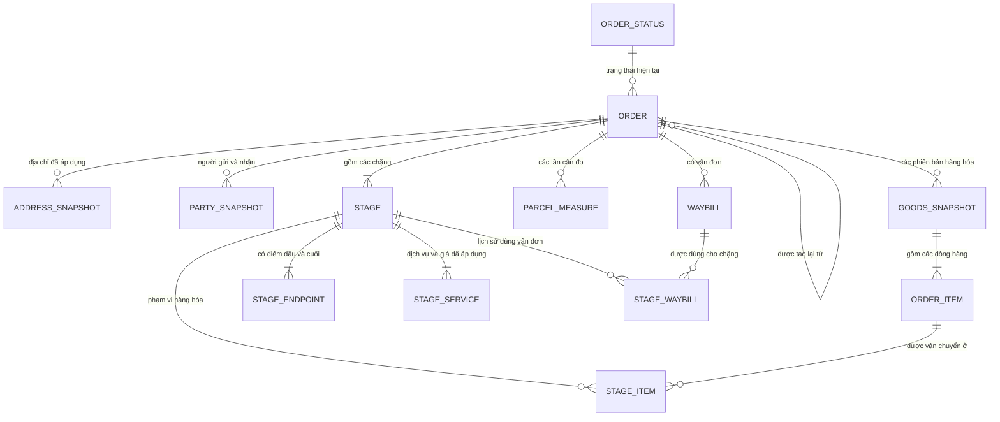
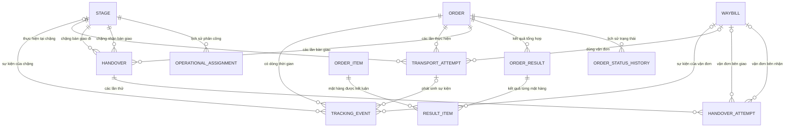
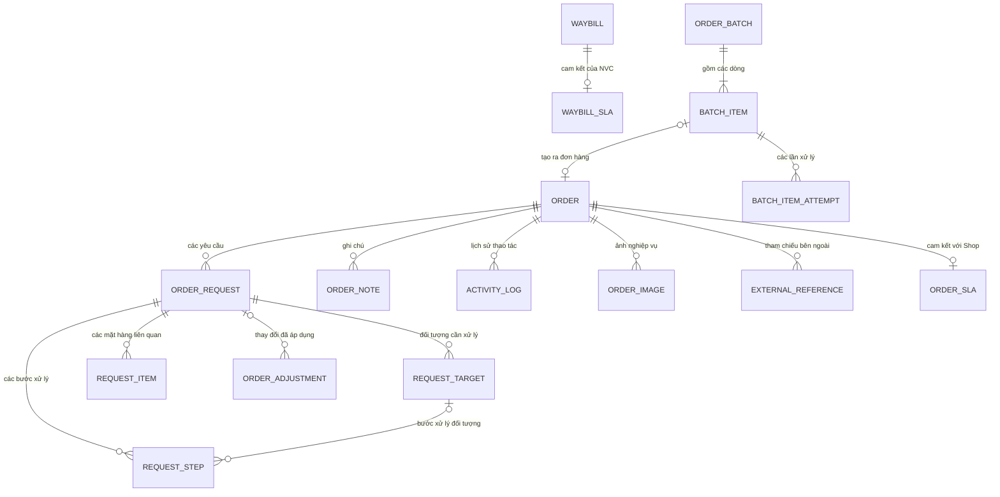
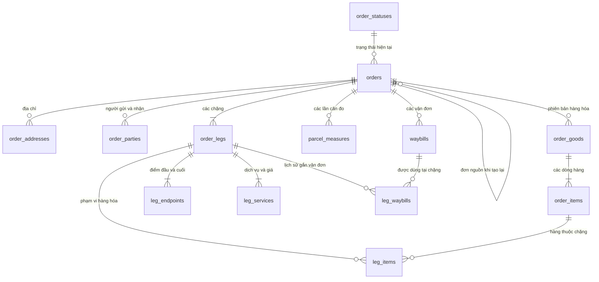
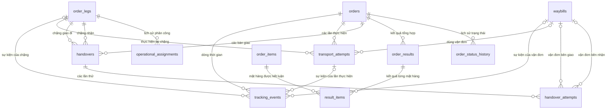
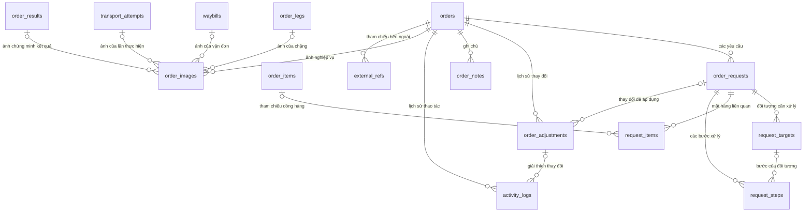
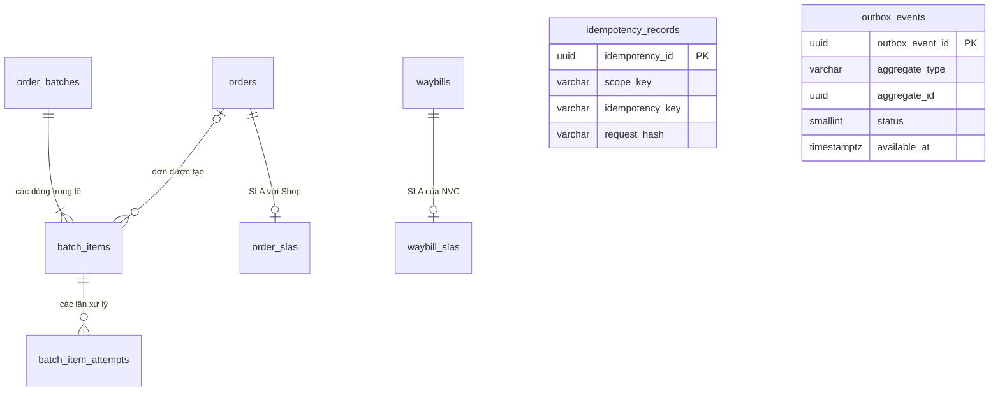

# SuperShip \- MODULE ORDER \- DATABASE DESIGN SPECIFICATION

> **Phạm vi:** Thiết kế cơ sở dữ liệu cho Module Order của SuperPlatform\.

> **Mục tiêu:** Lưu đúng dữ liệu Đơn hàng trong suốt vòng đời; giữ được lịch sử để tra soát; không tạo trùng khi thử lại/webhook gửi lại; không liên kết nhầm dữ liệu giữa các Đơn hàng\.

---

# THÔNG TIN TÀI LIỆU

## Thông tin chung

|Thuộc tính|Nội dung|
|---|---|
|Mã tài liệu|`DBDS-ORDER`|
|Tên tài liệu|Đặc tả thiết kế cơ sở dữ liệu \- Module Order|
|Module|Order \- SuperPlatform|
|Phiên bản|**`0.10.0`**|
|Trạng thái||
|Người phụ trách|Lê Phước Thắng|
|Người rà soát|Senior SE / Tech Lead / Database / QA \- `TBD`|
|Người phê duyệt|Product Owner \+ Software Architect theo phạm vi quyết định \- `TBD`|
|CSDL đề xuất|PostgreSQL 16\+; cần Architecture/Infra xác nhận trước môi trường thực tế|
|Cập nhật lần cuối|18/09/2026|

## Lịch sử thay đổi

|Version|Ngày phát hành|Mô tả thay đổi|Tác giả|
|---|---|---|---|
|**0\.10\.0**|18/09/2026|• **Toàn tài liệu:** Biên tập lại câu chữ theo hướng ưu tiên tiếng Việt, câu ngắn và dễ hiểu; giữ nguyên tên bảng, tên cột, mã trạng thái và thuật ngữ kỹ thuật cần thiết\.<br>• Chuẩn hóa cách gọi Đơn hàng, Chặng, Vận đơn, Lần thực hiện, Bàn giao, Yêu cầu, Kết quả và Lô xử lý\.<br>• Không thay đổi mô hình 37 bảng hoặc các quyết định thiết kế đã chốt\.|Lê Phước Thắng |
|**0\.9\.0**|18/09/2026|• **Mục 3–9:** Đồng bộ toàn bộ nguyên tắc, mô hình logic/vật lý, khóa ngoại, ràng buộc, chỉ mục, giao dịch, vòng đời dữ liệu và tìm kiếm với Database Dictionary `0.25.0`\.<br>• Bổ sung ngữ cảnh người tạo, quyết định vận chuyển, giá trong `leg_services`, trạng thái gốc của NVC tại Vận đơn, thứ tự Tracking, kết quả tổng hợp, quy tắc Bàn giao và Outbox thử lại/dead-letter\.<br>• Loại toàn bộ nội dung còn sót của các bảng/cột đã bỏ hoặc chuyển sang module khác\.<br>• **Mục 4\.7 và 5\.9:** Vẽ lại ERD logic thành 3 phần và ERD vật lý thành 4 phần theo nhóm chức năng; thể hiện đủ 37 bảng, số lượng quan hệ và các khóa liên kết chính\.|Lê Phước Thắng |
|**0\.8\.0**|18/09/2026|• **Mục 5\.2–5\.3:** Đồng bộ danh sách bảng vật lý với Database Dictionary `0.25.0`, chốt **37 bảng** trong schema `order_mgmt`\.<br>• Loại khỏi Order Database các bảng đã bỏ hoặc chuyển trách nhiệm sở hữu: `goods_features`, `leg_quotes`, `note_links`, `order_files`, `file_links`, nhóm `label_*`, `financial_components`, `source_requests`, `source_syncs`\.<br>• Chuẩn hóa `attempts` thành `transport_attempts`; bổ sung `order_images`, `waybill_slas`; Print Job thuộc Print Module (`PRT`)\.|Lê Phước Thắng |
|**0\.7\.0**|16/09/2026|• **Mục 1–3:** Chuẩn hóa mục đích, phạm vi, thuật ngữ và nguyên tắc thiết kế theo cách viết tiếng Việt dễ đọc\.<br>• **Mục 4–5:** Trình bày lại mô hình logic và vật lý theo baseline **46 bảng**, giữ rõ ranh giới Order với Carrier, Pricing, Finance và các module khác\.<br>• **Mục 6–10:** Sắp xếp lại quy tắc toàn vẹn, giao dịch, lịch sử, hiệu năng và truy vết yêu cầu để dùng trực tiếp cho thiết kế migration và triển khai Backend\.<br>• Giữ nguyên các quyết định dữ liệu đã chốt; không tạo schema riêng cho từng NVC\.|Lê Phước Thắng |
|**0\.6\.0**|16/09/2026|• **Mục 4\.2–4\.7:** Bổ sung bản chụp dữ liệu điểm đầu/điểm cuối Chặng và báo giá đã áp dụng bằng `leg_endpoints`, `leg_quotes`\.<br>• **Mục 5\.3–5\.8:** Bổ sung `fulfillment_mode`, Carrier Account/vehicle tham chiếu, Booking Lần thực hiện tham chiếu và `carrier_sorting_code` để hỗ trợ NVC giao tức thời\.<br>• Tổng số bảng tăng **44 → 46**\.|Lê Phước Thắng |
|**0\.5\.0**|16/09/2026|• **Mục 4–7:** Hoàn thiện mô hình theo 10 nhóm User Story: thử lại lô, Yêu cầu/Đối tượng/Step, Lần thực hiện/Bàn giao, Note/File ngữ cảnh, audit và financial attribution\.<br>• Bổ sung `batch_item_attempts`, `file_links`, `note_links`\.<br>• Tổng số bảng tăng **41 → 44**\.|Lê Phước Thắng |
|**0\.4\.0**|16/09/2026|• **Mục 4–6:** Chốt mô hình dòng hàng Order: `item_code` là mã dòng hàng nghiệp vụ, `sku` là tùy chọn, `product_ref` dùng để truy nguồn khi có\.<br>• `request_items` hỗ trợ hàng thay thế chưa tồn tại trong `order_items`\.|Lê Phước Thắng |
|**0\.3\.0**|16/09/2026|• **Mục 6–8:** Hoàn thiện ranh giới transaction, thứ tự khóa, kiểm soát ghi đồng thời bằng phiên bản, idempotency, xử lý `UNKNOWN`, sự kiện trùng/đến muộn và transactional outbox\.|Lê Phước Thắng |
|**0\.2\.0**<br>|16/09/2026|• **Mục 4–5:** Mở rộng Vận đơn để hỗ trợ `WAYBILL_CODE` và `DELIVERY_ID`\.<br>• Bổ sung `operational_assignments` để lưu người thực hiện theo thời gian hiệu lực; tách người được phân công khỏi quyền giữ kiện\.|Lê Phước Thắng |
|**0\.1\.0**|16/09/2026|• Xây dựng baseline từ BRD, Business Rule, Domain Model, SRS, Use Case và API Contract\.<br>• Chốt cấu trúc Order–Leg–Vận đơn, bản chụp dữ liệu lịch sử, khóa/quan hệ cùng Order, `soc` là mã đơn riêng của Shop và các nguyên tắc chuẩn hóa dữ liệu OLTP\.|Lê Phước Thắng |

---

# CÁCH ĐỌC NHANH

Nếu chỉ cần nắm thiết kế chính, đọc theo thứ tự:

1. **Mục 3** \- các nguyên tắc thiết kế không được vi phạm\.

2. **Mục 4** \- mô hình dữ liệu logic\.

3. **Mục 5\.3** \- danh sách 37 bảng vật lý\.

4. **Mục 6** \- quy tắc nào Database tự bảo vệ, quy tắc nào Backend xử lý\.

5. **Mục 7** \- transaction, xử lý đồng thời và chống xử lý trùng\.

## 7 nguyên tắc quan trọng nhất

1. Một Đơn hàng chỉ có một `order_id` và một `order_code` trong suốt vòng đời\.

2. Đơn hàng, Chặng vận chuyển và Vận đơn NVC là ba đối tượng khác nhau; Vận đơn được hiểu rộng là định danh/chuyến vận chuyển do NVC cấp\.

3. Yêu cầu xử lý chưa phải kết quả thực tế\.

4. Dữ liệu lịch sử cần tra soát thì không ghi đè\.

5. Tracking, lượt thực hiện, bàn giao và lịch sử thao tác phải lưu riêng\.

6. `soc` là mã đơn riêng của Shop và chỉ thuộc Đơn hàng\.

7. Shipper đang phụ trách được lưu theo phân công còn hiệu lực; không suy ra từ trạng thái hay Tracking\.

---

# 1\. MỤC ĐÍCH VÀ PHẠM VI

## 1\.1\. Mục đích

Tài liệu mô tả cách Module Order lưu dữ liệu trong cơ sở dữ liệu để Backend, Database, QA, BA và Architect triển khai thống nhất\.

Tài liệu trả lời các câu hỏi chính:

- Đơn hàng cần lưu dữ liệu gì?

- Dữ liệu nào thuộc Module Order, dữ liệu nào chỉ tham chiếu từ module khác?

- Một Đơn hàng có nhiều Chặng/NVC/Vận đơn thì liên kết thế nào?

- Khi có yêu cầu thay đổi, khi nào dữ liệu mới thật sự có hiệu lực?

- Lịch sử được giữ thế nào để tra soát?

- Làm sao chống tạo trùng do thử lại, webhook hoặc lô?

- Làm sao tránh ghi đè sai khi nhiều tiến trình cùng cập nhật?

- Cần chỉ mục nào để phục vụ tra cứu và vận hành?

Tài liệu là đầu vào cho Data Dictionary, migration, Backend implementation và kiểm thử dữ liệu\.

## 1\.2\. Phạm vi

Bao gồm:

- dữ liệu chính của Đơn hàng;

- trạng thái và kết quả hiện tại;

- người gửi, người nhận, địa chỉ, hàng hóa đã áp dụng;

- khối lượng, kích thước và lịch sử cân/đo;

- Chặng vận chuyển, dịch vụ, Vận đơn NVC theo nghĩa rộng;

- shipper/nhân sự đang được NVC hoặc Operations ghi nhận phụ trách;

- Tracking, lượt lấy/giao/hoàn/trả, bàn giao giữa NVC;

- giao một phần, đổi/thu hồi, hoàn/trả theo sản phẩm và số lượng;

- yêu cầu thay đổi, hủy, thử lại, đổi NVC;

- lịch sử điều chỉnh dữ liệu;

- ghi chú, bằng chứng, tệp và lịch sử thao tác;

- mẫu nhãn và lịch sử in;

- xử lý hàng loạt;

- dữ liệu tài chính để hiển thị, SLA và tham chiếu module ngoài;

- đồng bộ hệ thống nguồn;

- chống xử lý trùng;

- khóa, ràng buộc, chỉ mục, transaction, xử lý đồng thời, lưu giữ và bảo mật\.

## 1\.3\. Ngoài phạm vi

Không mô tả chi tiết:

- toàn bộ Business Rule, Use Case, User Story;

- nội dung nguyên bản của yêu cầu, phản hồi và webhook từ NVC;

- secret, credential, access token của NVC;

- công thức Pricing;

- sổ cái Finance, công nợ, đối soát và thanh toán;

- luồng xử lý nội bộ của Support, Incident, Claim, Compensation và Rating;

- logic điều phối tuyến, ca và quyết định phân công shipper; Module Order chỉ lưu kết quả phân công cần thiết để tra cứu;

- nội dung file nhị phân;

- HA/replication/backup topology;

- migration SQL hoàn chỉnh;

- test case chi tiết;

- các chỉ tiêu hiệu năng, lưu lượng, thời hạn lưu giữ và RTO/RPO chưa được chốt\.

---

# 2\. QUY ƯỚC THIẾT KẾ

## 2\.1\. Thuật ngữ cần biết

|Thuật ngữ|Cách hiểu|
|---|---|
|`PK`|Khóa chính của bảng\.|
|`FK`|Khóa ngoại dùng để liên kết bảng\.|
|Mã nghiệp vụ|Mã dùng trong nghiệp vụ/API, ví dụ `order_code`, `request_code`\.|
|`UNIQUE`|Không cho phép trùng trong phạm vi xác định\.|
|`CHECK`|Kiểm tra điều kiện đơn giản ngay tại Database\.|
|Bản dữ liệu đã áp dụng \(`snapshot`\)|Dữ liệu đã dùng cho Đơn hàng tại một thời điểm và phải giữ để tra soát\.|
|Lịch sử chỉ thêm mới \(`append-only`\)|Bản ghi cũ không bị ghi đè; thay đổi được ghi bằng bản ghi mới\.|
|Dữ liệu hiện tại để đọc nhanh \(`projection`\)|Giá trị hiện tại được lưu để đọc nhanh; lịch sử gốc vẫn phải tồn tại\.|
|Chống xử lý trùng \(`idempotency`\)|Cùng yêu cầu/sự kiện gửi lại không tạo thêm tác động nghiệp vụ\.|
|Khóa lạc quan \(`optimistic lock`\)|Dùng số phiên bản để phát hiện ghi đè đồng thời\.|
|`TBR`|Nội dung đã biết cần quyết định nhưng chưa có baseline chính thức\.|
|`Waybill`|Đối tượng chuẩn của Order đại diện định danh/chuyến vận chuyển do NVC cấp\. Có thể là mã vận đơn truyền thống hoặc `delivery_id` của NVC giao ngay\.|
|`OperationalAssignment`|Bản ghi shipper/nhân sự đang hoặc đã được phân công cho Chặng/Lượt vận chuyển, có thời gian hiệu lực và nguồn cung cấp\.|

## 2\.2\. Quy ước đặt tên

Tên vật lý dùng lowercase `snake_case`\.

|Đối tượng|Quy ước|Ví dụ|
|---|---|---|
|Schema|ngắn, rõ nghĩa|`order_mgmt`|
|Bảng|danh từ số nhiều|`orders`, `waybills`, `tracking_events`|
|PK|`<entity>_id`|`order_id`, `leg_id`|
|FK|dùng tên PK được tham chiếu|`order_id`, `waybill_id`|
|Boolean|`is_` / `has_`|`is_default`|
|Thời gian|hậu tố `_at`|`event_at`, `created_at`|
|Mã nghiệp vụ|hậu tố `_code`|`order_code`, `status_code`|
|Tham chiếu ngoài|hậu tố `_ref`|`source_ref`, `chính sách_ref`|
|Số tiền|hậu tố `_amount`|`cod_amount`|
|Phiên bản|`version_no`|`version_no`|
|Chỉ mục|`idx_<table>_<purpose>`|`idx_orders_shop_created`|
|Unique|`uq_<table>_<purpose>`|`uq_orders_order_code`|
|FK|`fk_<table>_<column>`|`fk_order_legs_order_id`|
|Check|`chk_<table>_<rule>`|`chk_order_legs_leg_type`|

Quy tắc thêm:

- không dùng tên mơ hồ như `data`, `info`, `value` nếu có tên rõ hơn;

- chỉ dùng viết tắt phổ biến như `sla`, `cod`, `sku`;

- không thêm tiền tố `tbl_`, `t_`;

- không đổi mã nghiệp vụ như `PICKUP`, `RETURN_FINAL`, `SPF-1002`;

- dùng `waybills` thay cho tên dài `carrier_waybills`;

- dùng `order_legs`, không dùng `legs` đơn lẻ;

- `transport_attempts` dành cho lượt thực hiện vận chuyển; lượt bàn giao dùng `handover_attempts`\.

## 2\.3\. Quy ước khóa và ràng buộc

1. Mỗi bảng chính có PK nội bộ dạng `uuid`\.

2. Mã nghiệp vụ không dùng thay PK nội bộ\.

3. `order_code` gồm 12–13 chữ số theo API Contract, là duy nhất trong Module Order và không đổi\.


6. `soc` là mã đơn riêng của Shop; không mặc định unique\.

7. Tra cứu `soc` theo phạm vi Shop bằng `(shop_id, soc)`\.

8. FK vật lý chỉ dùng giữa các bảng thuộc Module Order\.

9. Dữ liệu thuộc module khác chỉ lưu mã/tham chiếu cần thiết; không tạo FK xuyên module\.

10. Không dùng `ON DELETE CASCADE` từ `orders` xuống dữ liệu lịch sử\.

11. Không dùng xóa mềm cho mọi bảng theo thói quen\.

12. Không đưa luồng xử lý phức tạp vào trigger\.

## 2\.4\. Kiểu dữ liệu đề xuất

|Dữ liệu|Kiểu đề xuất|Ghi chú|
|---|---|---|
|ID nội bộ|`uuid`|Đề xuất UUIDv7 hoặc chuẩn UUID chung của platform\.|
|Mã/tham chiếu ngoài|`varchar`|Không giả định luôn là UUID\.|
|Carrier Code|`integer`|Mã số từ Carrier Registry\.|
|Mã hành chính|`varchar(20)`|Dùng thống nhất cho `province_code`, `district_code`, `commune_code`; hỗ trợ cả hệ mã cũ và mới\.|
|Thời gian|`timestamptz`|Ứng dụng chuẩn hóa UTC khi ghi\.|
|Ngày|`date`|Khi không cần giờ\.|
|Tiền VND|`bigint`|Số nguyên VND, không lưu số lẻ\.|
|Khối lượng gram|`integer`|Giá trị gram nguyên dương khi có\.|
|Kích thước cm|`integer`|Số centimet nguyên dương; chuẩn hóa trước khi ghi\.|
|Số lượng|`integer`|\> 0\.|
|Số phiên bản|`integer`|Bắt đầu từ `1`, tăng dần trong phạm vi cần thiết\.|
|Cờ đúng/sai|`boolean`|Không dùng `0/1`\.|
|Tập đóng tối đa 5 lựa chọn|`smallint`|Dùng mã số bắt đầu từ `1`, có ràng buộc `CHECK` và bảng mô tả ý nghĩa từng mã\.| 
|Tập đóng từ 6 lựa chọn ổn định|PostgreSQL named `ENUM`|Tên value phải tự mô tả và thuộc trách nhiệm sở hữu Order\.|
|Business code mở rộng|`varchar`/tham chiếu|Không khóa cứng bằng ENUM khi danh mục có thể phát triển\.|
|Dữ liệu có cấu trúc thay đổi|`jsonb`|Chỉ dùng cho phần khó cố định; field cần query vẫn tách thành cột\.|
|Hash/dấu vân tay dữ liệu|`varchar`/`bytea`|Dùng cho chống trùng/tra cứu an toàn\.|

> PostgreSQL 16\+ là đề xuất kỹ thuật\. Nếu dùng DBMS khác, vẫn phải bảo đảm được các nguyên tắc FK, UNIQUE có điều kiện, timestamp có timezone, JSON có kiểm soát và transaction/locking tương đương\.

---

# 3\. NGUYÊN TẮC THIẾT KẾ BẮT BUỘC

|ID|Quy tắc|Cách Database thể hiện|
|---|---|---|
|`DBC-ORDER-001`|Mỗi Đơn hàng có một mã duy nhất và không đổi\.|`orders.order_code` \+ `UNIQUE`\.|
|`DBC-ORDER-002`|Một Đơn hàng quản lý một kiện gửi; thêm Chặng/Vận đơn không tạo Order mới\.|Mọi dữ liệu vận chuyển FK về cùng `orders`\.|
|`DBC-ORDER-003`|Một Order có thể có nhiều Chặng, kể cả nhiều Chặng cùng loại khi kế hoạch vận chuyển yêu cầu\.|Không đặt `UNIQUE(order_id, leg_type)`; dùng `sequence_no` và quan hệ kế hoạch để xác định thứ tự\.|
|`DBC-ORDER-004`|Mỗi Chặng có tối đa một dịch vụ/NVC hiện hành nhưng phải giữ lịch sử khi đổi\.|`leg_services` versioned; partial `UNIQUE (leg_id) WHERE valid_to IS NULL`\.|
|`DBC-ORDER-005`|Một Vận đơn của NVC thuộc đúng một Order và có mã nguyên bản do NVC cấp\.|PK riêng; `UNIQUE(carrier_code, carrier_waybill_code)` và composite key cùng Order\.|
|`DBC-ORDER-006`|Một Chặng có thể có nhiều Vận đơn theo lịch sử nhưng tối đa một Vận đơn đang hiệu lực\.|`leg_waybills` \+ unique có điều kiện\.|
|`DBC-ORDER-007`|Dữ liệu đã áp dụng phải giữ được lịch sử\.|Bảng bản chụp dữ liệu có `valid_from`, `valid_to`, `version_no`\.|
|`DBC-ORDER-008`|Tracking, Lần thực hiện, Bàn giao và lịch sử thao tác là dữ liệu khác nhau\.|Dùng bảng riêng\.|
|`DBC-ORDER-009`|Yêu cầu chưa phải kết quả thực tế\.|`order_requests` tách khỏi `order_results` và bản chụp dữ liệu đã áp dụng\.|
|`DBC-ORDER-010`|Giao một phần/đổi/hoàn phải xác định sản phẩm và số lượng\.|`request_items`, `result_items`, `leg_items`\.|
|`DBC-ORDER-011`|Mỗi lần thử lại tạo một lượt thực tế mới khi NVC thực sự bắt đầu lại; không ghi đè lượt cũ\.|`transport_attempts` / `handover_attempts` chỉ thêm mới cho lần thực hiện thực tế\.|
|`DBC-ORDER-012`|NVC đang giữ kiện chỉ đổi khi có kết quả tiếp nhận/bàn giao thực tế\.|`orders.custodian_carrier_code` chỉ cập nhật từ kết quả hợp lệ\.|
|`DBC-ORDER-013`|Shipper đang phụ trách và NVC đang giữ kiện là hai khái niệm khác nhau\.|`operational_assignments` giữ NVC, shipper, nguồn và thời gian hiệu lực\.|
|`DBC-ORDER-014`|Sự kiện trùng, đến muộn hoặc hiệu chỉnh phải truy vết được\.|`tracking_events` có khóa nguồn/dấu vân tay dữ liệu, `apply_result`, `corrects_event_id`\.|
|`DBC-ORDER-015`|Lịch sử thao tác không bị sửa/ghi đè\.|`activity_logs` chỉ thêm mới\.|
|`DBC-ORDER-016`|Lỗi một dòng lô không làm rollback dòng khác\.|`order_batches` \+ `batch_items`; transaction theo item\.|
|`DBC-ORDER-017`|Yêu cầu từ hệ thống nguồn gửi lại không được tạo tác động trùng\.|Integration Module xử lý chống trùng dữ liệu đầu vào; Order tiếp tục dùng `idempotency_records` cho command thuộc phạm vi Order\.|
|`DBC-ORDER-018`|API gửi lại cùng lệnh không tạo tác động trùng\.|`idempotency_records`\.|
|`DBC-ORDER-019`|Finance/Reconciliation là nguồn chính thức của đối soát và sổ tài chính\.|Order chỉ giữ giá đã áp dụng trong `leg_services`; không duy trì bản sao Finance ledger\.|
|`DBC-ORDER-020`|Support, Incident, Claim, Rating và Operational Run thuộc module sở hữu tương ứng\.|`external_refs` chỉ lưu mã định danh, tham chiếu và quan hệ cần thiết\.|
|`DBC-ORDER-021`|Print Module sở hữu mẫu nhãn, Print Job, việc tạo nội dung in và file kết quả\.|Order chỉ giữ Activity `LABEL_PRINTED` hoặc `external_refs.module_code = 'PRT'` khi cần tra cứu\.|
|`DBC-ORDER-022`|Thời hạn lưu giữ khác nhau theo nhóm dữ liệu\.|Không ghi cứng một TTL chung\.|
|`DBC-ORDER-023`|Không giữ transaction DB trong lúc gọi hệ thống ngoài\.|Tách transaction ghi yêu cầu và transaction ghi kết quả\.|
|`DBC-ORDER-024`|Ghi dữ liệu nghiệp vụ và ghi sự kiện phát ra phải đồng bộ\.|`outbox_events` ghi cùng transaction với dữ liệu nghiệp vụ\.|
|`DBC-ORDER-025`|Mọi mã Vận đơn do NVC cấp được lưu thống nhất, kể cả delivery ID\.|Dùng `waybills.carrier_waybill_code`; không dùng cặp trường loại mã và giá trị mã\.|
|`DBC-ORDER-026`|Một thay đổi nghiệp vụ trong Order Database phải được ghi trọn vẹn hoặc không ghi gì cả\.|Dữ liệu hiện tại, lịch sử bắt buộc, audit và outbox phải được ghi trong cùng một giao dịch cục bộ \(local transaction\)\.| 
|`DBC-ORDER-027`|Điều kiện cho phép chuyển trạng thái \(State Gate\) phải dùng dữ liệu mới nhất khi nhiều tiến trình cùng cập nhật\.|Khóa dòng ngắn hoặc CAS theo `version_no`, sau đó đọc lại và đánh giá lại\.|
|`DBC-ORDER-028`|Chống trùng sự kiện phải an toàn khi hai tiến trình xử lý nhận cùng sự kiện đồng thời\.|Khóa chống trùng duy nhất và thao tác ghi nguyên tử\.|
|`DBC-ORDER-029`|Idempotency Key chỉ có ý nghĩa trong đúng phạm vi lệnh và nội dung yêu cầu\.|`UNIQUE(scope_key, idempotency_key)` kết hợp `request_hash`\.| 
|`DBC-ORDER-030`|Khi chưa xác định được kết quả gọi hệ thống ngoài \(`UNKNOWN`\), không tự gửi lại thao tác có nguy cơ tạo trùng\.|Giữ Yêu cầu, bước xử lý và correlation ID ở trạng thái chưa xác định; đối chiếu kết quả trước khi thử lại\.| 
|`DBC-ORDER-031`|Phát sự kiện liên module là at\-least\-once, không giả định exactly\-once\.|`outbox_events`; consumer phải idempotent\.|
|`DBC-ORDER-032`|Tạo lại Order phải truy được Order nguồn nhưng không sao chép hành trình/lịch sử cũ\.|`orders.copied_from_order_id` tự tham chiếu; Order mới có định danh riêng\.| 
|`DBC-ORDER-033`|Mỗi lần thử lại một dòng trong lô phải lưu riêng dữ liệu đầu vào, kết quả và lỗi\.|`batch_item_attempts` lưu lịch sử từng lần; `batch_items` chỉ giữ trạng thái và kết quả hiện tại để đọc nhanh\.| 
|`DBC-ORDER-034`|Yêu cầu phải biết chính xác bản chụp dữ liệu/đối tượng nào bị tác động; mỗi bước phải biết đối tượng nào đang xử lý khi có\.|`request_targets` dùng khóa ngoại theo đúng loại đối tượng; `request_steps.request_target_id`\.|
|`DBC-ORDER-035`|Phạm vi của Yêu cầu đã gửi sang hệ thống phụ thuộc không được sửa ngầm\.|`request_targets`/`request_items` không được thay đổi sau mốc gửi; thay đổi đáng kể tạo Yêu cầu mới hoặc version nghiệp vụ rõ ràng\.|
|`DBC-ORDER-036`|Yêu cầu thử lại và lần thực hiện thực tế là hai dòng thời gian nhưng phải truy ngược được\.|`transport_attempts.trigger_request_id`, `handover_attempts.trigger_request_id`; Yêu cầu thành công không tự tạo Lần thực hiện\.|
|`DBC-ORDER-037`|Lịch sử thực hiện vận chuyển và lịch sử bàn giao phải giữ đúng NVC/Vận đơn thực tế tại lần đó\.|`transport_attempts.carrier_code`; `handover_attempts.from_waybill_id`, `to_waybill_id`\.|
|`DBC-ORDER-038`|`REMAINING` là phạm vi hàng, không phải kết quả hoàn hàng thực tế `RETURN`\.|`request_items.item_role` và `result_items.item_role` có tập giá trị và ý nghĩa riêng; `RETURN` chỉ phát sinh khi có hành trình thực tế\.|
|`DBC-ORDER-039`|Ảnh nghiệp vụ phải gắn đúng ngữ cảnh nếu đã xác định được\.|`order_images` tham chiếu trực tiếp Chặng, Vận đơn, Lần thực hiện hoặc Kết quả và mọi tham chiếu phải thuộc cùng Order\.|
|`DBC-ORDER-040`|Nhật ký thao tác phải truy được dữ liệu trước và sau thay đổi mà không tạo nguồn sự thật thứ hai\.|`activity_logs.adjustment_id` trỏ `order_adjustments`; bulk activity có `batch_item_id`\.|
|`DBC-ORDER-041`|Dữ liệu vị trí, người nhận thực tế hoặc nguồn tệp chỉ được lưu khi nguồn cung cấp; không tự suy đoán\.|Các cột cho phép `NULL` có nguồn rõ; thiếu dữ liệu trả `NULL`/chưa xác định\.|
|`DBC-ORDER-042`|Kế hoạch vận chuyển đã chọn phải giải thích được quyết định cấp Order và từng Chặng\.|Kết hợp bản chụp dữ liệu quyết định trên `orders` với `order_legs`, `leg_endpoints`, `leg_services` và `leg_waybills`; không suy luận ngược mô hình khách hàng\.|
|`DBC-ORDER-043`|Loại hình vận chuyển thuộc dịch vụ được áp dụng, không ghi cứng theo NVC\.|`leg_services.fulfillment_mode`; bản chuẩn gồm `NETWORK_PARCEL`, `ON_DEMAND_DIRECT`\.|
|`DBC-ORDER-044`|Phí NVC và phí áp dụng cho Shop theo Chặng là bản chụp dữ liệu lịch sử, khác Finance ledger\.|`leg_services` giữ `pricing_result_ref`, `carrier_fee_amount`, `shop_shipping_fee_amount`, `priced_at`; Finance/Reconciliation vẫn sở hữu đối soát thực tế\.|
|`DBC-ORDER-045`|Lần yêu cầu NVC tạo chuyến \(`Booking Attempt`\) thuộc NVC nhưng Order phải truy vết được lần tạo chuyến liên quan Chặng/Vận đơn\.|`external_refs.ref_type = BOOKING_ATTEMPT` cùng ngữ cảnh `leg_id`, `waybill_id`, `carrier_code`; không tạo `booking_attempts` trong Order DB\.|
|`DBC-ORDER-046`|Mã phân loại NVC dùng cho in nhãn/chia chọn là dữ liệu của Vận đơn, không phải mã định danh NVC\.|`waybills.carrier_sorting_code` cho phép `NULL`; không UNIQUE và không dùng thay `carrier_waybill_code`\.|
|`DBC-ORDER-047`|Phân công tài xế có thể thay đổi cả người và phương tiện; lịch sử phải giữ đúng bản chụp dữ liệu mà nguồn cung cấp\.|`operational_assignments` giữ người được phân công, mã phương tiện, loại phương tiện và biển số theo khoảng hiệu lực; không lưu GPS realtime\.|
|`DBC-ORDER-048`|Trạng thái nguyên bản, vòng đời điểm dịch vụ, nội dung webhook, số lần điều phối lại và GPS thời gian thực thuộc Carrier/Integration\.|Order chỉ nhận sự kiện đã chuẩn hóa, tham chiếu và bản chụp dữ liệu cần thiết; không tạo bảng lưu sự kiện nguyên bản của NVC trong `order_mgmt`\.|
|`DBC-ORDER-049`|Order phải lưu thông tin về người và ứng dụng đã tạo đơn và quyết định vận chuyển đã áp dụng\.|`orders` giữ `created_by_identity_id`, `created_by_membership_id`, loại/mã/tên người thực hiện, Application, Client và kênh tạo đơn, `correlation_id`, `customer_model`, `transport_model`, `selection_mode`, mã tham chiếu và phiên bản cấu hình vận chuyển và `configuration_decision_ref`\.|
|`DBC-ORDER-050`|Trạng thái nguyên bản hiện tại của NVC thuộc Vận đơn; Chặng chỉ giữ trạng thái chuẩn hóa\.|`waybills.carrier_status_*`; lịch sử nằm tại `tracking_events`\.|
|`DBC-ORDER-051`|Tracking phải có thứ tự toàn Order và thứ tự riêng trong Chặng khi có\.|`order_sequence_no` luôn có; `leg_sequence_no` cho phép `NULL` và unique trong Chặng\.|
|`DBC-ORDER-052`|Mỗi Chặng và vai trò chỉ có một phân công hiện hành\.|Dùng ràng buộc có điều kiện: `UNIQUE (leg_id, role_type) WHERE valid_to IS NULL`\.|
|`DBC-ORDER-053`|Bàn giao chỉ tồn tại giữa hai Chặng liền kề do hai NVC khác nhau thực hiện\.|Một cặp Chặng tối đa một Bàn giao; lần thực hiện thành công phải có đủ hai Vận đơn hợp lệ\.|
|`DBC-ORDER-054`|Lỗi Outbox còn có thể thử lại khác với lỗi đã dừng thử lại\.|Trạng thái `RETRY_WAIT` và `DEAD_LETTER` tách biệt; đưa lại vào hàng đợi phải có quyền và được ghi nhật ký\.|

## 3\.1\. Giả định thiết kế

|ID|Giả định|Ảnh hưởng|
|---|---|---|
|`ASM-ORDER-001`|Module Order có trách nhiệm sở hữu database/schema rõ\.|FK chỉ dùng trong phạm vi Order\.|
|`ASM-ORDER-002`|Carrier Module đã chuẩn hóa trạng thái/sự kiện gốc trước khi gửi Order\.|Order không lưu webhook nguyên bản NVC làm nguồn nghiệp vụ\.|
|`ASM-ORDER-003`|Backend chịu trách nhiệm cấp mã nghiệp vụ\.|DB chỉ bảo vệ `UNIQUE`\.|
|`ASM-ORDER-005`|Permission/phạm vi dữ liệu được kiểm tra ở Backend\.|Database không chứa luồng xử lý phân quyền\.|
|`ASM-ORDER-006`|PostgreSQL 16\+ là profile tham chiếu\.|Cần Architecture/Infra xác nhận trước migration môi trường thực tế\.|

---

# 4\. MÔ HÌNH DỮ LIỆU LOGIC

Phần này mô tả dữ liệu theo góc nhìn nghiệp vụ\. Chưa đi sâu vào độ dài cột, kiểu dữ liệu vật lý hoặc câu lệnh tạo bảng\.

## 4\.1\. Phạm vi dữ liệu

Module Order chỉ lưu dữ liệu thuộc trách nhiệm của Order hoặc dữ liệu cần giữ để giải thích đúng lịch sử của Đơn hàng\.

|Nhóm|Dữ liệu chính|Cách Module Order quản lý|
|---|---|---|
|Đơn hàng lõi|Định danh, Shop, `soc`, trạng thái, thông tin người tạo và quyết định vận chuyển đã áp dụng|Lưu trực tiếp dữ liệu hiện tại và dữ liệu cần giữ để giải thích quyết định|
|Dữ liệu đã áp dụng|Người gửi, người nhận, địa chỉ, hàng hóa, dịch vụ, giá theo Chặng, SLA của Order và SLA của Vận đơn|Lưu theo phiên bản để tra soát; giữ nguồn hoặc mã tham chiếu khi cần|
|Vận chuyển|Chặng, điểm đầu/cuối, dịch vụ, Vận đơn, lịch sử gắn Vận đơn, lần thực hiện, bàn giao, phân công và vị trí thực tế|Order lưu dữ liệu đã áp dụng; danh mục, đặt chuyến, điều phối và dữ liệu nguyên bản của NVC vẫn thuộc module nguồn|
|Yêu cầu và thay đổi|Hủy, sửa, thử lại, giao một phần, hoàn, đổi NVC; đối tượng và mặt hàng bị tác động; thay đổi đã áp dụng|Tách rõ nội dung được yêu cầu với kết quả thực tế|
|Lịch sử|Tracking, trạng thái, thao tác, lần thực hiện, kết quả và lịch sử xử lý lô|Chỉ thêm mới hoặc đóng hiệu lực; không ghi đè lịch sử|
|Ghi chú và ảnh|Ghi chú cấp Order; ảnh có thể gắn với Chặng, Vận đơn, Lần thực hiện hoặc Kết quả|Order giữ thông tin mô tả và mã tham chiếu; dữ liệu ảnh thực tế thuộc `PLATFORM_STORAGE`|
|Tham chiếu ngoài|Support, Incident, Claim, Rating, Operational Run, Carrier, User, Product, Pricing và Finance|Chỉ lưu mã tham chiếu hoặc dữ liệu tối thiểu cần thiết; không sao chép dữ liệu do module khác sở hữu|
|Kỹ thuật|Idempotency và Transactional Outbox|Order sở hữu; việc nhận lại và đồng bộ dữ liệu tích hợp thuộc Integration Module|

Không sao chép toàn bộ dữ liệu danh mục User/Carrier/Product, vòng đời Support Ticket, quy trình Claim, Rating, Operational Run, sổ tài chính hoặc webhook nguyên bản của NVC vào Order Database\.

## 4\.2\. Ánh xạ từ mô hình nghiệp vụ sang dữ liệu logic

Không áp dụng máy móc nguyên tắc `1 Entity = 1 Table`\. Một khái niệm chỉ tách bảng khi có vòng đời/lịch sử/quan hệ/integrity riêng\.

|Khái niệm nghiệp vụ|Dữ liệu logic|Cách xử lý|Bảng vật lý chính|
|---|---|---|---|
|Đơn hàng|`Order`|Giữ riêng; hỗ trợ tự tham chiếu khi tạo lại|`orders`|
|Trạng thái chuẩn|`OrderStatus`|Danh mục \+ lịch sử|`order_statuses`, `order_status_history`|
|Người gửi/người nhận|`OrderParty`|Lưu bản dữ liệu đã áp dụng theo phiên bản|`order_parties`|
|Địa chỉ|`OrderAddress`|Lưu bản dữ liệu đã áp dụng và nguồn dữ liệu khi có|`order_addresses`|
|Kết quả cân/đo|`ParcelMeasure`|Mỗi lần cân/đo hợp lệ là một bản ghi riêng|`parcel_measures`|
|Chặng vận chuyển|`OrderLeg`, `LegItem`|Chặng riêng; phần hàng riêng khi không mang toàn bộ kiện|`order_legs`, `leg_items`|
|Điểm đầu/cuối Chặng|`LegEndpoint`|Lưu lịch sử điểm đầu/cuối; giữ tọa độ và mã tham chiếu khi nguồn cung cấp|`leg_endpoints`|
|Dịch vụ và giá đã áp dụng|`LegService`|Lưu dịch vụ, chính sách, tài khoản, loại hình thực hiện và bốn trường giá đã chốt theo từng phiên bản|`leg_services`|
|Kế hoạch vận chuyển đã chọn|`TransportDecisionSnapshot`|Kết hợp quyết định cấp Order với Chặng, điểm đầu/cuối, dịch vụ và Vận đơn; không suy luận ngược mô hình khách hàng|Không tạo bảng riêng|
|Vận đơn của NVC|`Waybill`|Lưu `carrier_waybill_code`, dữ liệu đã dùng khi tạo vận đơn và trạng thái nguyên bản hiện tại của NVC|`waybills`|
|Quan hệ Chặng\-Vận đơn|`LegWaybill`|Giữ lịch sử thời gian một Vận đơn được dùng cho Chặng|`leg_waybills`|
|Tracking|`TrackingEvent`|Lưu sự kiện đã chuẩn hóa; gắn Chặng, Vận đơn, Lần thực hiện và vị trí khi xác định được|`tracking_events`|
|Lượt thực hiện|`Attempt`|Lưu từng lần lấy/giao/hoàn/trả thực tế, NVC, Vận đơn, yêu cầu nguồn và người nhận thực tế khi có|`transport_attempts`|
|Bàn giao NVC|`Handover`, `HandoverAttempt`|Chỉ bàn giao giữa hai NVC khác nhau; một cặp Chặng có một quá trình bàn giao và nhiều lần thử|`handovers`, `handover_attempts`|
|Phân công vận hành|`OperationalAssignment`|Lưu người được phân công và thông tin phương tiện theo nguồn và khoảng hiệu lực|`operational_assignments`|
|Kết quả giao/hoàn/đổi|`OrderResult`, `ResultItem`|Tách khỏi status và yêu cầu|`order_results`, `result_items`|
|Yêu cầu nghiệp vụ|`OrderRequest`|Lưu đối tượng, phạm vi mặt hàng và các bước xử lý; không sửa phạm vi sau khi đã gửi đi|`order_requests`, `request_targets`, `request_items`, `request_steps`|
|Điều chỉnh đã áp dụng|`OrderAdjustment`|Nguồn chuẩn lưu dữ liệu trước và sau khi thay đổi nghiệp vụ|`order_adjustments`|
|Lịch sử thao tác|`ActivityLog`|Chỉ thêm mới; liên kết tới thay đổi hoặc dòng trong lô khi cần tra soát|`activity_logs`|
|Liên kết module khác|`ExternalRef`|Lưu mã định danh và tham chiếu tới Incident, Claim hoặc lần đặt chuyến thuộc module khác|`external_refs`|
|Xử lý hàng loạt|`OrderBatch`, `BatchItem`, `BatchItemAttempt`|Lô, item và từng lần thử lại tách nhau|`order_batches`, `batch_items`, `batch_item_attempts`|
|SLA|`OrderSla`, `WaybillSla`|Tách SLA SuperPlatform cam kết với Shop và SLA NVC cam kết theo từng Vận đơn; không có SLA theo Chặng/Milestone|`order_slas`, `waybill_slas`|
|Chống xử lý trùng|`IdempotencyRecord`|Theo phạm vi lệnh và nội dung yêu cầu|`idempotency_records`|
|Sự kiện chờ phát|`OutboxEvent`|Ghi cùng giao dịch với thay đổi nghiệp vụ|`outbox_events`|

## 4\.3\. Các đối tượng dữ liệu logic

|Đối tượng|Mục đích|Định danh logic|
|---|---|---|
|`Order`|Một Đơn hàng xuyên suốt vòng đời; có thể biết Order nguồn khi tạo lại|`order_id`|
|`OrderParty`|Người gửi/người nhận đã áp dụng|`party_id`|
|`OrderAddress`|Địa chỉ đã áp dụng và nguồn bản chụp dữ liệu|`address_id`|
|`OrderGoods`|Phiên bản thông tin hàng hóa|`goods_id`|
|`OrderItem`|Dòng hàng đã thực tế được áp dụng trong Order|`item_id`, mã công khai `item_code`|
|`OrderLeg`|Chặng `PICKUP`, `DELIVERY`, `RETURN`, `RETURN_FINAL`|`leg_id`|
|`LegEndpoint`|Snapshot điểm đầu/điểm cuối của một Chặng tại từng phiên bản kế hoạch|`leg_endpoint_id`|
|`LegService`|Bản chụp dịch vụ, chính sách và giá SuperPlatform đã áp dụng cho Chặng|`leg_service_id`|
|`Waybill`|Định danh/chuyến do NVC cấp|`waybill_id`|
|`TrackingEvent`|Sự kiện hành trình chuẩn hóa|`event_id`|
|`Attempt`|Một lần thực tế lấy/giao/hoàn/trả|`attempt_id`|
|`Handover`|Quá trình bàn giao giữa hai Chặng/NVC|`handover_id`|
|`HandoverAttempt`|Một lần thực tế thực hiện Bàn giao|`handover_attempt_id`|
|`OperationalAssignment`|Shipper/nhân sự và phương tiện được nguồn ghi nhận phụ trách|`assignment_id`|
|`OrderResult`|Kết quả vận chuyển thực tế đã xác nhận|`result_id`|
|`OrderRequest`|Yêu cầu nghiệp vụ; không đồng nghĩa thực tế kết quả|`request_id`|
|`OrderAdjustment`|Dữ liệu trước và sau của thay đổi đã áp dụng|`adjustment_id`|
|`OrderNote`|Ghi chú quản lý Order, khác hướng dẫn giao hàng|`note_id`|
|`ActivityLog`|Audit thao tác|`activity_id`|
|`OrderImage`|Thông tin mô tả và tham chiếu ảnh nghiệp vụ|`image_id`|
|`ExternalRef`|Tham chiếu object ngoài Order|`external_ref_id`|
|`OrderBatch`|Một lần xử lý hàng loạt|`batch_id`|
|`BatchItem`|Một dòng/mục trong lô|`batch_item_id`|
|`BatchItemAttempt`|Một lần thực thi/thử lại của BatchItem|`batch_item_attempt_id`|
|`OrderSla`|SLA SuperPlatform cam kết với Shop trên toàn Order|`sla_id`|
|`WaybillSla`|SLA và kết quả đối chiếu của NVC theo từng Vận đơn|`waybill_sla_id`|
|`IdempotencyRecord`|Khóa chống xử lý trùng một lệnh hợp lệ|`idempotency_id`|
|`OutboxEvent`|Sự kiện chờ phát|`outbox_event_id`|

## 4\.4\. Quan hệ và số lượng

|Đối tượng A|Quan hệ|Đối tượng B|Số lượng|
|---|---|---|---|
|Order nguồn|được dùng để tạo lại|Order mới|`1 — 0..N`; Order mới có `0..1` Order nguồn|
|Order|có|Leg|`1 — 0..4`|
|Leg|có lịch sử|LegEndpoint|`1 — 0..N`; tối đa một endpoint hiện hành cho mỗi `ORIGIN`/`DESTINATION`|
|Order|có|Vận đơn|`1 — 0..N`|
|Leg|được gắn|LegWaybill|`1 — 0..N`|
|Vận đơn|được gắn|LegWaybill|`1 — 0..N`|
|Leg|có|Lần thực hiện|`1 — 0..N`|
|OrderRequest|kích hoạt thực tế Lần thực hiện khi có|Lần thực hiện|`1 — 0..N`; Lần thực hiện có `0..1` trigger yêu cầu|
|Leg|có|OperationalAssignment|`1 — 0..N`|
|Order|có|Bàn giao|`1 — 0..N`|
|Bàn giao|có|HandoverAttempt|`1 — 0..N`|
|OrderRequest|kích hoạt HandoverAttempt khi có|HandoverAttempt|`1 — 0..N`|
|Order|có|TrackingEvent|`1 — 0..N`|
|Order|có|StatusHistory|`1 — 1..N`|
|Order|có|OrderResult|`1 — 0..N`|
|OrderResult|có|ResultItem|`1 — 0..N`|
|Order|có|OrderRequest|`1 — 0..N`|
|OrderRequest|có|Đối tượng/Item/Step|`1 — 0..N`|
|RequestTarget|được một hoặc nhiều bước xử lý|RequestStep|`1 — 0..N`; Step có `0..1` đối tượng cụ thể|
|OrderRequest|có thể làm phát sinh|Vận đơn|`1 — 0..N`; Vận đơn có `0..1` origin yêu cầu|
|Order|có|OrderAdjustment|`1 — 0..N`|
|Order|có|OrderNote|`1 — 0..N`|
|ExternalRef nguồn|có thể là nguồn của|ExternalRef khác|`1 — 0..N`, ví dụ Incident → Claim|
|OrderBatch|có|BatchItem|`1 — 1..N`|
|BatchItem|có|BatchItemAttempt|`1 — 0..N`|
|Order|có|OrderSla|`1 — 0..N`|

## 4\.5\. Quy tắc định danh

- `waybill_id` là ID nội bộ; `(carrier_code, carrier_waybill_code)` là định danh nghiệp vụ duy nhất của Vận đơn NVC\.

- `source_module` và `module_code` tuân theo hợp đồng mã module dùng chung; tệp và dữ liệu nhị phân dùng namespace `PLATFORM_STORAGE`\.

- Mỗi bảng nghiệp vụ chính dùng ID nội bộ ổn định, ưu tiên UUID\.

- `order_id` là ID nội bộ; `order_code` là mã nghiệp vụ SuperPlatform\.

- `copied_from_order_id` chỉ biểu diễn lineage tạo lại; không biến Order mới thành phiên bản của Order cũ\.

- `soc` là mã đơn riêng do Shop tự đặt; không phải PK và không liên quan NVC/Pricing\.


- `item_id` là ID nội bộ của dòng hàng đã áp dụng; `item_code` là mã dòng hàng dùng ở API; `sku` không phải định danh bắt buộc\.

- `request_item_id` có định danh riêng vì hàng mới có thể xuất hiện trong phạm vi yêu cầu trước khi trở thành `order_item` thực tế\.

- `batch_item_attempt_id` là định danh của từng lần xử lý; không dùng `attempt_count` thay cho lịch sử\.

- Mã từ hệ thống ngoài luôn đi kèm ngữ cảnh nguồn, ví dụ `module_code + ref_type + external_id`\.

- Không parse nghiệp vụ meaning từ UUID hoặc chuỗi ID kỹ thuật\.

## 4\.6\. Chuẩn hóa dữ liệu và dữ liệu lặp có kiểm soát

Module Order là hệ thống **OLTP**, vì vậy mặc định ưu tiên dữ liệu rõ nghĩa, ít trùng và cập nhật an toàn\.

### Nguyên tắc chuẩn hóa

- Mỗi bảng có một trách nhiệm nghiệp vụ rõ ràng\.

- Không lưu danh sách ID/mã trong text có dấu phân cách\.

- Không sao chép dữ liệu danh mục của User, Carrier, Product, Pricing, Finance, Support, Claim, Rating hoặc Operations\.

- Không gộp Tracking, Lần thực hiện, Bàn giao, Yêu cầu, Kết quả và Activity vào một timeline nguồn dữ liệu chuẩn chung\.

- Giá trị được yêu cầu không thay thế giá trị đang áp dụng trước khi đủ điều kiện nghiệp vụ\.

- `order_adjustments` là nguồn lưu dữ liệu trước và sau thay đổi; `activity_logs` chỉ tham chiếu tới thay đổi đó, không sao chép thêm một bản khác\.


- Giá đã áp dụng nằm trong cùng phiên bản `leg_services`; không tạo bảng báo giá riêng vì Order không lưu các báo giá ứng viên hoặc vòng đời báo giá độc lập\.

- Ghi chú thuộc toàn Order; `order_images` tham chiếu trực tiếp tới đúng Chặng, Vận đơn, Lần thực hiện hoặc Kết quả, không dùng bảng liên kết chung chung\.

- Print, Finance ledger và Integration replay/sync thuộc module sở hữu; Order chỉ giữ bên ngoài tham chiếu/sự kiện cần thiết\.

### Không tách bảng quá mức

Chỉ tách bảng khi dữ liệu có vòng đời hoặc lịch sử riêng, tạo quan hệ `1-N/N-N`, cần ràng buộc khóa riêng, có nhu cầu truy vấn độc lập thường xuyên hoặc có trách nhiệm sở hữu/thời hạn lưu giữ khác\.

Các bảng quan hệ và lịch sử dưới đây tồn tại vì có trách nhiệm dữ liệu riêng:

- `batch_item_attempts`: giữ từng lần xử lý của một dòng lô để không mất lỗi/kết quả cũ;


- `leg_endpoints`: giữ điểm đầu/điểm cuối đã áp dụng của từng Chặng, bao gồm tham chiếu và tọa độ bản chụp dữ liệu khi có;


### Dữ liệu lặp được phép giữ

|Dữ liệu|Vì sao được giữ|Nguồn chính thức|
|---|---|---|
|`orders.status_code`|Hiện tại state đọc thường xuyên|`orders`; lịch sử ở `order_status_history`|
|`orders.current_leg_id`|Hiện tại ngữ cảnh đọc nhanh|Chỉ cập nhật từ flow hợp lệ|
|`orders.custodian_carrier_code`|Business fact hiện tại, không suy từ tracking|Kết quả nhận/bàn giao vật lý hợp lệ|
|`transport_attempts.carrier_code`|Snapshot NVC thực hiện thực tế lần thực hiện|NVC của lần thực hiện thực tế tại thời điểm phát sinh|
|`order_addresses.carrier_code`|Ngữ cảnh NVC của địa chỉ khi địa chỉ phụ thuộc cặp Kho\-NVC|Cấu hình đã thực tế được áp dụng|
|`order_id` lặp ở bảng quan hệ|Chặn liên kết nhầm giữa hai Order|Composite FK|
|Snapshot người/địa chỉ/hàng hóa/dịch vụ|Giữ dữ liệu đã áp dụng|Snapshot lịch sử tương ứng|
|Địa chỉ/tọa độ trong `leg_endpoints`|Giải thích đúng kế hoạch vận chuyển dù dữ liệu Address/Hub hiện tại đã thay đổi|Phiên bản điểm đầu/cuối đã áp dụng|

`order_results` là nguồn lưu kết quả tổng hợp theo lịch sử theo DELIVERY/RETURN/EXCHANGE\. `orders.delivery_result` và `orders.exchange_result` chỉ là dữ liệu hiện tại phục vụ đọc nhanh; không thay thế lịch sử kết quả và không tự suy luận từ status\.

## 4\.7\. Sơ đồ ERD logic

Sơ đồ logic được chia thành ba phần để dễ theo dõi\. Tên viết hoa trong sơ đồ là khái niệm nghiệp vụ; tên bảng thật được trình bày tại sơ đồ vật lý ở Mục 5\.9\.

**Phần A \- Đơn hàng, dữ liệu đã chụp lại và kế hoạch vận chuyển**



**Phần B \- Hành trình, bàn giao và kết quả thực tế**



**Phần C \- Yêu cầu nghiệp vụ, ghi chú, SLA và xử lý hàng loạt**



# 5\. THIẾT KẾ CƠ SỞ DỮ LIỆU VẬT LÝ

Phần này mô tả cách mô hình logic được triển khai thành schema và bảng thực tế\.

## 5\.1\. Công nghệ cơ sở dữ liệu

|Thuộc tính|Thiết kế hiện tại|
|---|---|
|Loại ứng dụng|**OLTP \- xử lý giao dịch Đơn hàng**|
|Loại CSDL|CSDL quan hệ|
|DBMS|PostgreSQL|
|Phiên bản đề xuất|16\+|
|Schema|`order_mgmt`|
|Encoding|UTF\-8|
|Múi giờ lưu trữ|UTC; API chuyển đổi theo múi giờ hiển thị|
|Kiểu ID nội bộ|UUID|
|Quy tắc đặt tên|lowercase `snake_case`|

PostgreSQL 16\+ là profile tham chiếu\. Quyết định hạ tầng chính thức vẫn thuộc SAD/ADR và đội hạ tầng\. Schema được thiết kế cho OLTP; báo cáo lớn dùng read model/reporting store/Data Warehouse thay vì làm phẳng schema nghiệp vụ\.

## 5\.2\. Cách tổ chức schema

Dùng một schema chính là `order_mgmt`\.

```Plaintext
order_mgmt
├── dữ liệu Đơn hàng lõi và snapshot
├── Chặng, Vận đơn, hành trình và các lần thực hiện thực tế
├── yêu cầu, target, item, step và điều chỉnh
├── ghi chú, ảnh, external reference và audit
├── batch và lịch sử retry batch
├── SLA projection
└── idempotency và transactional outbox
```

Chưa tách thành nhiều schema nhỏ vì chưa có nhu cầu đủ mạnh về triển khai/quyền sở hữu độc lập\.

## 5\.3\. Danh sách bảng vật lý

Tổng cộng **37 bảng**\. `leg_endpoints` và `leg_services` lưu dữ liệu kế hoạch, dịch vụ và giá đã áp dụng theo Chặng; dữ liệu danh mục của Carrier, Shipping Configuration và Pricing không được sao chép vào schema `order_mgmt`\. Print Job, việc tạo nội dung in và file kết quả thuộc Print Module (`PRT`)\.

|\#|Nhóm|Bảng|Mục đích|Khóa chính|
|---|---|---|---|---|
|1|Đơn hàng lõi|`order_statuses`|Danh mục trạng thái chuẩn của Order|`status_code`|
|2|Đơn hàng lõi|`orders`|Định danh, dữ liệu hiện tại dùng để đọc nhanh, ngữ cảnh truy cập khi tạo đơn và quyết định vận chuyển|`order_id`|
|3|Snapshot|`order_addresses`|Lịch sử địa chỉ đã áp dụng|`address_id`|
|4|Snapshot|`order_parties`|Lịch sử người gửi/người nhận|`party_id`|
|5|Snapshot|`order_goods`|Lịch sử khai báo hàng hóa/kiện|`goods_id`|
|6|Snapshot|`order_items`|Dòng sản phẩm của bản chụp dữ liệu hàng hóa|`item_id`|
|7|Snapshot|`parcel_measures`|Lịch sử cân/đo kiện|`measure_id`|
|8|Vận chuyển|`order_legs`|Các Chặng của Order|`leg_id`|
|9|Vận chuyển|`leg_endpoints`|Lịch sử điểm đầu/điểm cuối của Chặng|`leg_endpoint_id`|
|10|Vận chuyển|`leg_items`|Phạm vi item thuộc Chặng|`(leg_id, item_id)`|
|11|Vận chuyển|`leg_services`|Snapshot dịch vụ, chính sách, tài khoản và giá áp dụng theo Chặng|`leg_service_id`|
|12|Vận chuyển|`waybills`|Vận đơn NVC và dữ liệu đã dùng khi tạo vận đơn|`waybill_id`|
|13|Vận chuyển|`leg_waybills`|Lịch sử Vận đơn gắn với Chặng|`leg_waybill_id`|
|14|Hành trình|`tracking_events`|Sự kiện vận chuyển lịch sử|`event_id`|
|15|Hành trình|`transport_attempts`|Lượt lấy/giao/hoàn/trả thực tế|`attempt_id`|
|16|Hành trình|`handovers`|Quá trình bàn giao giữa hai Chặng/NVC khác nhau|`handover_id`|
|17|Hành trình|`handover_attempts`|Từng lần thử bàn giao thực tế|`handover_attempt_id`|
|18|Hành trình|`operational_assignments`|Lịch sử người/phương tiện phụ trách Chặng|`assignment_id`|
|19|Kết quả|`order_results`|Kết quả tổng hợp DELIVERY/RETURN/EXCHANGE của toàn Order|`result_id`|
|20|Kết quả|`result_items`|Chi tiết item của kết quả thực tế|`(result_id, item_id, item_role)`|
|21|Lịch sử|`order_status_history`|Lịch sử trạng thái toàn Order|`status_history_id`|
|22|Yêu cầu|`order_requests`|Yêu cầu nghiệp vụ thuộc Order|`request_id`|
|23|Yêu cầu|`request_targets`|Đối tượng cụ thể mà Yêu cầu tác động|`request_target_id`|
|24|Yêu cầu|`request_items`|Phạm vi item của Yêu cầu|`request_item_id`|
|25|Yêu cầu|`request_steps`|Bước xử lý durable của Yêu cầu|`request_step_id`|
|26|Thay đổi|`order_adjustments`|Dữ liệu trước và sau của thay đổi đã áp dụng|`adjustment_id`|
|27|Hỗ trợ|`order_notes`|Ghi chú cộng tác cấp toàn Order|`note_id`|
|28|Audit|`activity_logs`|Timeline/audit thao tác của Order|`activity_id`|
|29|Ảnh|`order_images`|Thông tin mô tả và tham chiếu ảnh; dữ liệu ảnh thực tế thuộc `PLATFORM_STORAGE`|`image_id`|
|30|Tham chiếu|`external_refs`|Reference đến object ngoài Order|`external_ref_id`|
|31|Hàng loạt|`order_batches`|Một lô tạo Order hàng loạt|`batch_id`|
|32|Hàng loạt|`batch_items`|Kết quả hiện tại của từng dòng trong Lô|`batch_item_id`|
|33|Hàng loạt|`batch_item_attempts`|Lịch sử từng lần worker xử lý một item trong lô|`batch_item_attempt_id`|
|34|SLA|`order_slas`|SLA SuperPlatform cam kết với Shop trên toàn Order|`sla_id`|
|35|SLA|`waybill_slas`|SLA và kết quả đối chiếu NVC theo từng Vận đơn|`waybill_sla_id`|
|36|Kỹ thuật|`idempotency_records`|Ngăn một yêu cầu hợp lệ tạo tác động nghiệp vụ trùng lặp|`idempotency_id`|
|37|Kỹ thuật|`outbox_events`|Transactional Outbox phát sự kiện sau commit|`outbox_event_id`|

**Các cột và quan hệ chính:**

|Bảng|Nội dung thiết kế|
|---|---|
|`orders`|`copied_from_order_id` cho phép `NULL` để truy Order nguồn khi tạo lại\.|
|`order_addresses`|Nguồn bản chụp dữ liệu được giữ bằng `source_type`, `source_ref`, `carrier_code` cho phép `NULL`; không dùng `warehouse_code` riêng\.|
|`leg_services`|Lưu `fulfillment_mode`, `carrier_client_code`, `vehicle_type_code`; loại hình vận chuyển nằm ở bản chụp dữ liệu dịch vụ, không hard\-code theo NVC\.|
|`waybills`|`origin_request_id` cho phép `NULL`; `carrier_sorting_code` lưu mã phân loại do NVC cấp để in nhãn/chia chọn\.|
|`tracking_events`|Liên kết `attempt_id`; lưu `vị trí_type`, `vị trí_code`, `vị trí_name` khi nguồn cung cấp\.|
|`transport_attempts`|`carrier_code` bắt buộc; `trigger_request_id`, `received_by_name`, `received_by_relation` cho phép `NULL`\.|
|`handover_attempts`|`trigger_request_id`, `from_waybill_id`, `to_waybill_id` cho phép `NULL`\.|
|`operational_assignments`|Lưu `vehicle_ref`, `vehicle_type_code`, `vehicle_plate` cho phép `NULL`; không lưu lịch sử GPS realtime\.|
|`request_targets`|Đối tượng có kiểu rõ ràng: Party/Address/Goods/Leg/Vận đơn/Lần thực hiện/Bàn giao/Bên ngoài Ref\.|
|`request_steps`|`request_target_id` cho phép `NULL` để mỗi bước xác định đúng đối tượng đang xử lý\.|
|`order_notes`|`visibility` dùng `SHOP_SHARED`/`INTERNAL`; `corrects_note_id` liên kết ghi chú đính chính; không dùng `DELIVERY_NOTE` làm Order Note\.|
|`external_refs`|Lưu `source_external_ref_id`, `leg_id`, `waybill_id`, `carrier_code`; hỗ trợ `BOOKING_ATTEMPT` cùng các loại bên ngoài tham chiếu khác\.|
|`activity_logs`|Lưu `adjustment_id`, `batch_item_id`; dữ liệu trước/sau của thay đổi nghiệp vụ lấy từ `order_adjustments`\.|
|`order_batches`|`template_version` cho phép `NULL` cho import; `batch_type` xác định nghiệp vụ hàng loạt cụ thể\.|
|`batch_items`|`request_id` cho phép `NULL` khi một lô item tạo Order Yêu cầu\.|

**Dữ liệu tối thiểu của các bảng quan hệ/lịch sử chuyên biệt:**

- `batch_item_attempts`: `batch_item_id`, `attempt_no`, `status`, `input_data`, `result_data`, `errors`, `started_at`, `completed_at`, `created_at`\.


- `leg_endpoints`: `order_id`, `leg_id`, `endpoint_role`, `vị trí_type`, tham chiếu nguồn/`order_address_id` khi có, bản chụp dữ liệu địa chỉ/tọa độ, `valid_from`, `valid_to`, `version_no`\.


## 5\.4\. Quy tắc khóa chính

- Bảng nghiệp vụ chính dùng PK ổn định, ưu tiên UUID\.


- Không dùng `order_code`, `soc`, phone, Carrier Ref hoặc trạng thái làm PK\.

- `request_item_id`, `batch_item_attempt_id`, `leg_endpoint_id` và `leg_quote_id` không được suy ra từ số thứ tự\.

- ID nội bộ không trả public API nếu không có lý do nghiệp vụ\.

## 5\.5\. Quy tắc khóa ngoại

### Quan hệ trong Module

FK vật lý dùng giữa các bảng do Order sở hữu\. Quy tắc xóa mặc định `RESTRICT`/`NO ACTION`; không `CASCADE` từ Order xuống lịch sử\.

Các quan hệ bắt buộc cần được bảo vệ bằng khóa ngoại:

```Plaintext
orders.copied_from_order_id                         -> orders.order_id
leg_endpoints.(order_id, leg_id)                    -> order_legs.(order_id, leg_id)
leg_endpoints.(order_id, order_address_id)           -> order_addresses.(order_id, address_id) [khi có]
waybills.(order_id, origin_request_id)              -> order_requests.(order_id, request_id)
transport_attempts.(order_id, trigger_request_id)             -> order_requests.(order_id, request_id)
handover_attempts.(order_id, trigger_request_id)    -> order_requests.(order_id, request_id)
request_steps.(order_id, request_id, request_target_id) -> request_targets.(order_id, request_id, request_target_id)
batch_items.(order_id, request_id)                      -> order_requests.(order_id, request_id)
activity_logs.(order_id, adjustment_id)                 -> order_adjustments.(order_id, adjustment_id)
activity_logs.(order_id, batch_item_id)                  -> batch_items.(order_id, batch_item_id)
external_refs.(order_id, source_external_ref_id)        -> external_refs.(order_id, external_ref_id)
external_refs.(order_id, leg_id)                        -> order_legs.(order_id, leg_id) [khi có]
external_refs.(order_id, waybill_id)                    -> waybills.(order_id, waybill_id) [khi có]
order_notes.(order_id, corrects_note_id)                 -> order_notes.(order_id, note_id)
```

`request_targets` dùng composite FK cùng Order cho `party_id`, `address_id`, `goods_id`, `leg_id`, `waybill_id`, `attempt_id`, `handover_id`, `handover_attempt_id`, `external_ref_id`\. `request_steps` dùng FK ghép cả `order_id + request_id + request_target_id` để không thể trỏ đối tượng của Yêu cầu khác trong cùng Order\.


`handover_attempts.from_waybill_id/to_waybill_id` phải là Vận đơn của cùng Order\. Backend còn phải kiểm tra Vận đơn tương ứng đúng from/to Leg ở thời điểm lần thực hiện\.

### Tham chiếu sang Module khác

Không tạo FK vật lý sang Shop, User, Product, Carrier, Pricing, Finance, Support, Claim, Rating, Operations hoặc nền tảng lưu trữ tệp\.

- `carrier_code`, `service_code`, `carrier_client_code`, `vehicle_type_code`, `product_ref`, `shop_id` và các ID bên ngoài là tham chiếu logic, không phải FK vật lý\.

- `external_refs` giữ định danh ngoài module, bao gồm `BOOKING_ATTEMPT`; không sao chép vòng đời hoặc phản hồi nguyên bản của NVC\.

- `OPERATION_RUN` chỉ là tham chiếu đến lượt vận hành; Order không quản lý toàn bộ lượt hoặc các Order khác trong lượt\.


### Quan hệ cần bảo vệ thêm

Các bảng có `order_id` \+ ID con phải dùng composite FK khi có nguy cơ nối chéo Order\. Tối thiểu cần supporting unique trên:

```Plaintext
orders              (order_id)
order_legs          (order_id, leg_id)
leg_services       (order_id, leg_id, leg_service_id)
waybills            (order_id, waybill_id)
order_items         (order_id, item_id)
order_parties       (order_id, party_id)
order_addresses     (order_id, address_id)
order_goods         (order_id, goods_id)
order_requests      (order_id, request_id)
request_targets     (order_id, request_target_id)
request_targets     (order_id, request_id, request_target_id)
order_adjustments   (order_id, adjustment_id)
batch_items         (order_id, batch_item_id)
handovers           (order_id, handover_id)
handover_attempts   (order_id, handover_attempt_id)
external_refs       (order_id, external_ref_id)
```

## 5\.6\. Ràng buộc duy nhất và ràng buộc kiểm tra

Các ràng buộc nghiệp vụ quan trọng:

|Ràng buộc|Bảng|Mục đích|
|---|---|---|
|`uq_batch_item_attempt_no`|`batch_item_attempts`|Không trùng `attempt_no` trong một BatchItem|
|`chk_request_target_one`|`request_targets`|Mỗi bản ghi chỉ có một đối tượng đúng loại và khớp `target_type`|
|`chk_note_visibility`|`order_notes`|Chỉ `SHOP_SHARED`, `INTERNAL`|
|`chk_note_not_delivery_instruction`|`order_notes`|Không dùng `DELIVERY_NOTE` làm Note quản lý Order|
|`chk_request_item_role`|`request_items`|`DELIVER`, `REMAINING`, `REPLACEMENT`, `PICKUP_BACK`|
|`chk_result_item_role`|`result_items`|`DELIVERED`, `REMAINING`, `PICKED_UP`, `RETURNED`|
|`chk_result_type`|`order_results`|`DELIVERY`, `RETURN`, `EXCHANGE`|
|`chk_batch_type`|`order_batches`|Operation cụ thể đã được hỗ trợ; không dùng một `BULK_ACTION` mơ hồ nếu cần truy vết nghiệp vụ|
|`chk_orders_copy_source`|`orders`|`copied_from_order_id` không tự trỏ chính Order|
|`chk_notes_correction`|`order_notes`|`corrects_note_id` không tự trỏ chính Note|
|`chk_external_ref_source`|`external_refs`|`source_external_ref_id` không tự trỏ chính ExternalRef|
|`uq_leg_endpoint_current`|`leg_endpoints`|Tối đa một endpoint hiện hành cho mỗi `leg_id + endpoint_role`|
|`chk_leg_endpoint_role`|`leg_endpoints`|Chỉ `ORIGIN`, `DESTINATION`|
|`chk_leg_endpoint_coordinates`|`leg_endpoints`|Latitude/longitude phải cùng có hoặc cùng null; giá trị nằm trong miền tọa độ hợp lệ|
|`chk_leg_endpoint_source`|`leg_endpoints`|Có `source_ref` thì phải có `source_module`; endpoint phải có ít nhất một căn cứ nhận diện/bản chụp dữ liệu|
|`chk_leg_service_mode`|`leg_services`|`fulfillment_mode` thuộc tập giá trị đã duyệt|

Tiếp tục giữ các ràng buộc đã chốt cho `order_code`, loại Chặng, bản chụp đang áp dụng, Vận đơn đang hiệu lực của Chặng, số phiên bản, số lượng, khoảng thời gian, idempotency và chống trùng\.

### Quy tắc không nên đưa xuống Database

Backend xử lý:

- State Gate/Transition Matrix;

- cùng Shop khi dùng `copied_from_order_id` nếu chính sách yêu cầu;

- tại một thời điểm, chỉ có một Yêu cầu thử lại đang hoạt động cho cùng một Lần thực hiện hoặc Lần bàn giao đã thất bại;

- Phạm vi Yêu cầu không được thay đổi sau khi đã gửi đi;

- thời điểm materialize Replacement Item thành `order_items`;

- quy tắc ánh xạ `location_type` từ hệ thống nguồn;

- xác nhận Vận đơn của Bàn giao Lần thực hiện đúng from/to Leg;

- chính sách chọn label mặc định;

- khả năng phục vụ và năng lực đáp ứng của NVC;

- kiểm tra một Chặng đã có đủ `ORIGIN` và `DESTINATION` trước khi gửi xử lý;

- kết quả định giá còn hiệu lực tại thời điểm áp dụng; nếu hợp đồng tích hợp không cung cấp thời hạn thì không được tự suy ra TTL;

- vòng đời đặt chuyến và đối chiếu kết quả, vòng đời điểm dịch vụ, số lần điều phối lại và webhook nguyên bản;

- phân quyền, che dữ liệu và thời hạn lưu giữ;

- trách nhiệm sở hữu quy trình xử lý của Claim, Support và Operations;

- Pricing/Finance calculation\.

## 5\.7\. Dữ liệu tham chiếu và tập giá trị

|Nhóm dữ liệu|Cách quản lý|Giá trị / nguồn áp dụng|
|---|---|---|
|Trạng thái Order|`order_statuses`|Theo State Catalogue|
|`leg_type`|`CHECK`|`PICKUP`, `DELIVERY`, `RETURN`, `RETURN_FINAL`|
|`leg_services.fulfillment_mode`|`CHECK`|`NETWORK_PARCEL`, `ON_DEMAND_DIRECT`|
|`leg_endpoints.endpoint_role`|`CHECK`|`ORIGIN`, `DESTINATION`|
|`waybills.carrier_waybill_code`|`NOT NULL` + `UNIQUE` cùng `carrier_code`|Mã nguyên bản do NVC cấp; là định danh Vận đơn chuẩn của Order|
|`request_items.item_role`|`CHECK`|`DELIVER`, `REMAINING`, `REPLACEMENT`, `PICKUP_BACK`|
|`result_items.item_role`|`CHECK`|`DELIVERED`, `REMAINING`, `PICKED_UP`, `RETURNED`|
|`order_results.result_type`|`CHECK`|`DELIVERY`, `RETURN`, `EXCHANGE`; các loại là nghiệp vụ facts độc lập|
|Note/File visibility|`CHECK`|`SHOP_SHARED`, `INTERNAL`|
|Lô type|Tập giá trị kiểm soát|`IMPORT`, `EXPORT`, `LABEL_PRINT`, `BULK_CANCEL` ở phạm vi US hiện tại; bổ sung operation mới khi có requirement|
|Bên ngoài ref type|Tập giá trị kiểm soát|`SUPPORT_REQUEST`, `INCIDENT`, `CLAIM`, `RATING`, `OPERATION_RUN`, `BOOKING_ATTEMPT` và loại đã được phê duyệt|
|Carrier/Service/Product/User|Tham chiếu logic|Dữ liệu danh mục thuộc module sở hữu|
|Các trạng thái/loại kỹ thuật khác|Backend kết hợp `CHECK` sau khi chốt tập giá trị dùng trong thực tế|`TBR-DB-009`|

Không tạo `code_values` dùng chung và không dùng JSON/EAV thay cho domain ổn định\.

## 5\.8\. Thiết kế chỉ mục

### Nguyên tắc

1. Chỉ tạo index có query/constraint làm căn cứ\.

2. Bảng lịch sử ưu tiên parent \+ time/sequence\.

3. FK/unique mới phải có supporting index khi PostgreSQL không tự tạo phía FK\.

4. Index candidate phải được kiểm tra bằng workload và `EXPLAIN (ANALYZE, BUFFERS)` trước môi trường thực tế\.

5. Không index plaintext PII nếu chưa được Security chấp thuận\.

### Danh sách index chính

Các chỉ mục chính phục vụ truy vấn và liên kết dữ liệu:

|Chỉ mục|Bảng|Cột chính|Dùng cho|
|---|---|---|---|
|`idx_orders_copied_from`|`orders`|`copied_from_order_id`|Truy các Order được tạo lại từ Order nguồn|
|`idx_leg_endpoints_leg_current`|`leg_endpoints`|`leg_id, endpoint_role, valid_to`|Đọc endpoint hiện hành/lịch sử của Chặng|
|`idx_waybills_origin_request`|`waybills`|`origin_request_id`|Yêu cầu → Vận đơn phát sinh|
|`idx_attempts_trigger_request`|`transport_attempts`|`trigger_request_id, started_at`|Từ Yêu cầu thử lại truy đến Lần thực hiện thực tế|
|`idx_handover_attempts_trigger_request`|`handover_attempts`|`trigger_request_id, started_at`|Thử lại Bàn giao Yêu cầu → thực tế lần thực hiện|
|`idx_request_steps_target`|`request_steps`|`request_target_id, step_no`|Kết quả từng đối tượng trong multi\-đối tượng yêu cầu|
|`idx_external_refs_source`|`external_refs`|`source_external_ref_id`|Quan hệ nguồn, ví dụ Incident → Claim|
|`idx_external_refs_leg_type`|`external_refs`|`leg_id, ref_type, created_at`|Trace Booking Lần thực hiện/Bên ngoài Ref theo Chặng|
|`idx_activity_batch_item`|`activity_logs`|`batch_item_id, occurred_at`|Trace action của Order trong lô|
|`idx_batch_item_attempts_item_no`|`batch_item_attempts`|`batch_item_id, attempt_no`|Lịch sử thử lại của item|
|`idx_batch_items_request`|`batch_items`|`request_id`|Lô item → nghiệp vụ yêu cầu|

Danh sách index cuối cùng vẫn phải được QA/DBA kiểm tra theo workload thực tế\.

## 5\.9\. Sơ đồ ERD vật lý

Để sơ đồ 37 bảng không bị rối, ERD vật lý được chia thành bốn phần theo nhóm chức năng\. Tên bảng và tên khóa trong sơ đồ là tên thật dùng khi tạo database\.

**Phần A \- Đơn hàng, dữ liệu đã chụp lại và kế hoạch vận chuyển**



**Phần B \- Hành trình, bàn giao và kết quả**



**Phần C \- Yêu cầu nghiệp vụ, thay đổi, ghi chú và ảnh**



**Phần D \- Xử lý hàng loạt, SLA và cơ chế chống lỗi**



> `idempotency_records` và `outbox_events` được vẽ riêng vì chúng phục vụ kỹ thuật cho nhiều loại đối tượng, không chỉ riêng bảng `orders`\. Các bảng nghiệp vụ vẫn được kiểm tra thuộc đúng Order bằng khóa ngoại ghép như mô tả tại Mục 5\.5\.

# 6\. TOÀN VẸN DỮ LIỆU VÀ QUY TẮC NGHIỆP VỤ

## 6\.1\. Cơ sở dữ liệu phải tự bảo vệ những gì?

Database phải tự chặn các lỗi quan hệ cơ bản:

- bản ghi con không được tồn tại nếu bản ghi cha không tồn tại;

- Chặng/Vận đơn được tham chiếu phải thuộc đúng Đơn hàng;

- `from_leg_id`, `to_leg_id` của Bàn giao phải cùng Order, khác nhau và có hai Carrier khác nhau;

- một cặp Chặng có tối đa một Bàn giao; Bàn giao hoàn tất phải có Lần thực hiện thành công với hai Vận đơn đúng Chặng/Carrier;

- `UNIQUE (from_leg_id, to_leg_id)` bảo đảm một cặp Chặng chỉ có một Bàn giao; các lần thử nằm tại `handover_attempts`;

- Lần thực hiện thành công bắt buộc có `from_waybill_id` và `to_waybill_id`; đây phải là hai Vận đơn khác nhau, đang gắn hiệu lực với đúng Chặng tại `started_at`\. NVC phát hành từng Vận đơn phải khớp với `from_carrier_code` và `to_carrier_code` tương ứng;

- Label Print phải trỏ đúng Vận đơn của Order và đúng `label_version_id` đã dùng;

- `request_items`, `result_items`, `leg_items` phải trỏ tới item hợp lệ;

- Yêu cầu không được trỏ Vận đơn của Order khác;

- `current_leg_id` phải thuộc cùng Order\.

## 6\.2\. Quy tắc cơ sở dữ liệu có thể bảo vệ trực tiếp

- `order_code` không trùng;

- không khóa duy nhất theo `leg_type`; nhiều Chặng cùng loại được phép;

- mỗi nhóm bản chụp dữ liệu chỉ có một bản đang áp dụng;

- một Chặng tối đa một Vận đơn assignment đang hiệu lực;

- một Order tối đa một kết quả hiện tại cho mỗi `result_type`;

- version lịch sử không trùng;

- version mẫu nhãn không trùng;

- quantity \> 0;

- khoảng hiệu lực hợp lệ;

- idempotency/khóa nguồn không trùng trong đúng phạm vi\.

## 6\.3\. Quy tắc Backend phải xử lý

Backend/tầng nghiệp vụ xử lý các quy tắc cần nhiều ngữ cảnh:

- State Gate;

- State Transition Matrix;

- sự kiện nào chỉ lưu lịch sử, sự kiện nào được đổi trạng thái hiện tại;

- điều kiện NVC/dịch vụ có thể phục vụ;

- phân biệt yêu cầu được tiếp nhận với kết quả thực tế;

- quy trình đổi NVC;

- bảo toàn số lượng khi giao một phần;

- thời điểm chuyển NVC đang giữ kiện;

- phân quyền và che dữ liệu;

- logic Pricing/Finance;

- chính sách thời hạn lưu giữ\.

## 6\.4\. Giao một phần, đổi, thu hồi và hoàn theo sản phẩm

Đây là điểm bắt buộc phải có cấu trúc dữ liệu riêng\.

1. `request_items`: lưu sản phẩm và số lượng được **đề nghị** xử lý\.

2. `result_items`: lưu sản phẩm và số lượng **thực tế đã được xác nhận**\.

3. `leg_items`: lưu phần hàng thực thuộc một Chặng RETURN/RETURN\_FINAL khi Chặng không mang toàn bộ kiện\.

4. Không sao chép `request_items` sang `result_items` khi chưa có kết quả được xác nhận\.

5. Giao một phần phải kiểm tra tổng số lượng đã giao \+ còn lại bằng số lượng trước đó của từng sản phẩm\.

6. Hàng hóa gốc và kết quả giao trước đó vẫn giữ lịch sử khi phần còn lại đi RETURN\.

## 6\.5\. Sự kiện trùng, đến muộn và hiệu chỉnh

`tracking_events` cần các trường:

- `source_module`;

- `source_event_ref` nếu nguồn có ID ổn định;

- `event_dấu vân tay dữ liệu` nếu nguồn không có ID ổn định;

- `source_seq` nếu nguồn có sequence;

- `event_at`, `received_at`;

- `apply_result`: `APPLIED`, `HISTORY_ONLY`, `DUPLICATE`, `REJECTED`;

- `corrects_event_id` nếu là bản hiệu chỉnh\.

Quy tắc:

- sự kiện trùng: không tạo tác động nghiệp vụ lần hai;

- sự kiện đến muộn nhưng hợp lệ: vẫn lưu; có thể chỉ đánh dấu `HISTORY_ONLY`;

- hiệu chỉnh: giữ sự kiện cũ, thêm sự kiện mới;

- không xóa sự kiện cũ để “sửa lịch sử”\.

---

# 7\. GIAO DỊCH, XỬ LÝ ĐỒNG THỜI VÀ CHỐNG XỬ LÝ TRÙNG

Chương này quy định cách bảo vệ dữ liệu khi nhiều yêu cầu, tiến trình xử lý hoặc sự kiện cùng tác động vào một Order\.

Nguyên tắc quan trọng nhất:

> **ACID chỉ áp dụng trong một giao dịch cục bộ \(local transaction\) của Order Database\. Không có một giao dịch ACID chung bao trùm Order, Carrier, Pricing, Finance và các hệ thống bên ngoài\.**

Luồng liên hệ thống thực hiện theo thứ tự: **ghi trạng thái hoặc yêu cầu nội bộ → commit → gọi hệ thống ngoài hoặc phát sự kiện → nhận kết quả có mã liên kết \(correlation ID\) → mở giao dịch mới để áp dụng kết quả**\.

Không thiết kế theo giả định “exactly once” giữa các hệ thống\. Thiết kế phải chịu được **at\-least\-once delivery**, thử lại, timeout và callback gửi lặp\.

## 7\.1\. Nguyên tắc ACID

|Nguyên tắc|Cách áp dụng trong Module Order|
|---|---|
|**Atomicity \- Tính nguyên tử**|Trong một thay đổi nghiệp vụ cục bộ, dữ liệu hiện tại, lịch sử bắt buộc, Audit bắt buộc và `outbox_events` phải cùng commit hoặc cùng rollback\. Không được để `orders` đã đổi nhưng lịch sử/outbox chưa ghi\.|
|**Consistency \- Tính nhất quán**|Trước khi commit phải thỏa FK, UNIQUE, CHECK và các Business Rule bắt buộc\. State Gate phải được đánh giá bằng dữ liệu mới nhất, không chỉ bằng dữ liệu đã đọc trước khi chờ khóa dữ liệu\.|
|**Isolation \- Tính cô lập**|Đề xuất dùng `READ COMMITTED` làm mặc định\. Với dữ liệu có thể bị cập nhật đồng thời, dùng `version_no`/CAS hoặc khóa dòng ngắn\. Không dùng một isolation level cao cho toàn hệ thống nếu không có nhu cầu cụ thể\.|
|**Durability \- Tính bền vững**|Chỉ trả kết quả ghi dữ liệu thành công sau khi transaction đã commit\. Sự kiện cần phát ra được giữ bền vững trong `outbox_events` cùng transaction với dữ liệu nghiệp vụ\. Backup/RPO là lớp vận hành riêng, không thay thế ACID\.|

**Lưu ý:** Atomicity không có nghĩa là gom cả quy trình dài vào một transaction\. Một transaction phải ngắn và chỉ bao quanh phần dữ liệu mà Order Database có thể commit nguyên tử\.

## 7\.2\. Ranh giới giao dịch

|Mã|Nghiệp vụ|Dữ liệu phải được ghi nguyên tử trong cùng một giao dịch cục bộ|
|---|---|---|
|`TX-01`|Tạo Order hoặc tạo lại từ Order cũ|Ghi nhận Idempotency Key; tạo `orders` \(kèm `copied_from_order_id` nếu có\); lưu các bản chụp bắt buộc, Chặng ban đầu nếu đã xác định, lịch sử trạng thái, audit và outbox\. Không sao chép lịch sử hành trình của Order nguồn\.| 
|`TX-02`|Áp dụng kết quả tạo hoặc thay Vận đơn|Kiểm tra ngữ cảnh Order, Chặng và Yêu cầu; tạo hoặc đọc Vận đơn; gán `origin_request_id` nếu có; kết thúc phân công cũ khi đủ điều kiện; tạo `leg_waybills`; ghi audit và outbox\.| 
|`TX-03`|Nhận Tracking, kết quả thực hiện hoặc kết quả bàn giao|Ghi nhận khóa chống trùng của sự kiện; lưu sự kiện và vị trí; tạo hoặc cập nhật Lần thực hiện/Bàn giao tương ứng; liên kết Yêu cầu đã kích hoạt nếu xác định được; kiểm tra điều kiện chuyển trạng thái; cập nhật trạng thái hiện tại, NVC đang giữ kiện, lịch sử, audit và outbox\.| 
|`TX-04`|Tạo Yêu cầu|Ghi nhận Idempotency Key; tạo `order_requests`, đối tượng áp dụng, item và bước xử lý ban đầu; ghi audit và outbox\. Chỉ gọi module ngoài sau khi commit\.| 
|`TX-05`|Gửi Yêu cầu đi xử lý|Khóa dữ liệu hoặc dùng CAS cho Yêu cầu; kiểm tra đối tượng và mặt hàng; tạo/cập nhật bước cùng mã liên kết; chuyển Yêu cầu sang trạng thái đã gửi; sau khi commit không cho sửa phạm vi đã gửi\.|
|`TX-06`|Áp dụng thay đổi đã xác nhận|Khóa/CAS Order; xác minh đối tượng bản chụp dữ liệu còn hợp lệ; đóng bản chụp dữ liệu cũ; tạo bản chụp dữ liệu mới; `order_adjustments`; hoàn tất yêu cầu; audit/outbox\.|
|`TX-07`|Đổi NVC|Không dùng một giao dịch cho toàn bộ chuỗi\. Hủy NVC A → gỡ liên kết với A → tạo Vận đơn ở NVC B là các giao dịch và kết quả riêng\.| 
|`TX-08`|Xử lý lô|`order_batches` được commit riêng; mỗi `batch_items` được commit riêng; mỗi lần chạy tạo một `batch_item_attempts`; tác động nghiệp vụ của item phải được ghi cùng giao dịch với kết quả lần chạy tương ứng\.| 
|`TX-09`|Ghi Note/Ảnh|Tạo Note hoặc metadata ảnh cùng ngữ cảnh Chặng/Vận đơn/Lần thực hiện/Kết quả; mọi tham chiếu phải thuộc cùng Order\.|

Không giữ transaction hoặc khóa dữ liệu DB trong lúc gọi Carrier, Pricing, Finance, nền tảng lưu trữ tệp hoặc hệ thống nguồn\.

## 7\.3\. Quy tắc khóa và thứ tự cập nhật

Khi một transaction cần khóa nhiều đối tượng, ưu tiên thứ tự cố định sau để giảm deadlock:

1. `orders`;

2. `order_legs`;

3. `leg_waybills` / `waybills`;

4. `order_requests` / `request_steps`;

5. bản chụp dữ liệu hoặc kết quả hiện tại liên quan;

6. sau cùng mới ghi lịch sử, audit và outbox\.

Không bắt buộc transaction nào cũng khóa đủ các bảng trên\. Chỉ khóa row thực sự cần bảo vệ\.

Quy tắc chung:

- lấy khóa dữ liệu càng muộn càng tốt và giữ càng ngắn càng tốt;

- sau khi chờ khóa dữ liệu, phải **đọc lại dữ liệu hiện tại** rồi kiểm tra lại State Gate/Business Rule;

- nếu gặp deadlock hoặc serialization failure, rollback toàn transaction và thử lại có giới hạn;

- lần thử lại phải chạy lại kiểm tra nghiệp vụ, không chỉ chạy lại câu `UPDATE` cũ;

- không tự thử lại lời gọi ra hệ thống ngoài nếu chưa biết lần gọi trước đã tạo tác động hay chưa\.

## 7\.4\. Xử lý cập nhật đồng thời

|Đối tượng|Nguy cơ|Cơ chế bảo vệ|
|---|---|---|
|`orders`|Hai sự kiện hoặc yêu cầu cùng đổi trạng thái/dữ liệu hiện tại|Dùng `version_no` kết hợp CAS hoặc `SELECT ... FOR UPDATE`; giao dịch không ghi được phải đọc dữ liệu mới nhất và kiểm tra lại điều kiện chuyển trạng thái\.| 
|Bản chụp đang áp dụng|Hai thay đổi cùng tạo hai bản `valid_to IS NULL`|Khóa Order hoặc bản chụp hiện tại; dùng `UNIQUE` có điều kiện để bảo đảm chỉ có một bản đang áp dụng\.| 
|Vận đơn đang hiệu lực của Chặng|Hai tiến trình cùng tạo hoặc kích hoạt Vận đơn|Khóa ngắn theo Chặng; dùng `UNIQUE` có điều kiện để chỉ có một `leg_waybills` đang hiệu lực\.| 
|`order_requests` / `request_steps`|Callback và thao tác thử lại cùng cập nhật kết quả|Dùng `version_no` hoặc cập nhật có điều kiện theo trạng thái hiện tại; không cho phép ghi ngược trạng thái đã kết thúc về trạng thái chờ xử lý\.| 
|`tracking_events`|Hai tiến trình cùng nhận một sự kiện|Không đọc trước rồi mới ghi\. Dùng khóa chống trùng có ràng buộc `UNIQUE` và thao tác ghi nguyên tử; chỉ tiến trình ghi thành công mới được tạo tác động nghiệp vụ\.| 
|`batch_items`|Nhiều tiến trình cùng lấy một item|Giành quyền xử lý bằng lệnh cập nhật có điều kiện hoặc `FOR UPDATE SKIP LOCKED`; tại một thời điểm, một item chỉ do một tiến trình xử lý\.| 

### PATCH không bắt buộc `Idempotency-Key`

API Contract cho phép một số `PATCH` không có `Idempotency-Key`, nhưng gửi lại cùng nội dung không được tạo thêm tác động nghiệp vụ\.

Backend phải xử lý như sau:

1. khóa ngắn Order hoặc dùng CAS;

2. đọc giá trị hiện tại sau khi có quyền ghi;

3. nếu giá trị mong muốn đã giống giá trị hiện tại → trả lại kết quả hiện tại, **không tạo thêm bản chụp, adjustment hoặc audit cho cùng thay đổi nghiệp vụ**;

4. nếu còn thay đổi \-\> áp dụng một lần và ghi lịch sử/audit trong cùng transaction\.

Nhờ vậy hai yêu cầu PATCH giống nhau chạy đồng thời không tạo hai phiên bản dữ liệu giống nhau\.

## 7\.5\. Chống xử lý trùng cho API

`idempotency_records` phải đủ để phân biệt **ai gửi, gửi lệnh gì và nội dung yêu cầu nào**\.

Tối thiểu lưu:

- `scope_key`: phạm vi ổn định, ví dụ Shop/Hệ thống nguồn \+ operation;

- `idempotency_key`;

- `request_hash` của path/body/file metadata hoặc nội dung cần thiết sau khi chuẩn hóa;

- trạng thái xử lý;

- resource type/id hoặc yêu cầu ID đã tạo;

- mã phản hồi và metadata cần thiết để trả lại đúng kết quả cũ khi gọi lại;

- `created_at`, `updated_at`, `expires_at` khi chính sách được chốt\.

Ràng buộc bắt buộc:

```Plaintext
UNIQUE(scope_key, idempotency_key)
```

Quy tắc xử lý:

- cùng key \+ cùng `request_hash` \+ đã hoàn tất \-\> trả lại cùng resource/kết quả, không xử lý lần hai;

- cùng key \+ khác `request_hash` \-\> `IDEMPOTENCY_CONFLICT`;

- cùng key đang `PROCESSING` \-\> không tạo tiến trình xử lý/nghiệp vụ action thứ hai;

- nếu kết quả từ hệ thống ngoài đang là `UNKNOWN` → giữ nguyên định danh để tra soát, không đổi khóa rồi gửi lại thao tác;

- không commit một bản ghi `PROCESSING` đứng riêng mà không có tài nguyên hoặc Yêu cầu tương ứng, trừ khi đã thiết kế rõ cơ chế lease và khôi phục;

- TTL của idempotency record phải dài hơn cửa sổ thử lại thực tế của client/integration; giá trị cụ thể vẫn là TBR\.

## 7\.6\. Chống trùng và sai thứ tự cho sự kiện

### Sự kiện có ID ổn định từ nguồn

Database Dictionary phải xác định một `dedupe_key` theo đúng namespace của nguồn\. Khi nguồn có sự kiện ID ổn định, `dedupe_key` được tạo trực tiếp từ ID đó cùng ngữ cảnh cần thiết\.

Database phải có unique constraint tương đương:

```Plaintext
UNIQUE(source_namespace, dedupe_key)
```

`source_namespace` phải đủ hẹp để tránh đụng ID giữa các NVC/tài khoản tích hợp nhưng đủ ổn định để thử lại vẫn nhận ra cùng một sự kiện\.

### Sự kiện không có ID ổn định

Có thể dùng dấu vân tay dữ liệu, nhưng dấu vân tay dữ liệu phải tạo từ các thuộc tính ổn định như:

- nguồn;

- Order/Vận đơn/tham chiếu của NVC;

- loại sự kiện;

- thời điểm nghiệp vụ/sequence khi nguồn có;

- nội dung nghiệp vụ đã chuẩn hóa cần dùng để phân biệt sự kiện\.

Không dùng riêng `status + received_at` làm dấu vân tay dữ liệu\.

Nếu cùng khóa chống trùng nhưng nội dung nghiệp vụ khác nhau, không được tự coi là sự kiện trùng; phải ghi nhận xung đột để tra soát\.

### Sự kiện đến muộn

Event cũ hợp lệ vẫn được lưu lịch sử\. Việc có cập nhật trạng thái hiện tại hay không phải được đánh giá lại sau khi khóa dữ liệu hoặc CAS Order:

- nếu điều kiện chuyển trạng thái vẫn hợp lệ → áp dụng;

- nếu không còn được phép chuyển trạng thái nhưng sự kiện vẫn có giá trị lịch sử → ghi `HISTORY_ONLY`;

- sự kiện sai ngữ cảnh hoặc trái rule \-\> `REJECTED`\.

Không dùng thứ tự nhận thông điệp làm thứ tự nghiệp vụ duy nhất\.

## 7\.7\. Xử lý lời gọi ra hệ thống ngoài và trạng thái UNKNOWN

Không thể dùng ACID Database để bảo đảm “gọi NVC đúng một lần”\. Vì vậy trước lời gọi có thể tạo tác động ngoài hệ thống phải có yêu cầu/bước/correlation bền vững\.

Luồng chuẩn:

1. trong một giao dịch cục bộ, tạo hoặc giành quyền xử lý `order_requests`/`request_steps`, đồng thời lưu mã liên kết \(correlation ID\) và outbox nếu cần;

2. commit;

3. gọi Carrier hoặc module ngoài **mà không giữ transaction của database**;

4. nhận kết quả;

5. mở giao dịch cục bộ mới để khóa và kiểm tra trạng thái hiện tại, ghi kết quả, áp dụng tác động nghiệp vụ hợp lệ và ghi outbox;

6. commit\.

Nếu timeout hoặc mất kết nối sau khi đã gửi yêu cầu:

- trạng thái phải là `UNKNOWN`/chưa xác định, không tự coi `FAILED`;

- không tự gửi lại lệnh tạo/hủy/thay nếu có nguy cơ lần trước đã thành công;


- chỉ thử lại khi hợp đồng tích hợp hoặc cơ chế idempotency của hệ thống phụ thuộc bảo đảm an toàn hoặc đã xác định lần trước chưa tạo tác động\.

Đặc biệt với tạo Vận đơn/`delivery_id`, `UNKNOWN` phải chặn việc tạo thêm một chuyến NVC chỉ vì timeout\.

## 7\.8\. Transactional Outbox và tiến trình xử lý

`outbox_events` được ghi trong **cùng transaction** với thay đổi nghiệp vụ cần phát sự kiện\.

Worker xử lý theo nguyên tắc:

1. giành quyền xử lý bản ghi bằng `FOR UPDATE SKIP LOCKED`, lease hoặc lệnh cập nhật trạng thái có điều kiện;

2. commit việc giành quyền nếu mô hình worker yêu cầu;

3. gửi sự kiện;

4. cập nhật thành `SENT`, `RETRY_WAIT` hoặc `DEAD_LETTER` theo chính sách thử lại;

5. lưu `attempt_count`, `last_error`, `available_at`, `dead_lettered_at` để vận hành/tra soát\.

Worker không tự lấy bản ghi `DEAD_LETTER`\. Việc đưa bản ghi trở lại hàng đợi phải được phân quyền, ghi audit và không làm thay đổi dữ liệu sự kiện đã commit\.

Không được hiểu outbox là exactly\-once\. Tình huống sau là hợp lệ:

1. tiến trình xử lý gửi sự kiện thành công;

2. tiến trình xử lý crash trước khi đánh dấu `SENT`;

3. sự kiện được gửi lại\.

Vì vậy, consumer phải xử lý idempotent theo `outbox_event_id` hoặc theo định danh và phiên bản của sự kiện nghiệp vụ\.

Khi sự kiện có `aggregate_version`, nên bảo vệ producer bằng một nghiệp vụ sự kiện key ổn định, ví dụ:

```Plaintext
aggregate_type + aggregate_id + event_type + aggregate_version
```

để thử lại transaction không sinh hai sự kiện nghiệp vụ khác ID cho cùng một thay đổi\.


## 7\.9\. Xử lý hàng loạt

- tạo `order_batches` bằng transaction riêng;

- `UNIQUE(batch_id, item_no)` bảo đảm mỗi item có định danh duy nhất trong lô;

- tiến trình giành quyền xử lý item bằng khóa dữ liệu hoặc lệnh cập nhật có điều kiện;

- mỗi item có transaction riêng;

- thử lại chỉ xử lý item chưa thành công hoặc được phép thử lại;

- item đã thành công không chạy lại nghiệp vụ action;

- lỗi một item không rollback các item đã commit\.

## 7\.10\. Các tình huống lỗi bắt buộc phải kiểm thử

|Tình huống|Kết quả bắt buộc|
|---|---|
|Tiến trình dừng đột ngột trước khi commit|Không để lại thay đổi nghiệp vụ dang dở\.| 
|Commit thành công nhưng mất phản hồi API|Gọi lại với cùng Idempotency Key phải nhận đúng tài nguyên hoặc kết quả cũ\.| 
|Hai yêu cầu cùng idempotency key|Chỉ một yêu cầu giành quyền xử lý key\.|
|Hai Yêu cầu thử lại có khóa khác nhau nhưng cùng nhắm đến một Lần thực hiện thất bại|Chỉ được tạo một nghiệp vụ thử lại đang hoạt động\.| 
|Yêu cầu đã gửi nhưng người dùng cố sửa đối tượng/mặt hàng|Từ chối thay đổi hoặc tạo Yêu cầu/phiên bản mới; phản hồi cũ vẫn phải ánh xạ đúng dữ liệu đã gửi trước đó\.|
|Hai sự kiện giống nhau đến hai tiến trình xử lý|Chỉ một sự kiện được xử lý; không tạo trùng Lần thực hiện, Kết quả hoặc cập nhật trạng thái\.| 
|Event mới/cũ đảo thứ tự|Event cũ có thể vào lịch sử nhưng không rollback trạng thái hiện tại trái rule\.|
|Thử lại Yêu cầu được NVC chấp nhận nhưng chưa có tracking thực tế|Không tạo Lần thực hiện mới\.|
|Thực tế Lần thực hiện mới xuất hiện sau Thử lại|`trigger_request_id` trace được về Thử lại Yêu cầu\.|
|Bàn giao thử lại đổi Vận đơn giữa hai lần|Mỗi Bàn giao Lần thực hiện giữ đúng from/to Vận đơn của lần đó\.|
|Lô item thử lại nhiều lần|Mỗi lần có `batch_item_attempts` riêng; lỗi cũ không mất\.|
|Bulk action|Activity của Order trace được `batch_item_id` và Yêu cầu khi có\.|
|Gọi NVC timeout sau khi gửi|Giữ `UNKNOWN`; không tự lặp action nguy hiểm\.|
|Outbox gửi thành công rồi crash|Có thể gửi lại; consumer idempotent\.|
|Deadlock|Rollback toàn transaction; bounded thử lại chạy lại rule\.|

---

# 8\. VÒNG ĐỜI, LỊCH SỬ VÀ BẢO MẬT DỮ LIỆU

## 8\.1\. Các loại thời gian

Không dùng một `created_at` cho mọi ý nghĩa\.

|Trường|Ý nghĩa|
|---|---|
|`created_at`|Thời điểm bản ghi được tạo\.|
|`updated_at`|Thời điểm dữ liệu hiện tại được cập nhật\.|
|`event_at`|Thời điểm sự kiện thực tế xảy ra\.|
|`received_at`|Thời điểm Module Order nhận được sự kiện\.|
|`effective_at`|Thời điểm kết quả nghiệp vụ có hiệu lực\.|
|`valid_from`, `valid_to`|Khoảng thời gian một bản chụp dữ liệu/assignment có hiệu lực\.|
|`deleted_at`|Thời điểm dữ liệu/tệp ngừng được truy cập nhưng metadata vẫn được giữ\.|

## 8\.2\. Bảng lịch sử không ghi đè

Các bảng/record sau theo hướng append\-only hoặc chỉ đóng hiệu lực:

- `tracking_events`;

- `transport_attempts` lần thực hiện thực tế;

- `handover_attempts`;

- `order_status_history`;

- `order_results` đã hết hiệu lực;

- `order_adjustments`;

- `order_notes` \(đính chính bằng Note mới\);

- `activity_logs`;


- `batch_item_attempts`;

- `batch_items` đã kết thúc không bị đưa về trạng thái ban đầu để chạy lại tác động nghiệp vụ; lần thử lại hợp lệ phải tạo một lần thực hiện mới\.

## 8\.3\. Bảng được phép cập nhật dữ liệu hiện tại

- `orders`;

- `order_legs`;

- `waybills` hiện tại vòng đời fields;

- `order_requests` / `request_steps` theo CAS/state transition;


- `order_batches` / `batch_items` hiện tại processing state;


`request_targets` và `request_items` chỉ được sửa khi Yêu cầu còn ở giai đoạn chuẩn bị hoặc bổ sung thông tin\. Sau khi dữ liệu tương ứng đã được gửi đi, các bản ghi này không được thay đổi\.

Khi cập nhật dữ liệu nghiệp vụ quan trọng phải có lịch sử/nguồn tương ứng\.

## 8\.4\. Xóa dữ liệu

Không xóa vật lý mặc định:

- Order;

- Leg/Vận đơn và lịch sử gắn Vận đơn;

- Tracking/Lần thực hiện/Bàn giao;

- status/lịch sử kết quả;

- Yêu cầu/Adjustment;

- lịch sử thao tác;


Trường hợp đặc biệt:


- dữ liệu cá nhân: ẩn danh/xóa/hạn chế theo chính sách của từng nhóm dữ liệu, không xóa cả Order theo thói quen\.

## 8\.5\. Lịch sử thao tác và sự kiện Tracking

`activity_logs` và `tracking_events` không được trộn\.

`activity_logs` tối thiểu xác định người thực hiện/nguồn/hành động/kết quả/mã liên kết/thời gian\. Khi action làm thay đổi nghiệp vụ data:

- ghi `order_adjustments` với dữ liệu trước và sau thay đổi;

- `activity_logs.adjustment_id` trỏ adjustment đó;

- nếu action thuộc lô, lưu `batch_item_id`;

- không sao chép toàn bộ dữ liệu trước và sau thay đổi lần thứ hai vào `activity_logs.meta`\.

Tracking chỉ mô tả hành trình; vị trí/Lần thực hiện ngữ cảnh phải đến từ nguồn thực tế\.

## 8\.6\. Dữ liệu nhạy cảm trong lịch sử thao tác

Không sao chép toàn bộ PII vào log chỉ để thuận tiện gỡ lỗi\.

- phone/email/address/thông tin liên hệ của người nhận thực tế hoặc shipper chỉ lưu khi thật sự cần;

- ưu tiên tham chiếu hoặc dữ liệu đã được bảo vệ;

- không lưu secret/token;

- thời hạn lưu giữ dữ liệu audit phải được xem xét riêng khi nội dung có PII;

- khi ẩn danh vẫn phải giữ được fact rằng một thao tác đã xảy ra\.

## 8\.7\. Nhóm dữ liệu và thời hạn lưu giữ

|Nhóm|Ví dụ|Nguyên tắc|
|---|---|---|
|Dữ liệu lõi|order code, leg, vận đơn, kết quả cuối|Giữ theo chính sách nghiệp vụ/legal\.|
|Hành trình|tracking, lần thực hiện, bàn giao|Có thể archive; thời hạn lưu giữ riêng\.|
|PII|tên, phone, email, address, shipper contact|Thời hạn lưu giữ riêng; có thể ẩn danh/xóa/hạn chế\.|
|Tài chính|COD, phí, doanh thu/chi phí dữ liệu đọc nhanh|Theo nghĩa vụ Finance/Reconciliation\.|
|Audit|activity/correlation|Thời hạn lưu giữ riêng cho audit\.|
|Ảnh nghiệp vụ|tham chiếu ảnh|Thời hạn lưu giữ phải đồng bộ với `PLATFORM_STORAGE`\.|
|Kỹ thuật|idempotency/outbox|TTL riêng; không dùng TTL của Order\.|

Không ghi số ngày/tháng/năm vào schema trước khi Product/Legal/Security/Data Governance chốt\.

---

# 9\. HIỆU NĂNG VÀ BẢO MẬT

## 9\.1\. Các truy vấn chính

### Q1 \- Chi tiết Đơn hàng

- tìm `orders` bằng `order_code`;

- lấy bản chụp dữ liệu đang áp dụng;

- lấy Chặng/Vận đơn;

- lấy kết quả hiện tại;

- không tải toàn bộ tracking/activity nếu màn hình chưa cần\.

### Q2 \- Tra cứu nhanh

Tra cứu theo:

- `order_code`;

- `soc` trong phạm vi Shop;

- mã tham chiếu NVC\.

Chiến lược:

- `order_code` \-\> unique index;

- `soc` \-\> `(shop_id, soc)`;

- Vận đơn \-\> `(carrier_code, carrier_waybill_code)`;

- tra cứu mã Vận đơn khi chưa biết NVC dùng index `carrier_waybill_code` phù hợp và vẫn áp phạm vi dữ liệu;

- sau khi tìm được kết quả vẫn phải áp phạm vi dữ liệu\.

Không dùng `%keyword%` trên nhiều cột lớn làm thiết kế mặc định\.

Tìm chính xác theo Order Code, SOC, Vận đơn và số điện thoại đã chuẩn hóa; tên/địa chỉ có thể tìm không phân biệt hoa thường theo index đã phê duyệt\. Không tìm kiếm tùy ý trong JSONB\.

### Q3 \- Danh sách Đơn hàng

Bộ lọc phổ biến dùng index theo:

- Shop;

- trạng thái;

- thời gian tạo;

- thời gian cập nhật\.

Không tạo index cho mọi bộ lọc hiếm\. Luôn áp `shop_id`/phạm vi dữ liệu trước; danh sách lớn dùng phân trang bằng con trỏ với thứ tự ổn định\.

### Q4 \- Tracking

Query chính theo `(order_id, event_at)`; các bảng lịch sử tăng nhanh phải có index theo Order \+ thời gian\.

### Q5 \- Yêu cầu / lịch sử thao tác

Query theo `order_id` \+ thời gian giảm dần\.

### Q6 \- Báo cáo

Không `JOIN` trực tiếp dữ liệu Finance, Claim, Support hoặc Print vào Order OLTP\. Các tác vụ xuất dữ liệu hoặc báo cáo lớn không chạy trực tiếp trên database OLTP chính\. Chỉ mục trong thiết kế này phục vụ các truy vấn giao dịch chính; nếu dữ liệu thực tế cần tổng hợp lớn, phải tách mô hình dữ liệu phục vụ đọc/báo cáo, không biến `orders` thành kho dữ liệu báo cáo\.

## 9\.2\. Chia bảng dữ liệu lớn

**Chưa chia bảng ở mốc hiện tại** vì chưa có số liệu môi trường thực tế đủ để chọn partition key đúng\.

Các bảng có khả năng tăng nhanh:

- `tracking_events`;

- `activity_logs`;

- `order_status_history`;

- `transport_attempts`;

- `batch_item_attempts`;


- `outbox_events`\.

Chỉ bật partition khi:

1. có dự báo dung lượng hoặc số liệu môi trường thực tế;

2. truy vấn/bảo trì không đạt NFR bằng index bình thường;

3. thời hạn lưu giữ/archive chính sách đã rõ;

4. đã test loại bỏ phân vùng không liên quan, vacuum/index maintenance và query theo phạm vi dữ liệu\.

## 9\.3\. Các số liệu còn cần Product/Architecture chốt

- P95/P99 Search/List/Detail/Public Tracking;

- số yêu cầu tạo Order/giây;

- số sự kiện hành trình/giây và burst;

- số dòng tối đa của lô;

- phạm vi export/report tối đa;

- tổng số Order đang hoạt động và đã lưu lịch sử;

- số tracking sự kiện trung bình trên một Order;

- yêu cầu về mức độ sẵn sàng của từng đối tượng dữ liệu;

- RTO/RPO;

- thời gian truy xuất Audit;

- thời hạn lưu giữ từng nhóm dữ liệu\.

Database không tự đặt các con số này\.

## 9\.4\. Phân loại dữ liệu

|Nhóm|Ví dụ|Mức bảo vệ|
|---|---|---|
|`PII`|tên, phone, email, address, shipper contact|cao; che dữ liệu, access, thời hạn lưu giữ riêng|
|`FINANCIAL`|COD, phí, doanh thu, chi phí và lợi nhuận dùng để đọc nhanh|cao; bắt buộc phân quyền và audit|
|`BUSINESS_CONFIDENTIAL`|chính sách bản chụp dữ liệu, ghi chú nội bộ, integration ref|nội bộ/đúng phạm vi|
|`AUDIT`|người thực hiện, hành động, mã liên kết, tham chiếu dữ liệu trước/sau|không cho sửa hoặc ghi đè|
|`PUBLIC_LIMITED`|dữ liệu Public Tracking được phép công khai|chỉ công khai đúng phần được chính sách cho phép|
|`TECHNICAL`|idempotency, outbox, correlation|nội bộ|

Data Dictionary phải đánh dấu classification cho các cột nhạy cảm\.

## 9\.5\. Quyền Database đề xuất

|Role|Quyền|
|---|---|
|`order_app_rw`|Đọc/ghi dữ liệu hiện tại; được thêm lịch sử; không được xóa trực tiếp dữ liệu lịch sử\.| 
|`order_readonly`|Chỉ đọc theo nhu cầu vận hành\.|
|`order_outbox_worker`|Đọc/cập nhật trạng thái phát `outbox_events`\.|
|`order_lifecycle_worker`|Archive/anonymize theo chính sách được duyệt\.|
|`order_migration`|Chạy migration; không dùng làm credential runtime\.|

## 9\.6\. Nguyên tắc bảo vệ

- UI/module khác không truy cập bảng trực tiếp; đi qua service/API\.

- Mã hóa khi truyền và khi lưu theo chuẩn bảo mật của nền tảng\.

- Credential/secret không nằm trong bảng nghiệp vụ hoặc log\.

- Masking thực hiện ở read/API layer theo quyền\.

- Nội dung JSON phải tuân theo danh sách trường được phép; không dùng JSON để lách schema hoặc lưu secret và webhook nguyên bản\.

- Outbox chỉ mang dữ liệu consumer cần; không serialize toàn bộ Order nếu không cần\.


---

# KẾT LUẬN

Thiết kế Database của Module Order được xây theo bốn mục tiêu:

1. **Đúng nghiệp vụ:** một Order có thể đi qua nhiều Chặng/NVC/Vận đơn nhưng vẫn là cùng một Đơn hàng\.

2. **Giữ được lịch sử:** bản chụp dữ liệu, tracking, lần thực hiện, status, yêu cầu, kết quả, adjustment và activity đều có lịch sử rõ\.

3. **Không suy luận sai:** yêu cầu chưa phải kết quả; tạo Vận đơn chưa phải bàn giao kiện; shipper phụ trách chưa phải NVC đang giữ kiện; Order không tự tính dữ liệu thuộc Finance/Pricing\.

4. **Đủ an toàn để vận hành lâu dài:** có FK; giao dịch cục bộ tuân thủ ACID; khóa dữ liệu hoặc CAS khi cập nhật đồng thời; idempotency theo phạm vi và nội dung yêu cầu; xử lý trạng thái `UNKNOWN`; Transactional Outbox; xử lý sự kiện trùng/đến muộn; và bảo vệ dữ liệu nhạy cảm\.

Bản `0.10.0` đồng bộ với Database Dictionary `0.25.0` và là **Baseline Candidate** để tiếp tục xây migration plan cùng catalogue kiểm thử Database\.

Các tài liệu/API liên quan phải đồng bộ theo định nghĩa hiện tại: **`soc`**** là mã đơn riêng của Shop, chỉ thuộc Đơn hàng và không liên quan NVC hoặc Pricing\.**
