# SuperShip – PHÂN TÍCH KIẾN TRÚC TÍCH HỢP GRABEXPRESS VÀ GREEN SM EXPRESS VÀO SUPERPLATFORM

# THÔNG TIN TÀI LIỆU

|**Thuộc tính**|**Nội dung**|
|---|---|
|**Document ID**|`ARC-SUPERPLATFORM-ONDEMAND-CARRIER`|
|**Module / Phạm vi baseline**|Toàn bộ SuperPlatform; trọng tâm Carrier, Address, Shipping Configuration, Pricing và Order|
|**Version / Trạng thái**|`2.11.0` — Bản nháp|
|**Tác giả**|Lê Đào Nhân Sâm, Lê Phước Thắng|
|**Người hỗ trợ nghiên cứu/soạn thảo**|Chat GPT 5\.6 Sol \- Medium|
|**Người review/phê duyệt**|Chưa xác nhận|
|**Ngày cập nhật gần nhất**|16/09/2026|

# LỊCH SỬ THAY ĐỔI

|**Version**|**Ngày**|**Nội dung**|**Tác giả**|
|---|---|---|---|
|`2.11.0`|16/09/2026|Viết lại phần API nội bộ thành luồng phối hợp nghiệp vụ giữa các module; bổ sung thời điểm gọi, bên yêu cầu, bên xử lý, kết quả sử dụng và sơ đồ tổng thể; tên hàm kỹ thuật chuyển thành thông tin đối chiếu\.|Lê Đào Nhân Sâm / Codex hỗ trợ soạn thảo|
|`2.10.0`|16/09/2026|Thiết kế lại luồng giao diện chọn NVC giao tức thời: vị trí trong màn hình tạo đơn, cách nhóm và so sánh với NVC mạng lưới, nội dung thẻ phương án, xử lý báo giá hết hạn, tìm tài xế, không tìm được tài xế và giao diện vận hành nội bộ\.|Lê Đào Nhân Sâm / Codex hỗ trợ soạn thảo|
|`2.9.0`|16/09/2026|Viết lại mô hình dữ liệu khái niệm theo góc nhìn nghiệp vụ: giải thích dữ liệu cần lưu, mục đích, module chịu trách nhiệm và mối quan hệ trong một đơn thực tế; tên đối tượng kỹ thuật chỉ dùng để đối chiếu thiết kế chi tiết\.|Lê Đào Nhân Sâm / Codex hỗ trợ soạn thảo|
|`2.8.0`|16/09/2026|Chuẩn hóa cách viết toàn tài liệu theo hướng tiếng Việt là nội dung chính, thuật ngữ kỹ thuật chỉ đi kèm khi cần đối chiếu; xóa phần hướng dẫn đọc riêng; Việt hóa tên mục và các khái niệm kiến trúc/vận hành chính\.|Lê Đào Nhân Sâm / Codex hỗ trợ soạn thảo|
|`2.7.0`|16/09/2026|Bổ sung điều kiện bật/tắt NVC giao tức thời theo ứng dụng, mô hình khách hàng, Shop và điểm lấy; xác định quyền sở hữu cấu hình, quy tắc kế thừa/ghi đè và thứ tự kiểm tra trước khi hiển thị Delivery Option\.|Lê Đào Nhân Sâm / Codex hỗ trợ soạn thảo|
|`2.6.0`|16/09/2026|Bổ sung hướng dẫn đọc cho người không chuyên kỹ thuật; mở rộng bảng thuật ngữ, từ điển trạng thái NVC và từ điển tên biến; quy định cách trình bày hai lớp Việt–kỹ thuật; thay cấu hình YAML ở phần kết luận bằng bảng giải thích nghiệp vụ\.|Lê Đào Nhân Sâm / Codex hỗ trợ soạn thảo|
|`2.5.0`|16/09/2026|Bổ sung và hiệu chỉnh bốn use case vận hành: Shop → Hub, Hub → Người nhận, tạo booking NVC thất bại/không xác định và trả Shop thất bại; sửa mapping theo Leg, loại bỏ raw status Grab chưa xác nhận và phân loại rõ luồng ngoại lệ điểm nội bộ NVC là `PROPOSED/TBD-CONTRACT`\.|Lê Đào Nhân Sâm / Codex hỗ trợ soạn thảo|
|`2.4.0`|16/09/2026|Chuẩn hóa lại lifecycle GrabExpress/Green SM theo sơ đồ NVC; bổ sung luồng API–dispatch–webhook Green SM, lifecycle từng điểm, luồng hoàn tự động, điều kiện đặt lịch và ma trận retry/reconciliation; phân biệt rõ retry tìm tài xế, retry API và retry webhook\.|Lê Đào Nhân Sâm / Codex hỗ trợ soạn thảo|
|`2.3.0`|16/09/2026|Hoàn thiện định hướng nền tảng đa loại hình vận chuyển: thống nhất NVC mạng lưới và on\-demand trên Order–Leg–Waybill; chính thức hóa SPF\-0302/SPF\-0303; bổ sung sequence diagram thực tế Grab/Green SM, luồng qua Hub và nguyên tắc mở rộng provider không sửa lõi Order\.|Lê Đào Nhân Sâm / Codex hỗ trợ soạn thảo|
|`2.2.0`|16/09/2026|Bổ sung lại các sơ đồ Mermaid theo kiến trúc đã hiệu chỉnh: quan hệ Order–Leg–Waybill–Booking, lấy phương án vận chuyển, booking/fallback, webhook, trạng thái chuẩn SuperPlatform và lifecycle gốc của GrabExpress/Green SM Express\.|Lê Đào Nhân Sâm / Codex hỗ trợ soạn thảo|
|`2.1.0`|16/09/2026|Bổ sung chính sách khả dụng theo tỉnh/quận/phường/geofence/điểm lấy; cơ chế `ENABLED/DEGRADED/PAUSED/BLOCKED`; metric vận hành, điều kiện hiển thị option và quy trình cảnh báo–phê duyệt nhằm giảm tạo chuyến thất bại trước khi khách hàng đặt đơn\.|Lê Đào Nhân Sâm / Codex hỗ trợ soạn thảo|
|`2.0.0`|16/09/2026|Viết lại phạm vi toàn SuperPlatform; phân biệt bằng chứng, suy luận và đề xuất; chốt luồng end\-to\-end, ownership dữ liệu, ảnh hưởng và giải pháp cho 19 module; sửa quan hệ giữa booking, phân tài xế và Waybill\.|Lê Đào Nhân Sâm / Codex hỗ trợ soạn thảo|
|`1.0.0`|15/09/2026|Nghiên cứu ban đầu trong phạm vi Module Order, lifecycle, serviceability và mapping trạng thái\.|Lê Phước Thắng|

# BẢNG THUẬT NGỮ

|**Thuật ngữ trong tài liệu**|**Cách nói dễ hiểu**|**Ví dụ trong SuperPlatform**|
|---|---|---|
|**Order – Đơn hàng**|Yêu cầu giao hàng tổng thể do Shop tạo và theo dõi|Một đơn của Shop đi từ Shop qua Hub rồi tới người nhận vẫn là một Order|
|**Nhà vận chuyển – NVC/Carrier**|Đơn vị thực tế nhận và vận chuyển kiện hàng|SuperShip, GrabExpress, Green SM, GHN|
|**NVC mạng lưới**|NVC vận chuyển qua bưu cục, kho, hub và tuyến khai thác|GHN, J\&T, BEST, VNPost|
|**NVC giao tức thời – on\-demand**|NVC tìm tài xế gần thời điểm đặt và giao trực tiếp theo chuyến|GrabExpress, Green SM Express|
|**Dịch vụ – Service**|Một gói vận chuyển cụ thể mà NVC cung cấp|Giao xe máy, giao ô tô hoặc giao đặt lịch<br>|
|**Tài khoản NVC – Carrier Account**|Tài khoản thương mại dùng để gọi API và áp dụng giá/quyền riêng|Tài khoản chung SuperShip hoặc tài khoản riêng của Shop|
|**Phương án giao hàng – Delivery Option**|Lựa chọn hiển thị cho Shop gồm NVC, dịch vụ, giá và thời gian dự kiến|“Green SM xe máy – 35\.000 đồng – dự kiến 45 phút”|
|**Kiểm tra khả năng nhận chuyến – Serviceability**|Kiểm tra NVC có nhận đúng tuyến, thời gian, kiện hàng và tài khoản này không|Cùng một quận nhưng khung giờ hiện tại có thể không còn dịch vụ|
|**Báo giá – Quote/Estimate**|Giá và điều kiện NVC trả về trước khi tạo chuyến|Green SM trả giá kèm `fee_id` và thời hạn sử dụng|
|**Kế hoạch vận chuyển – Fulfillment Plan**|Cách toàn bộ Order sẽ đi qua những chặng nào|Shop → Hub SuperShip → Người nhận<br>|
|**Chặng vận chuyển – Fulfillment Leg/Leg**|Một đoạn vận chuyển vật lý có điểm đầu và điểm cuối rõ ràng|Leg 1: Shop → Hub; Leg 2: Hub → Người nhận|
|**Vận đơn – Waybill**|Bản ghi vận chuyển của một chặng, gắn với đúng một NVC|Leg 2 được Grab thực hiện có một Waybill Grab<br>|
|**Lần yêu cầu tạo chuyến – Booking Attempt**|Một lần SuperPlatform gửi yêu cầu tạo chuyến tới NVC|Lần đầu bị từ chối; lần sau chỉ được tạo khi đã chắc chắn không gây trùng|
|**Mã chuyến NVC – Provider Booking Reference**|Mã do Grab/Green SM cấp sau khi nhận yêu cầu|Dùng để tra cứu, hủy và đối soát chuyến|
|**Tìm/phân tài xế – Driver Allocation/Dispatch**|NVC đang tìm và gán tài xế cho chuyến đã tạo|Grab `ALLOCATING`, Green SM `FINDING`|
|**Điểm lấy – PICK UP point**|Nơi tài xế nhận kiện|Shop hoặc Hub SuperShip|
|**Điểm giao – DROP OFF point**|Nơi tài xế giao kiện|Người nhận hoặc Hub SuperShip|
|**Điểm hoàn – RETURN point**|Nơi tài xế trả kiện khi giao không thành công|Thường là địa chỉ lấy ban đầu theo flow Green SM|
|**Quyền giữ kiện – Custody**|Đơn vị hiện đang chịu trách nhiệm vật lý với kiện hàng|Sau khi Hub bàn giao, custody chuyển từ Hub sang Grab|
|**Dữ liệu gốc NVC – Raw status/event**|Trạng thái hoặc sự kiện đúng nguyên văn NVC gửi|`PENDING_PICKUP`, `point_status_changed`|
|**Trạng thái chuẩn hóa**|Cách SuperPlatform dịch nhiều trạng thái NVC thành một cách hiểu thống nhất|`ALLOCATING` và `FINDING` cùng được hiểu là “Đang tìm tài xế”|
|**Webhook**|NVC chủ động gửi thông báo sang SuperPlatform khi có thay đổi|Có tài xế, đã tới điểm lấy, giao xong|
|**Tra cứu đối soát – Reconciliation/Details**|SuperPlatform chủ động hỏi lại NVC khi thiếu hoặc nghi ngờ webhook|Create bị timeout nên phải kiểm tra chuyến có tồn tại không|
|**Thử lại – Retry**|Thực hiện lại một hành động thất bại|NVC tìm lại tài xế hoặc SuperPlatform gọi lại API an toàn|
|**Tái điều phối – Redispatch**|NVC tiếp tục tìm tài xế khác cho cùng một chuyến|Tài xế đã nhận nhưng hủy, NVC quay lại tìm người khác|
|**Phương án dự phòng – Fallback**|Chuyển sang dịch vụ/NVC khác sau khi phương án cũ đã kết thúc an toàn|Grab không tìm được tài xế, Shop chấp nhận chuyển sang Green SM|
|**Timeout**|Quá thời gian chờ nhưng chưa biết NVC có xử lý thành công hay không|Không được coi timeout là tạo chuyến thất bại ngay|
|**Kết quả cuối – Terminal**|Trạng thái đã kết thúc, không còn tự chuyển tiếp|Giao thành công, hủy hoặc thất bại cuối cùng|
|**Dữ liệu chụp tại thời điểm quyết định – Snapshot**|Bản sao giá, dịch vụ và cấu hình được giữ lại để lịch sử không thay đổi|Bảng giá đổi ngày mai nhưng đơn hôm nay vẫn giữ giá đã chọn|
|**Khả năng được hỗ trợ – Capability**|Tính năng thực tế account/service được phép dùng|COD, đặt lịch, hủy, theo dõi tài xế|
|**Bộ chuyển đổi NVC – Adapter**|Thành phần kỹ thuật dịch API riêng của từng NVC sang chuẩn chung|GrabExpressAdapter, GreenSMExpressAdapter|
|**API/Endpoint**|Cổng kỹ thuật để hai hệ thống gửi yêu cầu cho nhau|API tạo chuyến, xem chi tiết hoặc hủy chuyến|
|**Sandbox/Production**|Môi trường thử nghiệm/môi trường chạy thật|Phải kiểm thử sandbox trước khi bật production|
|**COD**|Tiền thu hộ người nhận|Chỉ dùng khi đúng NVC, dịch vụ và tài khoản được phép|
|**SPF\-xxxx**|Mã trạng thái nội bộ SuperPlatform|`SPF-0302` có tên hiển thị “Đang tìm tài xế”|

## Trạng thái NVC thường gặp

|Mã kỹ thuật|NVC|Người không chuyên nên hiểu là|
|---|---|---|
|`QUEUEING`|Grab|Chuyến đặt lịch đang chờ đến giờ bắt đầu tìm tài xế|
|`ALLOCATING`|Grab|Đang tìm tài xế|
|`PENDING_PICKUP`|Grab|Đã có tài xế, đang chờ/đi đến điểm lấy|
|`PICKING_UP`|Grab|Tài xế đang thực hiện lấy kiện|
|`PENDING_DROP_OFF`|Grab|Đã lấy kiện và chuẩn bị đi giao|
|`IN_DELIVERY`|Grab|Đang giao tới điểm nhận|
|`COMPLETED`|Grab|Chuyến giao đã hoàn thành|
|`RETURNED`|Grab|Kiện đã được trả về điểm trả do Grab xác định|
|`FAILED`|Grab|Chuyến thất bại và đã kết thúc|
|`CANCELED/CANCELLED`|Grab|Chuyến đã bị hủy; API và webhook có thể viết khác nhau|
|`WAITING_FOR_PAYMENT`|Green SM|Đang chờ điều kiện thanh toán|
|`SCHEDULING`|Green SM|Chuyến đặt lịch đang chờ đến cửa sổ điều phối|
|`FINDING`|Green SM|Đang tìm tài xế|
|`ASSIGNED`|Green SM|Đã có tài xế nhận chuyến|
|`IN PROCESS`|Green SM|Chuyến đang được thực hiện|
|`ARRIVING`|Green SM point|Tài xế đang đi tới điểm lấy/giao/hoàn|
|`NEARED`|Green SM point|Tài xế đã ở gần, khoảng 300 m theo tài liệu hiện có|
|`NEARED_50M`|Green SM point|Tài xế còn khoảng 50 m|
|`ARRIVED`|Green SM point|Tài xế đã tới điểm|
|`COMPLETED`|Green SM point/order|Point/chuyến đã kết thúc; phải xem thêm loại point và `RETURNING` để biết giao thành công hay đang hoàn|
|`RETURNING`|Green SM sub\-status|Giao người nhận không thành công và đang mang kiện về điểm hoàn|

## Tên biến và mã cấu hình cần đối chiếu API

|Tên xuất hiện trong tài liệu/API|Nghĩa tiếng Việt|Vì sao phải giữ tên code|
|---|---|---|
|`carrier_id`|Mã nhà vận chuyển|Xác định đang gọi Grab, Green SM hay NVC khác|
|`service_id`|Mã dịch vụ của NVC|Mỗi dịch vụ có vùng, giá và giới hạn khác nhau|
|`fulfillment_mode`|Loại hình thực hiện vận chuyển|Phân biệt giao mạng lưới với giao tức thời|
|`capabilities`|Danh sách khả năng được bật|Biết account có COD, đặt lịch, hủy, tracking hay không|
|`fee_id`|Mã báo giá Green SM|Liên kết Create với đúng báo giá đã lấy|
|`expires_at`|Thời điểm báo giá hết hiệu lực|Quá thời điểm này phải báo giá lại|
|`order_id`/`deliveryID`|Mã chuyến do NVC cấp|Dùng để tra cứu và nhận webhook đúng chuyến|
|`point_id`|Mã một điểm lấy/giao/hoàn|Tránh cập nhật nhầm điểm khi đơn có nhiều điểm|
|`point_type`|Loại điểm|Nhận biết đây là điểm lấy, giao hay hoàn|
|`order.status`|Trạng thái chính của chuyến Green SM|Chưa đủ để kết luận nếu còn `RETURNING`|
|`sub_status`|Trạng thái bổ sung|Cho biết chuyến đã `COMPLETED` nhưng hàng vẫn đang hoàn|
|`retry_counts`|Số lần thử lại được mô tả trong một sơ đồ Green SM|Đang mâu thuẫn với cấu hình service, không hard\-code|
|`re_dispatch_counts`|Số lần NVC có thể tái tìm tài xế theo dữ liệu service|Phải lấy theo contract/cấu hình thực tế|
|`base_url`|Địa chỉ gốc của API|Khác nhau giữa sandbox và production|
|`UNKNOWN`|Chưa xác định Create thành công hay thất bại|Phải đối soát trước khi gọi Create lần nữa|

# 1\. MỤC ĐÍCH, PHẠM VI VÀ MỨC ĐỘ TIN CẬY

Tài liệu trả lời bốn câu hỏi:

1. GrabExpress và Green SM Express khác NVC mạng lưới ở điểm nào và làm thay đổi SuperPlatform ra sao?

2. Module nào sở hữu dữ liệu/quy tắc nào để không dồn mọi logic vào Order hoặc Shipping Configuration?

3. Luồng tạo đơn, báo giá, booking, tìm tài xế, giao và hoàn phải vận hành thế nào?

4. Điểm nào đã có bằng chứng, điểm nào là giải pháp kiến trúc, điểm nào bắt buộc xác nhận với NVC?

Tài liệu này không thay thế API Contract chi tiết của Grab/Green SM, SRS/SAD từng module hoặc hợp đồng thương mại\.

## 1\.1\. Nhãn bằng chứng bắt buộc

|**Nhãn**|**Cách đọc ngắn gọn**|**Ý nghĩa**|
|---|---|---|
|`CONFIRMED-PUBLIC`|**NVC đã công bố**|Có tài liệu công khai chính thức của NVC xác nhận trực tiếp\.|
|`CONFIRMED-BASELINE`|**SuperPlatform đã chốt**|Đã có trong tài liệu/baseline SuperPlatform hiện hành\.|
|`INFERRED`|**Đang suy luận**|Suy luận hợp lý từ nhiều bằng chứng nhưng chưa phải cam kết của NVC\.|
|`PROPOSED`|**Giải pháp đề xuất**|Phương án kiến trúc do tài liệu đề xuất, cần được dự án phê duyệt\.|
|`TBD-CONTRACT`|**Chưa được NVC cam kết**|Phải xác nhận bằng sandbox, credential hoặc hợp đồng SuperShip–NVC trước khi chạy thật\.|
|`CONFLICTING`|**Nguồn đang mâu thuẫn**|Hai nguồn hoặc hai phần tài liệu đưa thông tin khác nhau; chưa được chọn một giá trị làm chuẩn\.|

Không được biến `INFERRED`, `PROPOSED` hoặc `TBD-CONTRACT` thành rule production nếu chưa có quyết định/phê duyệt tương ứng\.

## 1\.2\. Danh mục dẫn chứng

|**Mã**|**Tài liệu / Nguồn**|**Nội dung dùng làm bằng chứng**|
|---|---|---|
|`E-GRAB-API`|[GrabExpress Developer](https://developer.grab.com/docs/grab-express/) và Hướng dẫn tích hợp GrabExpress|OAuth, Quote, Create, Details, Cancel, webhook, lifecycle, rate limit và field contract\.|
|`E-GRAB-RES`|Nghiên cứu sâu GrabExpress|Capability, giới hạn vùng, hàng hóa, COD, return và khoảng trống contract\.|
|`E-GSM-API`|[Green SM Express Developer](https://developer.greensm.com/vn/docs/express) và Hướng dẫn tích hợp Green SM<br>|Available Services, Estimate, Create, Details, List, Cancel, Geocode và webhook\.|
|`E-GSM-RES`|Nghiên cứu sâu Green SM Express|Capability, lifecycle, driver/point event, COD, return và khoảng trống contract\.|
|`E-CAP`|Kiểm kê API và capability|Ma trận API/capability và mức xác nhận của hai NVC\.|
|`E-COV`|Nghiên cứu serviceability|Vùng, hai đầu tuyến, khoảng cách, thời gian và bộ kiểm thử serviceability\.|
|`E-OND`|Áp dụng NVC on\-demand vào SuperPlatform|Mapping lifecycle on\-demand vào Order và xử lý không tìm được tài xế\.|
|`E-SP-ARCH`|Kiến trúc nghiệp vụ tổng thể SuperPlatform|Boundary và trách nhiệm các module\.|
|`E-SP-EXT`|Kiến trúc Feature Module, Extension Point và Capability|Capability, feature flag và extension point\.|

# 2\. KẾT LUẬN KIẾN TRÚC

## 2\.1\. Đây là một loại hình vận chuyển mới, không phải hai luồng đơn hàng riêng

GrabExpress và Green SM Express là giao trực tiếp theo chuyến, có bước điều phối/tìm tài xế và có thể thất bại vì thiếu tài xế sau khi tuyến đã báo giá được\. Grab có `ALLOCATING`; Green SM có `FINDING`/`ASSIGNED`\. `CONFIRMED-PUBLIC` \[E\-GRAB\-API\]\[E\-GSM\-API\]\[E\-CAP\]

SuperPlatform phải phân loại ở cấp **dịch vụ**, không gắn cứng cả NVC\. Ví dụ một cấu hình Green SM cần được hiểu như sau:

|Thông tin cần quản lý|Giá trị minh họa|Ý nghĩa nghiệp vụ|
|---|---|---|
|Nhà vận chuyển \(`carrier_id`\)|Green SM|Chuyến do Green SM thực hiện|
|Dịch vụ \(`service_id`\)|`2099`|Mã kỹ thuật của đúng dịch vụ được Green SM cấp; đây chỉ là ví dụ, không được hard\-code|
|Loại hình vận chuyển \(`fulfillment_mode`\)|Giao tức thời trực tiếp \(`ON_DEMAND_DIRECT`\)|NVC tìm tài xế và giao trực tiếp theo chuyến, không qua mạng lưới bưu cục|
|Báo giá thời gian thực|Có|Giá phải lấy tại thời điểm Shop chọn phương án|
|Kiểm tra khả năng nhận tuyến|Có|Phải kiểm tra đúng hai đầu địa chỉ, thời gian và kiện hàng|
|Tìm/phân tài xế|Có|Tạo chuyến thành công chưa có nghĩa đã có tài xế|
|Theo dõi vị trí tài xế|Có nếu account/service được cấp|Không được mặc định mọi tài khoản đều có|
|Hủy chuyến|Có theo điều kiện|Chỉ hủy trong trạng thái và thời điểm NVC cho phép|
|Thu hộ COD|Phụ thuộc hợp đồng \(`CONTRACT_DEPENDENT`\)|Chỉ bật khi hợp đồng và đúng dịch vụ xác nhận hỗ trợ|

Một NVC có thể cung cấp nhiều service khác nhau; service ID, vùng, giờ, phương tiện và quyền tài khoản phải lấy từ contract/API động\. `CONFIRMED-PUBLIC` \[E\-GRAB\-RES\]\[E\-GSM\-API\]\[E\-COV\]

## 2\.2\. Giữ nguyên mô hình Đơn hàng–Vận đơn, bổ sung quyết định và lịch sử tạo chuyến

Không tạo loại đơn hàng riêng mang tên Grab hoặc Green SM như `GrabOrder` hay `GreenSMOrder`\. `PROPOSED`

```Plaintext
Order
├── Fulfillment Plan Snapshot
│   └── một hoặc nhiều Fulfillment Leg
└── Waybill của từng Leg
    ├── Carrier Service Snapshot
    ├── Quote Snapshot
    ├── Booking Attempt(s)
    └── Provider Event(s)
```

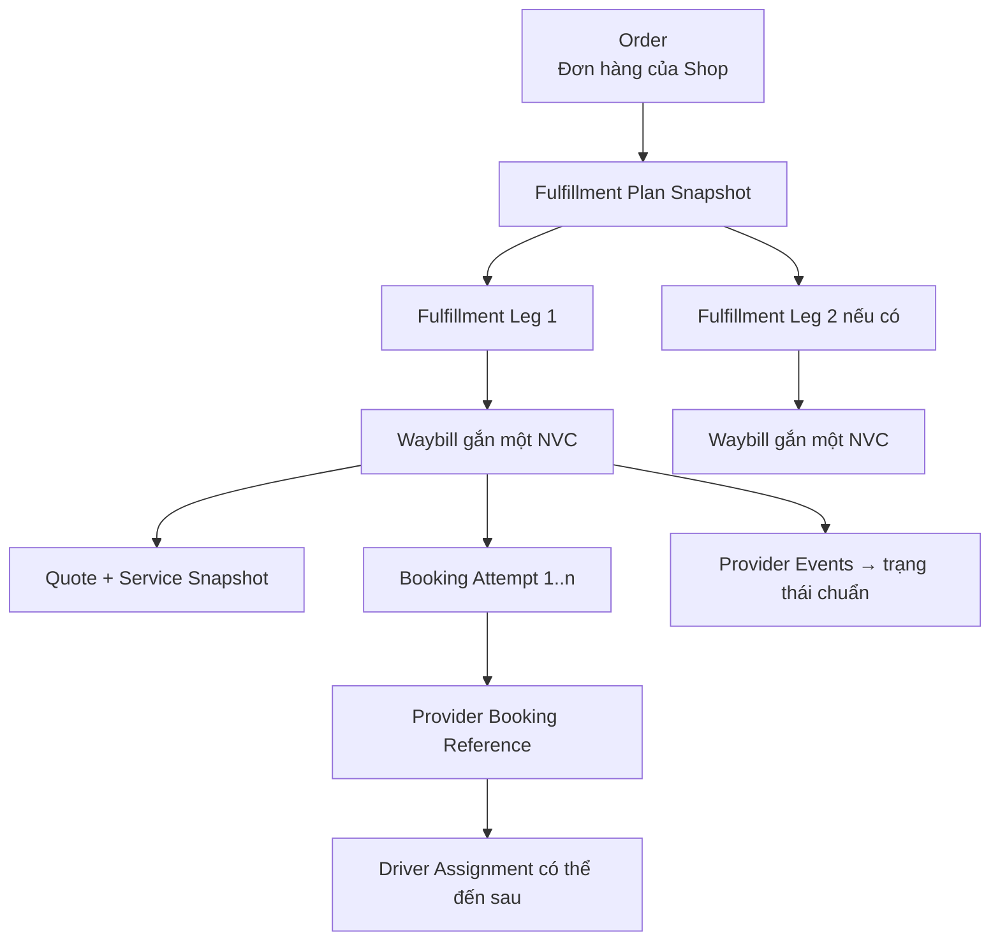
```mermaid
flowchart TD
    O["Order\nĐơn hàng của Shop"] --> FP["Fulfillment Plan Snapshot"]
    FP --> L1["Fulfillment Leg 1"]
    FP --> L2["Fulfillment Leg 2 nếu có"]
    L1 --> W1["Waybill gắn một NVC"]
    L2 --> W2["Waybill gắn một NVC"]
    W1 --> Q1["Quote + Service Snapshot"]
    W1 --> B1["Booking Attempt 1..n"]
    B1 --> R1["Provider Booking Reference"]
    R1 --> D1["Driver Assignment có thể đến sau"]
    W1 --> E1["Provider Events → trạng thái chuẩn"]
```

- API tạo chuyến thành công có thể trả mã chuyến NVC trong lúc NVC vẫn đang tìm tài xế\. Nghĩa là chuyến đã tồn tại nhưng chưa có tài xế\. `CONFIRMED-PUBLIC` \[E\-GRAB\-API\]\[E\-GSM\-API\]

- Khi mã chuyến NVC đã được cấp, Vận đơn có thể được lưu ngay ở trạng thái đang điều phối; không cần đợi có tài xế\. `PROPOSED`

- Khi API tạo chuyến quá thời gian chờ hoặc kết quả chưa rõ, chỉ ghi nhận lần tạo chuyến là “chưa xác định” \(`UNKNOWN`\); không tạo mã NVC giả và không gọi lại thiếu kiểm soát\. `PROPOSED`, do NVC chưa cam kết cơ chế chống tạo trùng `TBD-CONTRACT` \[E\-CAP\]

- Việc NVC đã gán tài xế là một mốc của Vận đơn, không phải điều kiện duy nhất để Vận đơn tồn tại\. `PROPOSED`

## 2\.3\. Không tạo module Grab/Xanh SM riêng

Hai NVC được triển khai bằng adapter/provider plugin trong Carrier\. Khác biệt NVC phải nằm sau interface typed; Order chỉ dùng contract chuẩn hóa\. `PROPOSED` \[E\-SP\-EXT\]

Nếu SuperShip dùng Grab/Xanh SM để điều chuyển thuần nội bộ không gắn Order khách hàng, nên tạo `Operational Transport Job`; không tạo Order giả\. Chỉ cân nhắc module Dispatch riêng khi nghiệp vụ nội bộ đủ lớn\. `PROPOSED`

## 2\.4\. Kiến trúc một nền tảng cho hai loại hình vận chuyển

SuperPlatform phải phục vụ đồng thời:

|**Nội dung**|**Vận chuyển mạng lưới**|**Vận chuyển giao tức thời theo nhu cầu**|
|---|---|---|
|Ví dụ|SuperShip, GHN, J\&T, BEST, VNPost|GrabExpress, Green SM Express|
|Mô hình vật lý|Pickup → kho/hub/chia chọn → tuyến vận tải → giao|Pickup → tài xế → drop\-off trực tiếp|
|Phạm vi điển hình|Nội tỉnh, liên tỉnh, toàn quốc|Nội thành/nội vùng theo serviceability động|
|Cơ chế nhận đơn|NVC nhận bưu gửi theo mạng lưới/ca lấy|NVC phải tìm tài xế tại hoặc gần thời điểm yêu cầu|
|Kiểm tra trước tạo|Tuyến, dịch vụ, bảng giá, địa bàn|Hai đầu tọa độ, service, quote, account, thời gian và availability|
|Giá|Thường theo bảng giá/vùng/khối lượng|Quote theo tuyến, thời điểm, phương tiện và có thể biến động|
|Trạng thái đặc thù|Kho, trung chuyển, bưu cục, giao lại|Đang tìm tài xế, không tìm được tài xế, tài xế hủy/tái điều phối|
|Rủi ro chính|Sai tuyến, chậm qua mạng, sai lệch cân/phí|Không có tài xế, quote hết hạn, booking timeout, giá thay đổi|
|Điểm chung trên SuperPlatform|Order → Fulfillment Leg → Waybill → trạng thái chuẩn → tài chính/hỗ trợ/báo cáo|Order → Fulfillment Leg → Waybill → trạng thái chuẩn → tài chính/hỗ trợ/báo cáo|

SuperPlatform không buộc hai loại hình có cùng raw lifecycle\. Nền tảng chỉ yêu cầu chúng triển khai cùng một contract chuẩn ở ranh giới Carrier:

```Plaintext
Kiểm tra khả dụng
→ Báo giá hoặc trả căn cứ tính giá
→ Tạo booking/vận đơn
→ Đọc trạng thái
→ Hủy khi được phép
→ Phát sự kiện chuẩn hóa
→ Cung cấp bằng chứng/chi phí khi capability hỗ trợ
```

Module Order không được chứa nhánh `if Grab`, `if GreenSM`, `if GHN`\. Order chỉ hiểu `fulfillment_mode`, capability, Delivery Option, Booking Attempt, Waybill và normalized event\. Provider mới chỉ cần:

1. khai báo service/capability;

2. triển khai adapter contract;

3. khai báo status mapping;

4. vượt contract test;

5. được bật bởi System Configuration và Shipping Configuration\.

Đây là điều kiện để SuperPlatform mở rộng từ giao mạng lưới sang giao hỏa tốc mà không hình thành hai hệ thống tách biệt\. `PROPOSED`, dựa trên boundary module và extension architecture \[E\-SP\-ARCH\]\[E\-SP\-EXT\]

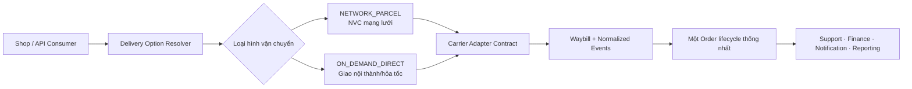
```mermaid
flowchart LR
    UI["Shop / API Consumer"] --> OPT["Delivery Option Resolver"]
    OPT --> MODE{"Loại hình vận chuyển"}
    MODE --> NET["NETWORK_PARCEL\nNVC mạng lưới"]
    MODE --> ODD["ON_DEMAND_DIRECT\nGiao nội thành/hỏa tốc"]
    NET --> CA["Carrier Adapter Contract"]
    ODD --> CA
    CA --> W["Waybill + Normalized Events"]
    W --> O["Một Order lifecycle thống nhất"]
    O --> CONS["Support · Finance · Notification · Reporting"]
```

# 3\. LUỒNG NGHIỆP VỤ ĐẦU–CUỐI ĐƯỢC ĐỀ XUẤT

## 3\.1\. Tìm và hiển thị phương án vận chuyển

```Plaintext
1. Order/BFF nhận dữ liệu tạo đơn
2. User xác nhận Shop, quyền và Data Scope
3. Address chuẩn hóa địa chỉ, trả mã địa chỉ + tọa độ
4. Shipping Configuration kiểm tra tính năng đã bật cho App, mô hình khách hàng,
   Shop và điểm lấy; sau đó Availability Policy loại NVC/service đang PAUSED/BLOCKED
5. Carrier kiểm tra health, serviceability và lấy quote từng service còn lại
6. Pricing tính giá bán/markup/ưu đãi từ carrier quote hợp lệ
7. Order/BFF chỉ trả Delivery Options đạt điều kiện cho giao diện
```

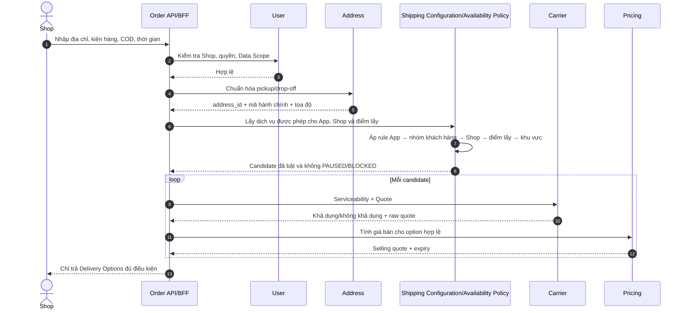
```mermaid
sequenceDiagram
    autonumber
    actor Shop
    participant API as Order API/BFF
    participant User
    participant Address
    participant Config as Shipping Configuration/Availability Policy
    participant Carrier
    participant Pricing

    Shop->>API: Nhập địa chỉ, kiện hàng, COD, thời gian
    API->>User: Kiểm tra Shop, quyền, Data Scope
    User-->>API: Hợp lệ
    API->>Address: Chuẩn hóa pickup/drop-off
    Address-->>API: address_id + mã hành chính + tọa độ
    API->>Config: Lấy dịch vụ được phép cho App, Shop và điểm lấy
    Config->>Config: Áp rule App → nhóm khách hàng → Shop → điểm lấy → khu vực
    Config-->>API: Candidate đã bật và không PAUSED/BLOCKED
    loop Mỗi candidate
        API->>Carrier: Serviceability + Quote
        Carrier-->>API: Khả dụng/không khả dụng + raw quote
        API->>Pricing: Tính giá bán cho option hợp lệ
        Pricing-->>API: Selling quote + expiry
    end
    API-->>Shop: Chỉ trả Delivery Options đủ điều kiện
```

Grab không công bố endpoint serviceability riêng; Quote là phép thử khả dụng gần nhất nhưng quote thành công không bảo đảm có tài xế\. Green SM có `list-available-services`, sau đó vẫn phải `estimate/order`\. `CONFIRMED-PUBLIC` \[E\-COV\]\[E\-CAP\]

Không module nào được suy khả dụng chỉ từ tỉnh/thành phố\. Hai đầu tuyến, tọa độ, thời gian, service, kiện hàng, COD, Carrier Account và phản hồi provider đều tham gia quyết định\. `CONFIRMED-PUBLIC` \[E\-COV\]

### 3\.1\.1\. Chính sách bật/tắt theo khu vực

SuperPlatform **nên hỗ trợ cấu hình theo tỉnh**, nhưng tỉnh chỉ là một cấp trong chính sách khu vực, không phải bằng chứng cuối cùng rằng NVC chắc chắn phục vụ được Order\. `PROPOSED`, dựa trên việc vùng công bố và khả năng runtime có thể khác nhau \[E\-COV\]

Phạm vi cấu hình nên hỗ trợ từ rộng tới hẹp:

```Plaintext
Toàn quốc
└── Tỉnh/Thành phố
    └── Quận/Huyện
        └── Phường/Xã hoặc vùng tọa độ/geofence
            └── Điểm lấy hàng cụ thể
```

Quy tắc ở phạm vi hẹp được ưu tiên hơn quy tắc ở phạm vi rộng\. Mỗi quy tắc gắn với tài khoản NVC, dịch vụ, ứng dụng và mô hình khách hàng \(`carrier_account + service + application + customer_type`\), đồng thời có thời gian hiệu lực, người thay đổi và lý do\. Ví dụ có thể bật Green SM tại TP\.HCM nhưng tắt riêng một huyện, một vùng tọa độ hoặc một điểm lấy có tỷ lệ tạo chuyến thấp\.

Trạng thái chính sách khu vực:

|**Trạng thái**|**Ý nghĩa**|**Hành vi khi lấy phương án**|
|---|---|---|
|`ENABLED`|Được phép kiểm tra khả năng phục vụ tại thời điểm hiện tại\.|Tiếp tục gọi API kiểm tra khả năng phục vụ và báo giá\.|
|`DEGRADED`|Hiệu quả thấp nhưng chưa đủ căn cứ để tắt\.|Giảm ưu tiên, cảnh báo bộ phận vận hành; chỉ hiển thị nếu kiểm tra thực tế đạt và chính sách cho phép\.|
|`PAUSED`|Tạm ngừng nhận Order mới tại phạm vi đó\.|Không gọi quote và không hiển thị option; booking đang chạy vẫn tiếp tục theo dõi\.|
|`BLOCKED`|Không được kinh doanh hoặc không được hợp đồng hỗ trợ\.|Loại hoàn toàn cho đến khi có quyết định mới\.|

### 3\.1\.2\. Dùng dữ liệu thực tế để giảm đơn tạo thất bại

Module Báo cáo phải tính theo một khoảng thời gian xác định và đúng tổ hợp “NVC \+ dịch vụ \+ phương tiện \+ khu vực lấy \+ khu vực giao \+ khung giờ \+ tài khoản NVC”:

- số lần kiểm tra và có quote;

- tỷ lệ Create được NVC chấp nhận;

- tỷ lệ phân được tài xế;

- thời gian phân tài xế;

- tỷ lệ `NO_DRIVER_AVAILABLE`;

- tỷ lệ NVC/tài xế hủy trước pickup;

- số mẫu và độ mới của dữ liệu\.

Không tự động tắt chỉ vì “có ít đơn thành công”\. Phải phân biệt tỷ lệ thấp do ít mẫu, lỗi tích hợp, account chưa được cấp quyền, ngoài vùng, giờ cao điểm hay thực sự thiếu tài xế\. `PROPOSED`

Quy tắc tự động phải có:

- ngưỡng số mẫu tối thiểu;

- cửa sổ thời gian trượt, ví dụ luôn tính trên 7 ngày gần nhất;

- ngưỡng chuyển `ENABLED → DEGRADED → PAUSED`;

- ngưỡng bật lại khác ngưỡng tạm dừng để tránh bật/tắt liên tục;

- thời gian chờ tối thiểu trước khi đánh giá lại;

- khả năng can thiệp thủ công, kèm lý do, người phê duyệt và nhật ký thay đổi;

- cơ chế kiểm tra thăm dò có kiểm soát hoặc rà soát thủ công trước khi bật lại\.

Giai đoạn đầu chỉ nên **cảnh báo và đề xuất tạm dừng \(****`PAUSED`****\) để bộ phận vận hành phê duyệt**\. Chỉ tự động tạm dừng sau khi dữ liệu và ngưỡng đã được nghiệm thu\. Đây là cơ chế bảo vệ trải nghiệm, không phải cam kết chắc chắn có tài xế: kiểm tra khả năng phục vụ và báo giá thành công vẫn có thể không tìm được tài xế\. `PROPOSED`, căn cứ giới hạn đã xác nhận \[E\-COV\]\[E\-CAP\]

### 3\.1\.3\. Điều kiện hiển thị một phương án vận chuyển cho khách hàng

Một phương án vận chuyển \(`Delivery Option`\) chỉ được hiển thị khi đồng thời:

1. NVC/service được hợp đồng và capability account cho phép;

2. System Configuration không tắt toàn cục;

3. ứng dụng đang tạo đơn được bật loại hình giao tức thời;

4. mô hình khách hàng của Shop được phép sử dụng;

5. Shop đã được bật tính năng và được phép dùng NVC/service tương ứng;

6. điểm lấy đang chọn không tắt hoặc ghi đè loại bỏ NVC/service đó;

7. Shipping Configuration không `PAUSED/BLOCKED` tại khu vực, Shop hoặc điểm lấy;

8. kết nối NVC đang ổn định và cơ chế tạm ngắt khi NVC lỗi \(`circuit breaker`\) cho phép gọi;

9. kiểm tra khả năng phục vụ và báo giá tại thời điểm hiện tại thành công;

10. giá và báo giá còn hiệu lực;

11. chính sách khả dụng không loại phương án theo quy tắc đã được phê duyệt\.

#### Cấu hình bật/tắt theo ứng dụng, Shop và điểm lấy

Không phải mọi Shop và mọi App đều mặc định nhìn thấy GrabExpress/Green SM\. Việc bật tính năng thuộc **Shipping Configuration** và phải hỗ trợ các cấp sau:

|Cấp cấu hình|Câu hỏi cần trả lời|Ví dụ|
|---|---|---|
|Toàn hệ thống|SuperPlatform có cho phép phát sinh chuyến mới với NVC này không?|Green SM bị tắt khẩn cấp do sự cố toàn hệ thống|
|Ứng dụng|App nào được phép cung cấp loại hình giao này?|App SuperAI bật Grab/Green SM; App SuperShip chưa bật|
|Mô hình khách hàng|Nhóm khách hàng nào trong App được dùng?|Khách hàng SuperAI được tự chọn; khách hàng toàn quốc chưa áp dụng|
|Shop|Shop cụ thể đã được cấp tính năng chưa?|Shop A được pilot; Shop B không nhìn thấy lựa chọn|
|Điểm lấy|Điểm lấy nào của Shop được dùng hoặc bị loại trừ?|Shop A bật tính năng nhưng kho A được dùng Grab, kho B chỉ dùng Green SM|
|NVC và dịch vụ|Tại cấp trên, NVC/service nào được phép?|Cho phép Green SM xe máy nhưng chưa bật dịch vụ ô tô|
|Khu vực và thời gian|Tuyến/khung giờ hiện tại có bị tạm dừng không?|Tạm ẩn Grab tại một phường vào giờ thường xuyên thiếu tài xế|

Quy tắc kế thừa và ghi đè:

1. **Tắt toàn hệ thống là khóa an toàn cao nhất:** cấp dưới không được tự bật lại\.

2. **App chưa bật thì Shop thuộc App đó không được nhìn thấy tính năng:** không gọi quote chỉ để rồi loại bỏ sau\.

3. **Shop phải được bật rõ ràng hoặc kế thừa từ nhóm Shop đã được phê duyệt:** giai đoạn pilot nên mặc định không bật cho Shop mới\.

4. **Điểm lấy được phép thu hẹp cấu hình của Shop:** Shop đã bật Grab/Green SM nhưng một kho cụ thể có thể tắt Grab hoặc chỉ giữ Green SM\.

5. **Muốn chỉ bật cho một điểm lấy:** bật tính năng cho Shop, đặt mặc định các điểm lấy là không sử dụng, sau đó bật riêng điểm được phép\. Không dùng điểm lấy để vượt qua một Shop đang bị khóa\.

6. **Rule an toàn luôn thắng rule kinh doanh:** dù App/Shop/điểm lấy đã bật, option vẫn bị ẩn nếu account không có quyền, khu vực bị `PAUSED/BLOCKED`, NVC đang lỗi hoặc quote runtime thất bại\.

Ba trạng thái cấu hình dễ hiểu nên dùng tại App, Shop và điểm lấy:

|Trạng thái|Ý nghĩa|
|---|---|
|`INHERIT` – Kế thừa|Không quyết định riêng; áp dụng cấu hình của cấp trên|
|`ENABLED` – Bật|Được phép xét tiếp các điều kiện NVC, khu vực và runtime|
|`DISABLED` – Tắt|Không hiển thị và không gọi quote/create cho phạm vi này|

Ví dụ quyết định:

```Plaintext
App SuperAI: ENABLED
└── Nhóm khách hàng SuperAI: ENABLED
    ├── Shop A: ENABLED
    │   ├── Kho Quận 1: Grab + Green SM
    │   └── Kho Bình Chánh: chỉ Green SM
    └── Shop B: DISABLED

App SuperShip: DISABLED
└── Mọi Shop thuộc App SuperShip: không hiển thị Grab/Green SM
```

Kết quả kiểm tra phải trả về cả quyết định và lý do, ví dụ “không hiển thị vì App chưa bật”, “Shop chưa được cấp tính năng” hoặc “điểm lấy đã tắt Grab”\. Nhờ đó CSKH và vận hành biết cần sửa cấu hình nào, thay vì chỉ nhận thông báo chung “không có dịch vụ”\.

Nếu không còn phương án on\-demand đủ điều kiện, giao diện phải đề xuất NVC khác hoặc thông báo chưa có phương án phù hợp **trước khi tạo Order/booking**, thay vì cho khách hàng chọn một option đã biết có xác suất thất bại cao\. `PROPOSED`

## 3\.2\. Tạo đơn hàng và yêu cầu NVC tạo chuyến

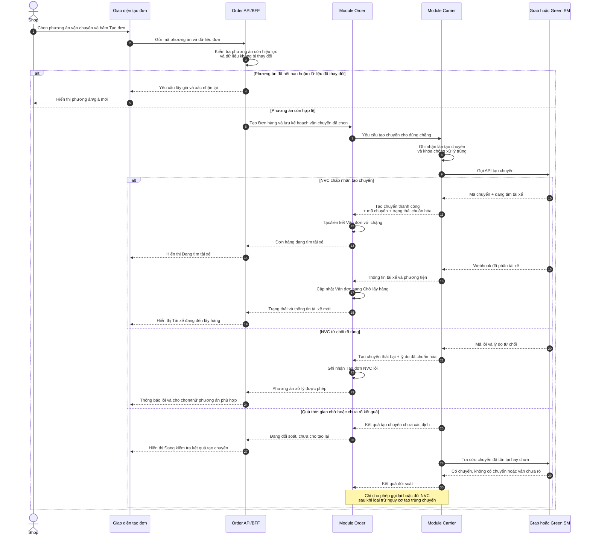
```mermaid
sequenceDiagram
    autonumber
    actor Shop
    participant UI as Giao diện tạo đơn
    participant API as Order API/BFF
    participant ORD as Module Order
    participant CAR as Module Carrier
    participant NVC as Grab hoặc Green SM

    Shop->>UI: Chọn phương án vận chuyển và bấm Tạo đơn
    UI->>API: Gửi mã phương án và dữ liệu đơn
    API->>API: Kiểm tra phương án còn hiệu lực<br/>và dữ liệu không bị thay đổi

    alt Phương án đã hết hạn hoặc dữ liệu đã thay đổi
        API-->>UI: Yêu cầu lấy giá và xác nhận lại
        UI-->>Shop: Hiển thị phương án/giá mới
    else Phương án còn hợp lệ
        API->>ORD: Tạo Đơn hàng và lưu kế hoạch vận chuyển đã chọn
        ORD->>CAR: Yêu cầu tạo chuyến cho đúng chặng
        CAR->>CAR: Ghi nhận lần tạo chuyến<br/>và khóa chống xử lý trùng
        CAR->>NVC: Gọi API tạo chuyến

        alt NVC chấp nhận tạo chuyến
            NVC-->>CAR: Mã chuyến + đang tìm tài xế
            CAR-->>ORD: Tạo chuyến thành công<br/>+ mã chuyến + trạng thái chuẩn hóa
            ORD->>ORD: Tạo/liên kết Vận đơn với chặng
            ORD-->>API: Đơn hàng đang tìm tài xế
            API-->>UI: Hiển thị Đang tìm tài xế

            NVC-->>CAR: Webhook đã phân tài xế
            CAR-->>ORD: Thông tin tài xế và phương tiện
            ORD->>ORD: Cập nhật Vận đơn sang Chờ lấy hàng
            ORD-->>API: Trạng thái và thông tin tài xế mới
            API-->>UI: Hiển thị Tài xế đang đến lấy hàng
        else NVC từ chối rõ ràng
            NVC-->>CAR: Mã lỗi và lý do từ chối
            CAR-->>ORD: Tạo chuyến thất bại + lý do đã chuẩn hóa
            ORD->>ORD: Ghi nhận Tạo đơn NVC lỗi
            ORD-->>API: Phương án xử lý được phép
            API-->>UI: Thông báo lỗi và cho chọn/thử phương án phù hợp
        else Quá thời gian chờ hoặc chưa rõ kết quả
            CAR-->>ORD: Kết quả tạo chuyến chưa xác định
            ORD-->>API: Đang đối soát, chưa cho tạo lại
            API-->>UI: Hiển thị Đang kiểm tra kết quả tạo chuyến
            CAR->>NVC: Tra cứu chuyến đã tồn tại hay chưa
            NVC-->>CAR: Có chuyến, không có chuyến hoặc vẫn chưa rõ
            CAR-->>ORD: Kết quả đối soát
            Note over ORD,CAR: Chỉ cho phép gọi lại hoặc đổi NVC<br/>sau khi loại trừ nguy cơ tạo trùng chuyến
        end
    end
```

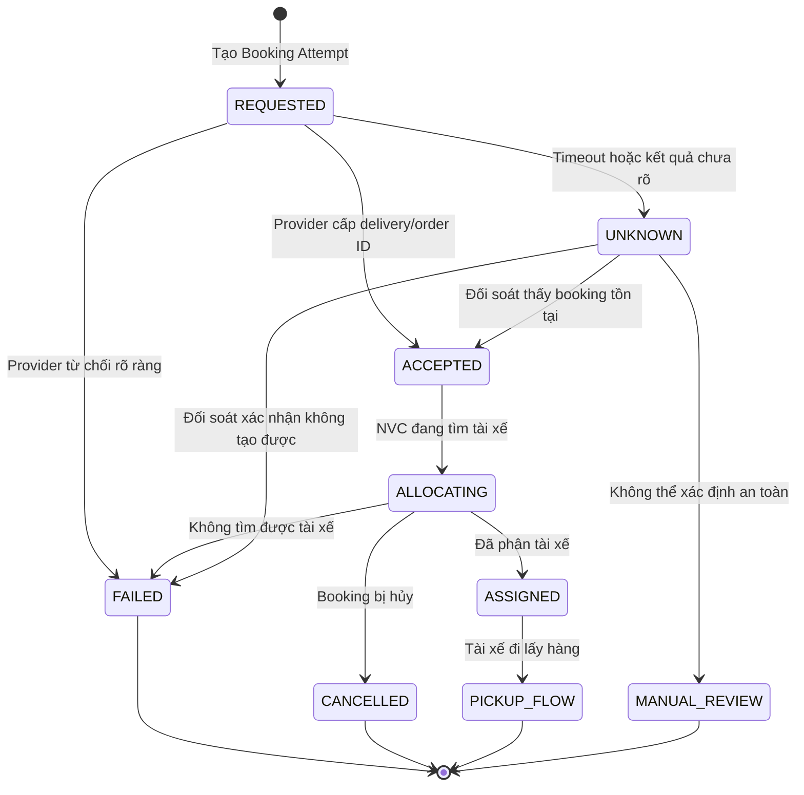
```mermaid
stateDiagram-v2
    [*] --> REQUESTED: Tạo Booking Attempt
    REQUESTED --> ACCEPTED: Provider cấp delivery/order ID
    REQUESTED --> FAILED: Provider từ chối rõ ràng
    REQUESTED --> UNKNOWN: Timeout hoặc kết quả chưa rõ

    ACCEPTED --> ALLOCATING: NVC đang tìm tài xế
    ALLOCATING --> ASSIGNED: Đã phân tài xế
    ALLOCATING --> FAILED: Không tìm được tài xế
    ALLOCATING --> CANCELLED: Booking bị hủy
    ASSIGNED --> PICKUP_FLOW: Tài xế đi lấy hàng

    UNKNOWN --> ACCEPTED: Đối soát thấy booking tồn tại
    UNKNOWN --> FAILED: Đối soát xác nhận không tạo được
    UNKNOWN --> MANUAL_REVIEW: Không thể xác định an toàn

    FAILED --> [*]
    CANCELLED --> [*]
    PICKUP_FLOW --> [*]
    MANUAL_REVIEW --> [*]
```

Sơ đồ trên mô tả vòng đời chuẩn của một lần yêu cầu NVC tạo chuyến \(`Booking Attempt`\), không phải trạng thái gốc của riêng một NVC\. `ACCEPTED` nghĩa là NVC đã cấp mã chuyến; `ASSIGNED` mới có nghĩa đã có tài xế\. Không được gộp hai trạng thái này\. `PROPOSED`, dựa trên vòng đời tạo chuyến và tìm tài xế đã xác nhận \[E\-GRAB\-API\]\[E\-GSM\-API\]

Quote hết hạn hoặc địa chỉ, thời gian, kiện hàng, COD hay service thay đổi thì phải kiểm tra và báo giá lại\. Green SM xác nhận `fee_id`/`expires_at`; TTL/quote identity của Grab còn phải xác nhận\. `CONFIRMED-PUBLIC/TBD-CONTRACT` \[E\-GSM\-API\]\[E\-GRAB\-RES\]

## 3\.3\. Chuyển sang phương án dự phòng an toàn

Chỉ fallback khi provider trả thất bại terminal rõ ràng, booking cũ đã hủy thành công hoặc đã đối soát chắc chắn booking cũ không tồn tại\. Không fallback tự động nếu Create timeout, vì public contract của cả hai NVC chưa xác nhận idempotency Create\. `TBD-CONTRACT` \[E\-CAP\]

Nếu phương án dự phòng đổi giá, ETA, phương tiện, COD hoặc điều kiện dịch vụ vượt ngưỡng Shop đã chấp thuận, phải xin xác nhận lại\. `PROPOSED`

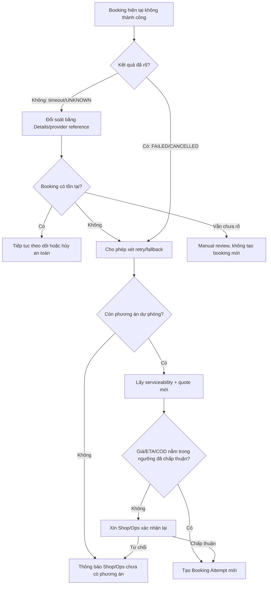
```mermaid
flowchart TD
    A["Booking hiện tại không thành công"] --> B{"Kết quả đã rõ?"}
    B -->|"Không: timeout/UNKNOWN"| C["Đối soát bằng Details/provider reference"]
    C --> D{"Booking có tồn tại?"}
    D -->|"Có"| E["Tiếp tục theo dõi hoặc hủy an toàn"]
    D -->|"Không"| F["Cho phép xét retry/fallback"]
    D -->|"Vẫn chưa rõ"| G["Manual review, không tạo booking mới"]
    B -->|"Có: FAILED/CANCELLED"| F
    F --> H{"Còn phương án dự phòng?"}
    H -->|"Không"| I["Thông báo Shop/Ops chưa có phương án"]
    H -->|"Có"| J["Lấy serviceability + quote mới"]
    J --> K{"Giá/ETA/COD nằm trong ngưỡng đã chấp thuận?"}
    K -->|"Có"| L["Tạo Booking Attempt mới"]
    K -->|"Không"| M["Xin Shop/Ops xác nhận lại"]
    M -->|"Chấp thuận"| L
    M -->|"Từ chối"| I
```

## 3\.4\. Theo dõi, giao thất bại và hoàn

- Webhook là nguồn cập nhật nhanh; polling Details là cơ chế đối soát, không gọi dồn dập\. `PROPOSED`, dựa trên API Details/webhook \[E\-GRAB\-API\]\[E\-GSM\-API\]

- Event phải idempotent, chấp nhận trùng và sai thứ tự\. Green SM công khai thừa nhận khả năng này; Grab chưa công bố sequence/retry contract\. `CONFIRMED-PUBLIC/TBD-CONTRACT` \[E\-CAP\]

- Raw event phải được lưu trước khi map trạng thái chuẩn\. `PROPOSED`

- Grab có kết quả `RETURNED` trong lifecycle được cung cấp; Green SM có point/return flow\. Public API chưa chứng minh endpoint chủ động tạo return/redelivery tương đương NVC mạng lưới\. Không tự bổ sung raw status trung gian như `IN_RETURN` nếu contract thực tế không trả\. `CONFIRMED-PUBLIC/TBD-CONTRACT` \[E\-GRAB\-RES\]\[E\-GSM\-RES\]

- Không hiển thị action “Yêu cầu giao lại/chủ động hoàn” nếu capability của account/service chưa được xác nhận\. `PROPOSED`

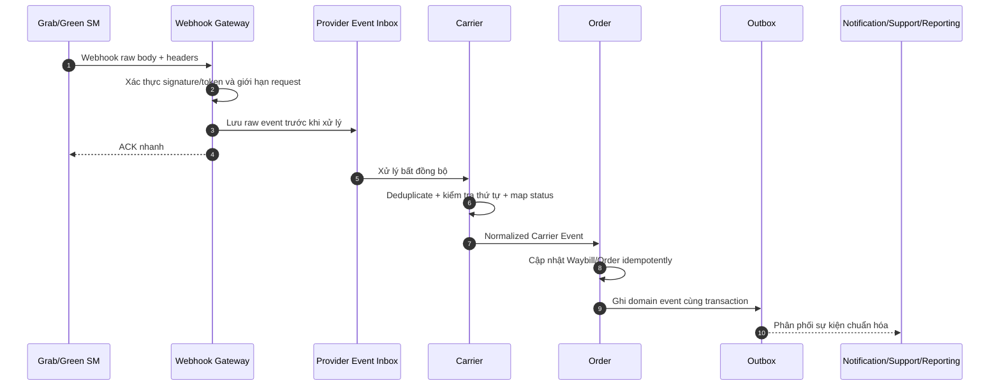
```mermaid
sequenceDiagram
    autonumber
    participant NVC as Grab/Green SM
    participant WH as Webhook Gateway
    participant Inbox as Provider Event Inbox
    participant Carrier
    participant Order
    participant Outbox
    participant Consumers as Notification/Support/Reporting

    NVC->>WH: Webhook raw body + headers
    WH->>WH: Xác thực signature/token và giới hạn request
    WH->>Inbox: Lưu raw event trước khi xử lý
    WH-->>NVC: ACK nhanh
    Inbox->>Carrier: Xử lý bất đồng bộ
    Carrier->>Carrier: Deduplicate + kiểm tra thứ tự + map status
    Carrier->>Order: Normalized Carrier Event
    Order->>Order: Cập nhật Waybill/Order idempotently
    Order->>Outbox: Ghi domain event cùng transaction
    Outbox-->>Consumers: Phân phối sự kiện chuẩn hóa
```

## 3\.5\. Vòng đời trạng thái và nguyên tắc ánh xạ

### 3\.5\.1\. Trạng thái chuẩn SuperPlatform

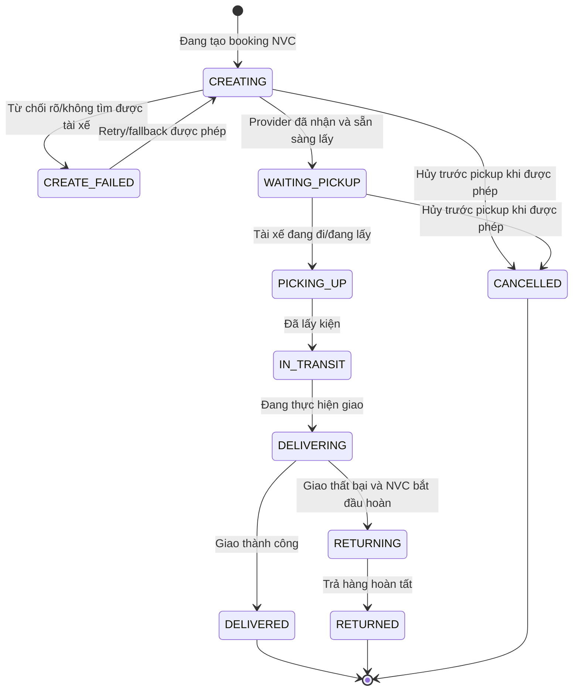
```mermaid
stateDiagram-v2
    [*] --> CREATING: Đang tạo booking NVC
    CREATING --> CREATE_FAILED: Từ chối rõ/không tìm được tài xế
    CREATE_FAILED --> CREATING: Retry/fallback được phép
    CREATING --> WAITING_PICKUP: Provider đã nhận và sẵn sàng lấy
    WAITING_PICKUP --> PICKING_UP: Tài xế đang đi/đang lấy
    PICKING_UP --> IN_TRANSIT: Đã lấy kiện
    IN_TRANSIT --> DELIVERING: Đang thực hiện giao
    DELIVERING --> DELIVERED: Giao thành công
    DELIVERING --> RETURNING: Giao thất bại và NVC bắt đầu hoàn
    RETURNING --> RETURNED: Trả hàng hoàn tất
    CREATING --> CANCELLED: Hủy trước pickup khi được phép
    WAITING_PICKUP --> CANCELLED: Hủy trước pickup khi được phép
    DELIVERED --> [*]
    RETURNED --> [*]
    CANCELLED --> [*]
```

Đây là luồng khái niệm để người đọc hiểu\. Khi triển khai phải dùng mã SPF đã được baseline Order phê duyệt; không tự tạo mã trạng thái mới từ tên trong sơ đồ\. Raw status, Booking Attempt status, Waybill status và Order\-level status là bốn lớp khác nhau, không map 1:1\. `CONFIRMED-BASELINE/PROPOSED` \[E\-OND\]\[E\-SP\-ARCH\]

### 3\.5\.2\. Vòng đời trạng thái gốc của GrabExpress

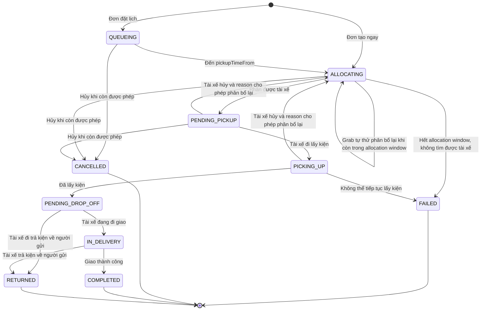
```mermaid
stateDiagram-v2
    [*] --> QUEUEING: Đơn đặt lịch
    [*] --> ALLOCATING: Đơn tạo ngay
    QUEUEING --> ALLOCATING: Đến pickupTimeFrom
    ALLOCATING --> ALLOCATING: Grab tự thử phân bổ lại khi còn trong allocation window
    ALLOCATING --> PENDING_PICKUP: Phân được tài xế
    ALLOCATING --> FAILED: Hết allocation window, không tìm được tài xế
    PENDING_PICKUP --> ALLOCATING: Tài xế hủy và reason cho phép phân bổ lại
    PENDING_PICKUP --> PICKING_UP: Tài xế đi lấy kiện
    PICKING_UP --> ALLOCATING: Tài xế hủy và reason cho phép phân bổ lại
    PICKING_UP --> FAILED: Không thể tiếp tục lấy kiện
    PICKING_UP --> PENDING_DROP_OFF: Đã lấy kiện
    PENDING_DROP_OFF --> IN_DELIVERY: Tài xế đang đi giao
    PENDING_DROP_OFF --> RETURNED: Tài xế đi trả kiện về người gửi
    IN_DELIVERY --> COMPLETED: Giao thành công
    IN_DELIVERY --> RETURNED: Tài xế trả kiện về người gửi
    QUEUEING --> CANCELLED: Hủy khi còn được phép
    ALLOCATING --> CANCELLED: Hủy khi còn được phép
    PENDING_PICKUP --> CANCELLED: Hủy khi còn được phép
    FAILED --> [*]
    CANCELLED --> [*]
    COMPLETED --> [*]
    RETURNED --> [*]
```

`ALLOCATING → ALLOCATING` là retry nội bộ của Grab trong `allocation window`, không phải SuperPlatform gọi lại Create\. Grab chưa công bố số lần thử hoặc độ dài cửa sổ; tuyệt đối không tự đặt con số\. Sau `FAILED`, API công khai không có thao tác yêu cầu tìm lại tài xế cho cùng delivery; muốn thử lại phải tạo delivery mới sau khi đã xác nhận delivery cũ terminal\. Grab công bố cả biến thể `CANCELED` và `CANCELLED`; Carrier phải normalize và xác nhận enum canonical với Grab\. Việc hủy chủ động chỉ áp dụng trước khi kiện đã được lấy\. `CONFIRMED-PUBLIC/TBD-CONTRACT` \[E\-GRAB\-API\]\[E\-GRAB\-RES\]\[E\-CAP\]

### 3\.5\.3\. Vòng đời trạng thái gốc của Green SM Express

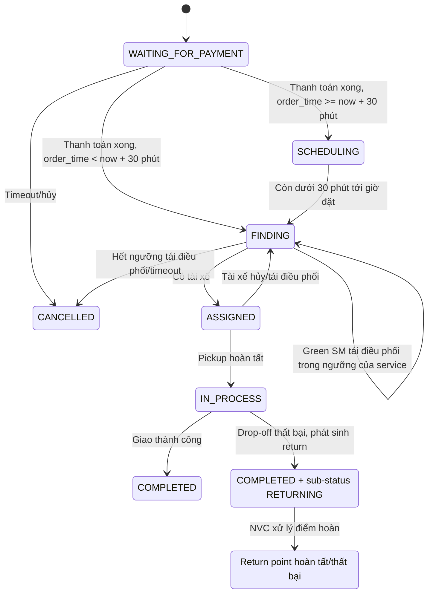
```mermaid
stateDiagram-v2
    [*] --> WAITING_FOR_PAYMENT
    WAITING_FOR_PAYMENT --> FINDING: Thanh toán xong, order_time < now + 30 phút
    WAITING_FOR_PAYMENT --> SCHEDULING: Thanh toán xong, order_time >= now + 30 phút
    WAITING_FOR_PAYMENT --> CANCELLED: Timeout/hủy
    SCHEDULING --> FINDING: Còn dưới 30 phút tới giờ đặt
    FINDING --> ASSIGNED: Có tài xế
    FINDING --> FINDING: Green SM tái điều phối trong ngưỡng của service
    FINDING --> CANCELLED: Hết ngưỡng tái điều phối/timeout
    ASSIGNED --> FINDING: Tài xế hủy/tái điều phối
    ASSIGNED --> IN_PROCESS: Pickup hoàn tất
    IN_PROCESS --> COMPLETED: Giao thành công
    state "COMPLETED + sub-status RETURNING" as COMPLETED_RETURNING
    state "Return point hoàn tất/thất bại" as RETURN_POINT_RESULT
    IN_PROCESS --> COMPLETED_RETURNING: Drop-off thất bại, phát sinh return
    COMPLETED_RETURNING --> RETURN_POINT_RESULT: NVC xử lý điểm hoàn
```

Ngưỡng `30 phút` được tài liệu Green SM mô tả trực tiếp\. Riêng số lần tái điều phối đang mâu thuẫn: một sơ đồ dùng điều kiện `retry_counts <= 2`, trong khi dữ liệu service mẫu trả `re_dispatch_counts = 4`\. Vì vậy số lần phải lấy theo cấu hình service/contract thực tế; không hard\-code `2` hoặc `4`\. Điểm giao nhận còn có lifecycle riêng `CREATED → ARRIVING → NEARED → NEARED_50M → ARRIVED → COMPLETED/FAILED`\. Không được chỉ nhìn `order.status = COMPLETED`: phải kiểm tra sub\-status, loại point và return point để biết hàng đã kết thúc vật lý hay còn đang hoàn\. `CONFIRMED-PUBLIC/CONFLICTING` \[E\-GSM\-API\]\[E\-GSM\-RES\]\[E\-CAP\]

### 3\.5\.4\. Chính thức hóa hai trạng thái tìm tài xế

Hai trạng thái sau phải được giữ trong bộ trạng thái chuẩn để Shop và CSKH phân biệt chính xác giai đoạn trước pickup:

|Mã|Tên trạng thái|Khi vào|Khi ra|Tính chất|
|---|---|---|---|---|
|`SPF-0302`|Đang tìm tài xế|NVC thực sự bắt đầu allocation: Grab `ALLOCATING`, Green SM `FINDING`|Có tài xế, thất bại terminal, hủy hoặc chuyển sang phương án khác|Đang xử lý, chưa terminal|
|`SPF-0303`|Không tìm được tài xế|Tất cả retry/fallback tự động đã hết hoặc cần Shop/CS can thiệp|Shop retry, chọn/chấp nhận phương án khác hoặc hủy Order|Ngoại lệ cần hành động, chưa nhất thiết terminal của Order|

Không chuyển Order sang `SPF-0303` chỉ vì một tài xế hủy hoặc một Booking Attempt thất bại:

- Grab quay lại `ALLOCATING` hoặc Green SM quay lại `FINDING` → giữ/chuyển về `SPF-0302`\.

- Grab thất bại nhưng hệ thống đang thử Green SM → Order vẫn `SPF-0302`; thất bại Grab nằm trong Booking Attempt/Event Log\.

- Chỉ khi không còn phương án tự động hoặc policy yêu cầu người dùng quyết định mới chuyển `SPF-0303`\.

Phân biệt bắt buộc:

|**Tình huống**|**Trạng thái đúng**|
|---|---|
|API Create đang gửi hoặc timeout chưa rõ|`SPF-0101 — Đang tạo đơn NVC` hoặc trạng thái đối soát tương ứng; không kết luận thiếu tài xế|
|Provider booking đã tồn tại và đang allocation|`SPF-0302 — Đang tìm tài xế`|
|Có tài xế, đang chờ tới lượt pickup|`SPF-0301 — Chờ lấy hàng`|
|Tài xế đang đi/đã tới điểm lấy|`SPF-0401 — Đang lấy hàng`|
|Hết retry/fallback, không bố trí được tài xế|`SPF-0303 — Không tìm được tài xế`|
|Shop/CS chủ động hủy|`SPF-0201 — Đã hủy`|
|Lỗi kỹ thuật Create trước khi provider nhận booking|`SPF-0102 — Tạo đơn NVC lỗi`|

Green SM có thể trả cùng raw status `CANCELLED` cho ngữ cảnh khác nhau; Grab cũng có `FAILED/CANCELLED`\. Mapping phải xét `cancellation_actor`, failure reason, Booking Attempt, retry/fallback và giai đoạn hiện tại, không map chỉ theo tên raw status\. `CONFIRMED-PUBLIC/PROPOSED` \[E\-CAP\]\[E\-OND\]

## 3\.6\. Các luồng vận hành thực tế

### 3\.6\.1\. Giao trực tiếp Shop → Người nhận bằng GrabExpress

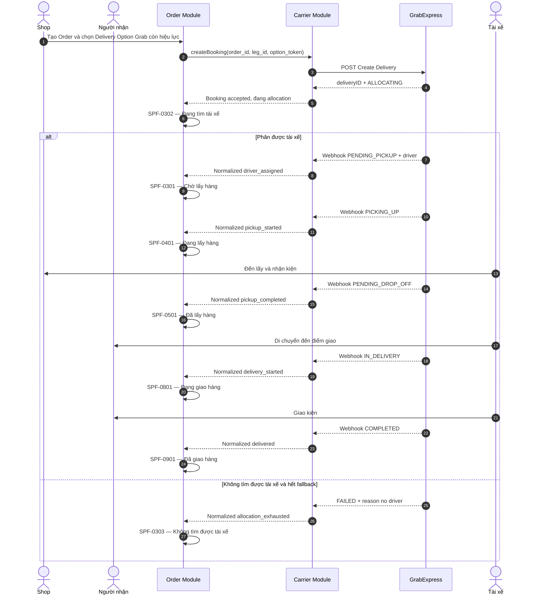
```mermaid
sequenceDiagram
    autonumber
    actor Shop
    actor Receiver as Người nhận
    participant ORD as Order Module
    participant CAR as Carrier Module
    participant GRAB as GrabExpress
    actor Driver as Tài xế

    Shop->>ORD: Tạo Order và chọn Delivery Option Grab còn hiệu lực
    ORD->>CAR: createBooking(order_id, leg_id, option_token)
    CAR->>GRAB: POST Create Delivery
    GRAB-->>CAR: deliveryID + ALLOCATING
    CAR-->>ORD: Booking accepted, đang allocation
    ORD->>ORD: SPF-0302 — Đang tìm tài xế

    alt Phân được tài xế
        GRAB-->>CAR: Webhook PENDING_PICKUP + driver
        CAR-->>ORD: Normalized driver_assigned
        ORD->>ORD: SPF-0301 — Chờ lấy hàng
        GRAB-->>CAR: Webhook PICKING_UP
        CAR-->>ORD: Normalized pickup_started
        ORD->>ORD: SPF-0401 — Đang lấy hàng
        Driver->>Shop: Đến lấy và nhận kiện
        GRAB-->>CAR: Webhook PENDING_DROP_OFF
        CAR-->>ORD: Normalized pickup_completed
        ORD->>ORD: SPF-0501 — Đã lấy hàng
        Driver->>Receiver: Di chuyển đến điểm giao
        GRAB-->>CAR: Webhook IN_DELIVERY
        CAR-->>ORD: Normalized delivery_started
        ORD->>ORD: SPF-0801 — Đang giao hàng
        Driver->>Receiver: Giao kiện
        GRAB-->>CAR: Webhook COMPLETED
        CAR-->>ORD: Normalized delivered
        ORD->>ORD: SPF-0901 — Đã giao hàng
    else Không tìm được tài xế và hết fallback
        GRAB-->>CAR: FAILED + reason no driver
        CAR-->>ORD: Normalized allocation_exhausted
        ORD->>ORD: SPF-0303 — Không tìm được tài xế
    end
```

### 3\.6\.2\. Giao trực tiếp Shop → Người nhận bằng Green SM Express

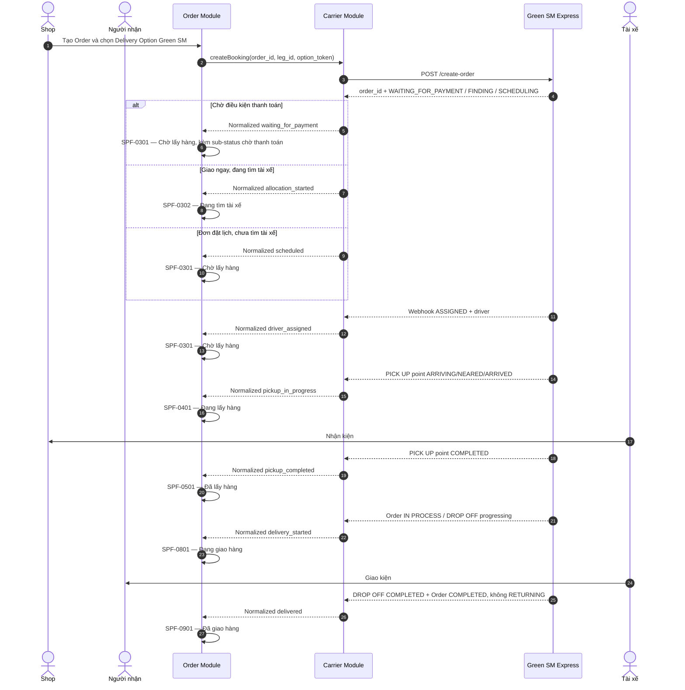
```mermaid
sequenceDiagram
    autonumber
    actor Shop
    actor Receiver as Người nhận
    participant ORD as Order Module
    participant CAR as Carrier Module
    participant GSM as Green SM Express
    actor Driver as Tài xế

    Shop->>ORD: Tạo Order và chọn Delivery Option Green SM
    ORD->>CAR: createBooking(order_id, leg_id, option_token)
    CAR->>GSM: POST /create-order
    GSM-->>CAR: order_id + WAITING_FOR_PAYMENT / FINDING / SCHEDULING

    alt Chờ điều kiện thanh toán
        CAR-->>ORD: Normalized waiting_for_payment
        ORD->>ORD: SPF-0301 — Chờ lấy hàng, kèm sub-status chờ thanh toán
    else Giao ngay, đang tìm tài xế
        CAR-->>ORD: Normalized allocation_started
        ORD->>ORD: SPF-0302 — Đang tìm tài xế
    else Đơn đặt lịch, chưa tìm tài xế
        CAR-->>ORD: Normalized scheduled
        ORD->>ORD: SPF-0301 — Chờ lấy hàng
    end

    GSM-->>CAR: Webhook ASSIGNED + driver
    CAR-->>ORD: Normalized driver_assigned
    ORD->>ORD: SPF-0301 — Chờ lấy hàng
    GSM-->>CAR: PICK UP point ARRIVING/NEARED/ARRIVED
    CAR-->>ORD: Normalized pickup_in_progress
    ORD->>ORD: SPF-0401 — Đang lấy hàng
    Driver->>Shop: Nhận kiện
    GSM-->>CAR: PICK UP point COMPLETED
    CAR-->>ORD: Normalized pickup_completed
    ORD->>ORD: SPF-0501 — Đã lấy hàng
    GSM-->>CAR: Order IN PROCESS / DROP OFF progressing
    CAR-->>ORD: Normalized delivery_started
    ORD->>ORD: SPF-0801 — Đang giao hàng
    Driver->>Receiver: Giao kiện
    GSM-->>CAR: DROP OFF COMPLETED + Order COMPLETED, không RETURNING
    CAR-->>ORD: Normalized delivered
    ORD->>ORD: SPF-0901 — Đã giao hàng
```

Nếu Green SM trả `Order COMPLETED + sub_status RETURNING`, không chạy nhánh giao thành công cuối sơ đồ; phải chuyển sang luồng hoàn và kiểm tra `RETURN point`\.

### 3\.6\.3\. Lấy hàng từ Shop về Hub SuperShip

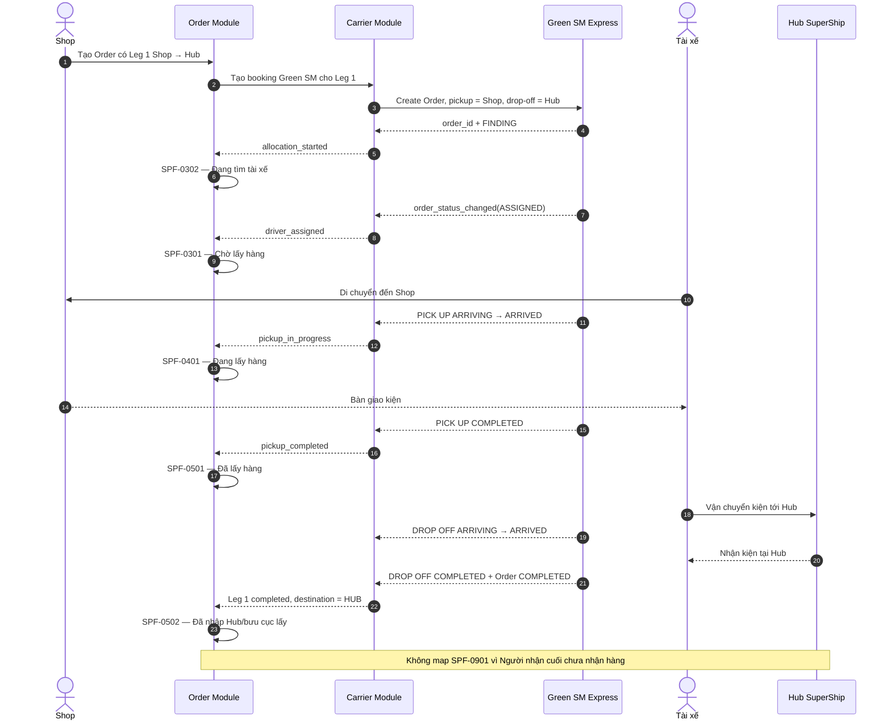
```mermaid
sequenceDiagram
    autonumber
    actor Shop
    participant ORD as Order Module
    participant CAR as Carrier Module
    participant GSM as Green SM Express
    actor Driver as Tài xế
    participant HUB as Hub SuperShip

    Shop->>ORD: Tạo Order có Leg 1 Shop → Hub
    ORD->>CAR: Tạo booking Green SM cho Leg 1
    CAR->>GSM: Create Order, pickup = Shop, drop-off = Hub
    GSM-->>CAR: order_id + FINDING
    CAR-->>ORD: allocation_started
    ORD->>ORD: SPF-0302 — Đang tìm tài xế

    GSM-->>CAR: order_status_changed(ASSIGNED)
    CAR-->>ORD: driver_assigned
    ORD->>ORD: SPF-0301 — Chờ lấy hàng
    Driver->>Shop: Di chuyển đến Shop
    GSM-->>CAR: PICK UP ARRIVING → ARRIVED
    CAR-->>ORD: pickup_in_progress
    ORD->>ORD: SPF-0401 — Đang lấy hàng
    Shop-->>Driver: Bàn giao kiện
    GSM-->>CAR: PICK UP COMPLETED
    CAR-->>ORD: pickup_completed
    ORD->>ORD: SPF-0501 — Đã lấy hàng

    Driver->>HUB: Vận chuyển kiện tới Hub
    GSM-->>CAR: DROP OFF ARRIVING → ARRIVED
    HUB-->>Driver: Nhận kiện tại Hub
    GSM-->>CAR: DROP OFF COMPLETED + Order COMPLETED
    CAR-->>ORD: Leg 1 completed, destination = HUB
    ORD->>ORD: SPF-0502 — Đã nhập Hub/bưu cục lấy
    Note over ORD,HUB: Không map SPF-0901 vì Người nhận cuối chưa nhận hàng
```

Raw `COMPLETED` của Green SM chỉ kết thúc **Leg 1** vì `DROP OFF` là Hub\. Hub phải xác nhận đã nhận kiện trước khi Order vào `SPF-0502`; webhook NVC và xác nhận nhập Hub cần được đối soát, không thay thế lẫn nhau\. `CONFIRMED-BASELINE/PROPOSED` \[E\-SP\-ARCH\]\[E\-OND\]

### 3\.6\.4\. Giao hàng từ Hub đến Người nhận

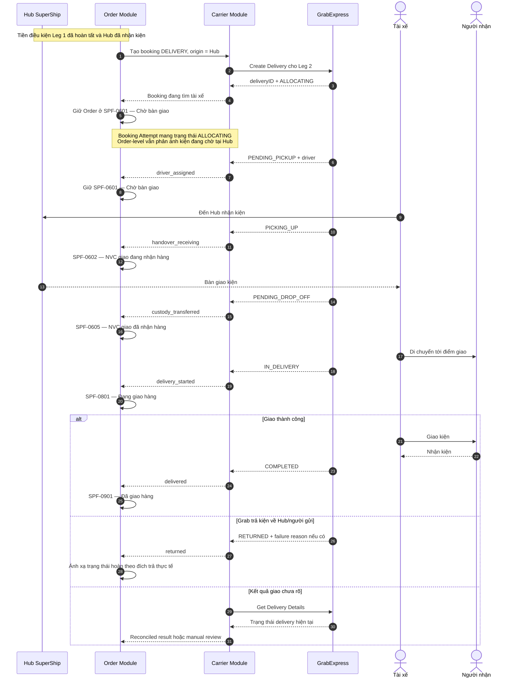
```mermaid
sequenceDiagram
    autonumber
    participant HUB as Hub SuperShip
    participant ORD as Order Module
    participant CAR as Carrier Module
    participant GRAB as GrabExpress
    actor Driver as Tài xế
    actor Receiver as Người nhận

    Note over HUB,ORD: Tiền điều kiện Leg 1 đã hoàn tất và Hub đã nhận kiện
    ORD->>CAR: Tạo booking DELIVERY, origin = Hub
    CAR->>GRAB: Create Delivery cho Leg 2
    GRAB-->>CAR: deliveryID + ALLOCATING
    CAR-->>ORD: Booking đang tìm tài xế
    ORD->>ORD: Giữ Order ở SPF-0601 — Chờ bàn giao
    Note over ORD,CAR: Booking Attempt mang trạng thái ALLOCATING<br/>Order-level vẫn phản ánh kiện đang chờ tại Hub

    GRAB-->>CAR: PENDING_PICKUP + driver
    CAR-->>ORD: driver_assigned
    ORD->>ORD: Giữ SPF-0601 — Chờ bàn giao
    Driver->>HUB: Đến Hub nhận kiện
    GRAB-->>CAR: PICKING_UP
    CAR-->>ORD: handover_receiving
    ORD->>ORD: SPF-0602 — NVC giao đang nhận hàng
    HUB-->>Driver: Bàn giao kiện
    GRAB-->>CAR: PENDING_DROP_OFF
    CAR-->>ORD: custody_transferred
    ORD->>ORD: SPF-0605 — NVC giao đã nhận hàng

    Driver->>Receiver: Di chuyển tới điểm giao
    GRAB-->>CAR: IN_DELIVERY
    CAR-->>ORD: delivery_started
    ORD->>ORD: SPF-0801 — Đang giao hàng

    alt Giao thành công
        Driver->>Receiver: Giao kiện
        Receiver-->>Driver: Nhận kiện
        GRAB-->>CAR: COMPLETED
        CAR-->>ORD: delivered
        ORD->>ORD: SPF-0901 — Đã giao hàng
    else Grab trả kiện về Hub/người gửi
        GRAB-->>CAR: RETURNED + failure reason nếu có
        CAR-->>ORD: returned
        ORD->>ORD: Ánh xạ trạng thái hoàn theo đích trả thực tế
    else Kết quả giao chưa rõ
        CAR->>GRAB: Get Delivery Details
        GRAB-->>CAR: Trạng thái delivery hiện tại
        CAR-->>ORD: Reconciled result hoặc manual review
    end
```

### 3\.6\.5\. Tạo chuyến NVC thất bại sau khi Đơn hàng đã được tạo

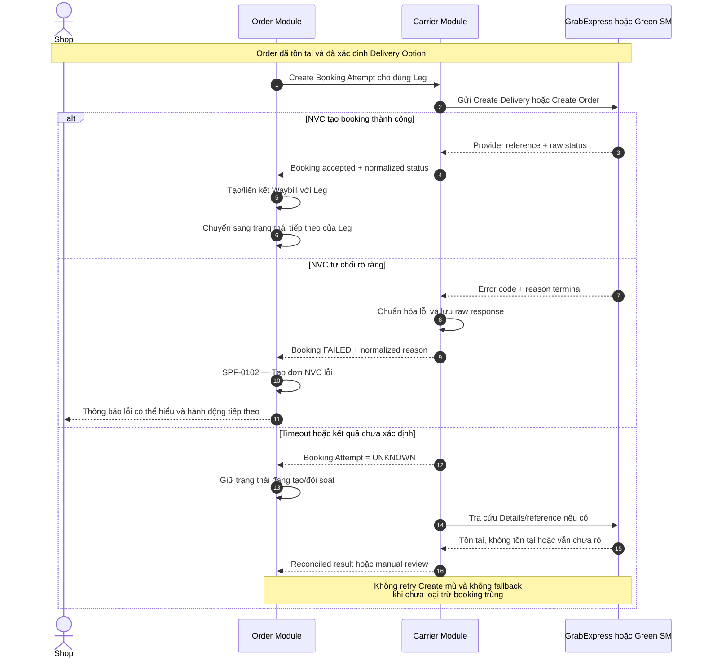
```mermaid
sequenceDiagram
    autonumber
    actor Shop
    participant ORD as Order Module
    participant CAR as Carrier Module
    participant NVC as GrabExpress hoặc Green SM

    Note over Shop,NVC: Order đã tồn tại và đã xác định Delivery Option
    ORD->>CAR: Create Booking Attempt cho đúng Leg
    CAR->>NVC: Gửi Create Delivery hoặc Create Order

    alt NVC tạo booking thành công
        NVC-->>CAR: Provider reference + raw status
        CAR-->>ORD: Booking accepted + normalized status
        ORD->>ORD: Tạo/liên kết Waybill với Leg
        ORD->>ORD: Chuyển sang trạng thái tiếp theo của Leg
    else NVC từ chối rõ ràng
        NVC-->>CAR: Error code + reason terminal
        CAR->>CAR: Chuẩn hóa lỗi và lưu raw response
        CAR-->>ORD: Booking FAILED + normalized reason
        ORD->>ORD: SPF-0102 — Tạo đơn NVC lỗi
        ORD-->>Shop: Thông báo lỗi có thể hiểu và hành động tiếp theo
    else Timeout hoặc kết quả chưa xác định
        CAR-->>ORD: Booking Attempt = UNKNOWN
        ORD->>ORD: Giữ trạng thái đang tạo/đối soát
        CAR->>NVC: Tra cứu Details/reference nếu có
        NVC-->>CAR: Tồn tại, không tồn tại hoặc vẫn chưa rõ
        CAR-->>ORD: Reconciled result hoặc manual review
        Note over ORD,NVC: Không retry Create mù và không fallback<br/>khi chưa loại trừ booking trùng
    end
```

### 3\.6\.7\. UC\-OND\-07 — Trả Shop thất bại và kiện được đưa về điểm nội bộ NVC

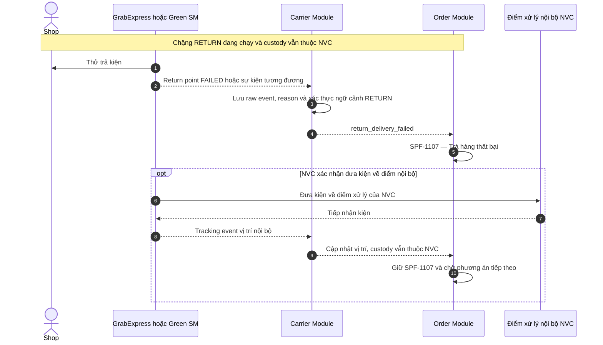
```mermaid
sequenceDiagram
    autonumber
    actor Shop
    participant NVC as GrabExpress hoặc Green SM
    participant CAR as Carrier Module
    participant ORD as Order Module
    participant DEPOT as Điểm xử lý nội bộ NVC

    Note over Shop,ORD: Chặng RETURN đang chạy và custody vẫn thuộc NVC
    NVC->>Shop: Thử trả kiện
    NVC-->>CAR: Return point FAILED hoặc sự kiện tương đương
    CAR->>CAR: Lưu raw event, reason và xác thực ngữ cảnh RETURN
    CAR-->>ORD: return_delivery_failed
    ORD->>ORD: SPF-1107 — Trả hàng thất bại

    opt NVC xác nhận đưa kiện về điểm nội bộ
        NVC->>DEPOT: Đưa kiện về điểm xử lý của NVC
        DEPOT-->>NVC: Tiếp nhận kiện
        NVC-->>CAR: Tracking event vị trí nội bộ
        CAR-->>ORD: Cập nhật vị trí, custody vẫn thuộc NVC
        ORD->>ORD: Giữ SPF-1107 và chờ phương án tiếp theo
    end
```

Đây là **mô hình ngoại lệ do SuperPlatform đề xuất**, chưa phải capability công khai đã xác nhận cho cả Grab và Green SM\. Không tạo Waybill/Handover mới chỉ vì kiện di chuyển giữa các điểm nội bộ của cùng NVC\. Trước production phải xác nhận NVC có gửi event điểm nội bộ hay không, số lần thử trả, thời gian lưu kiện, phí phát sinh và cách Shop yêu cầu giao/trả lại\. Nếu provider không cung cấp event này, CSKH/Ops chỉ cập nhật bằng quy trình can thiệp có audit\. `PROPOSED/TBD-CONTRACT` \[E\-GRAB\-RES\]\[E\-GSM\-RES\]

## 3\.7\. Luồng chi tiết theo sơ đồ của NVC

### 3\.7\.1\. Quy tắc đọc sơ đồ

Sơ đồ NVC được dùng để xác định thứ tự nghiệp vụ và trạng thái\. Tên endpoint trong ảnh có thể chứa prefix của API Gateway như `/v1/express/...`, trong khi API Contract của từng môi trường có thể cung cấp path tương đối khác\. Khi lập trình phải dùng `base_url` và endpoint trong credential/contract hiện hành, không ghép cứng path chỉ từ ảnh\. Nội dung nào nguồn không công bố số retry thì tài liệu này không tự đặt số\. `CONFIRMED-PUBLIC/TBD-CONTRACT` \[E\-GSM\-API\]\[E\-GRAB\-API\]

### 3\.7\.2\. Green SM: xác thực, báo giá, tạo chuyến, theo dõi và hủy

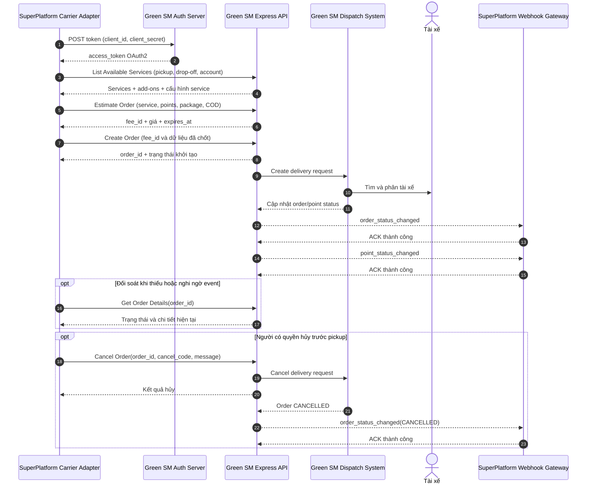
```mermaid
sequenceDiagram
    autonumber
    participant SP as SuperPlatform Carrier Adapter
    participant AUTH as Green SM Auth Server
    participant API as Green SM Express API
    participant DSP as Green SM Dispatch System
    actor Driver as Tài xế
    participant WH as SuperPlatform Webhook Gateway

    SP->>AUTH: POST token (client_id, client_secret)
    AUTH-->>SP: access_token OAuth2
    SP->>API: List Available Services (pickup, drop-off, account)
    API-->>SP: Services + add-ons + cấu hình service
    SP->>API: Estimate Order (service, points, package, COD)
    API-->>SP: fee_id + giá + expires_at
    SP->>API: Create Order (fee_id và dữ liệu đã chốt)
    API-->>SP: order_id + trạng thái khởi tạo
    API->>DSP: Create delivery request
    DSP->>Driver: Tìm và phân tài xế
    DSP-->>API: Cập nhật order/point status
    API-->>WH: order_status_changed
    WH-->>API: ACK thành công
    API-->>WH: point_status_changed
    WH-->>API: ACK thành công

    opt Đối soát khi thiếu hoặc nghi ngờ event
        SP->>API: Get Order Details(order_id)
        API-->>SP: Trạng thái và chi tiết hiện tại
    end

    opt Người có quyền hủy trước pickup
        SP->>API: Cancel Order(order_id, cancel_code, message)
        API->>DSP: Cancel delivery request
        API-->>SP: Kết quả hủy
        DSP-->>API: Order CANCELLED
        API-->>WH: order_status_changed(CANCELLED)
        WH-->>API: ACK thành công
    end
```

Điều kiện bắt buộc:

- `Available Services` chỉ trả dịch vụ cho đầu vào hiện tại; vẫn phải `Estimate` trước khi Create\.

- `fee_id` và báo giá phải còn hiệu lực\. Đổi địa chỉ, tọa độ, service, thời gian, kiện hàng hoặc COD thì báo giá lại\.

- Hủy chỉ thực hiện trước pickup và theo trạng thái/cut\-off NVC cho phép\.

- `List User Orders` là API tra cứu vận hành, không nằm trên critical path của Create\.

- Webhook phải được lưu raw và ACK nhanh\. Details dùng để đối soát, không polling dồn dập\.

### 3\.7\.3\. Green SM: vòng đời của từng điểm lấy, giao hoặc hoàn

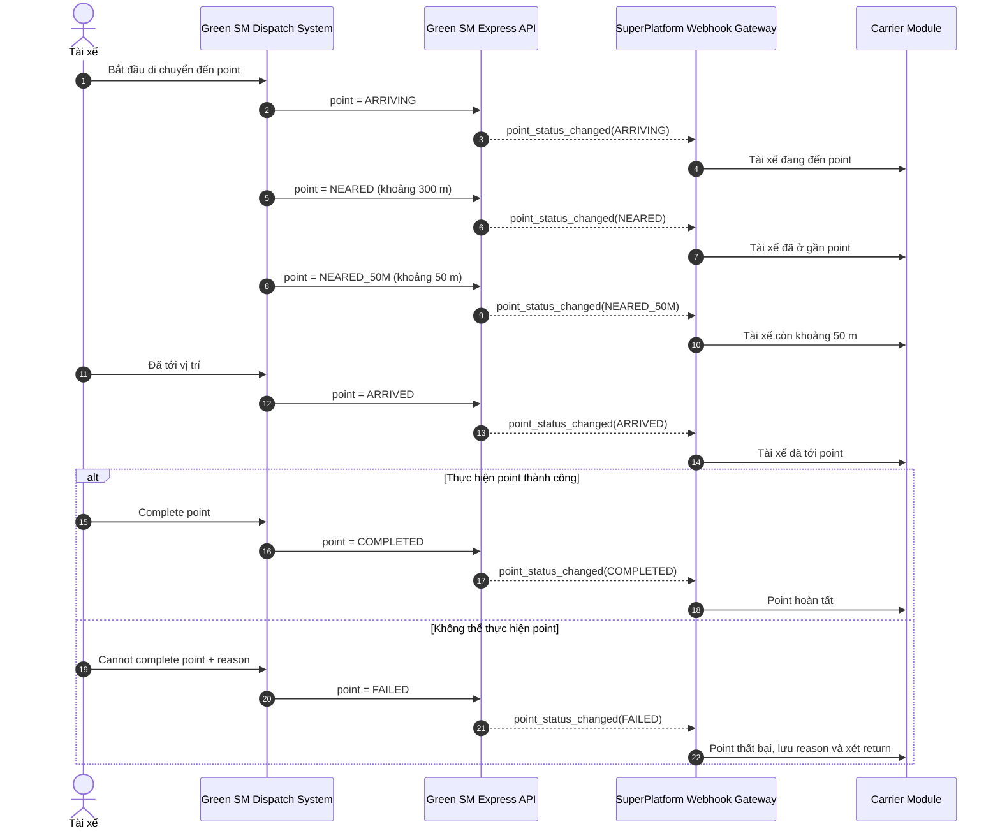
```mermaid
sequenceDiagram
    autonumber
    actor Driver as Tài xế
    participant DSP as Green SM Dispatch System
    participant API as Green SM Express API
    participant WH as SuperPlatform Webhook Gateway
    participant CAR as Carrier Module

    Driver->>DSP: Bắt đầu di chuyển đến point
    DSP->>API: point = ARRIVING
    API-->>WH: point_status_changed(ARRIVING)
    WH->>CAR: Tài xế đang đến point
    DSP->>API: point = NEARED (khoảng 300 m)
    API-->>WH: point_status_changed(NEARED)
    WH->>CAR: Tài xế đã ở gần point
    DSP->>API: point = NEARED_50M (khoảng 50 m)
    API-->>WH: point_status_changed(NEARED_50M)
    WH->>CAR: Tài xế còn khoảng 50 m
    Driver->>DSP: Đã tới vị trí
    DSP->>API: point = ARRIVED
    API-->>WH: point_status_changed(ARRIVED)
    WH->>CAR: Tài xế đã tới point

    alt Thực hiện point thành công
        Driver->>DSP: Complete point
        DSP->>API: point = COMPLETED
        API-->>WH: point_status_changed(COMPLETED)
        WH->>CAR: Point hoàn tất
    else Không thể thực hiện point
        Driver->>DSP: Cannot complete point + reason
        DSP->>API: point = FAILED
        API-->>WH: point_status_changed(FAILED)
        WH->>CAR: Point thất bại, lưu reason và xét return
    end
```

Mỗi event chỉ cập nhật đúng point được định danh\. Carrier phải lưu `point_id`, `point_type` \(`PICK UP`, `DROP OFF`, `RETURN`\), raw status, reason và thời điểm; không dùng trạng thái của một point để suy ra toàn bộ Order nếu chưa kiểm tra các point còn lại\.

### 3\.7\.4\. Green SM: tự phát sinh điểm hoàn

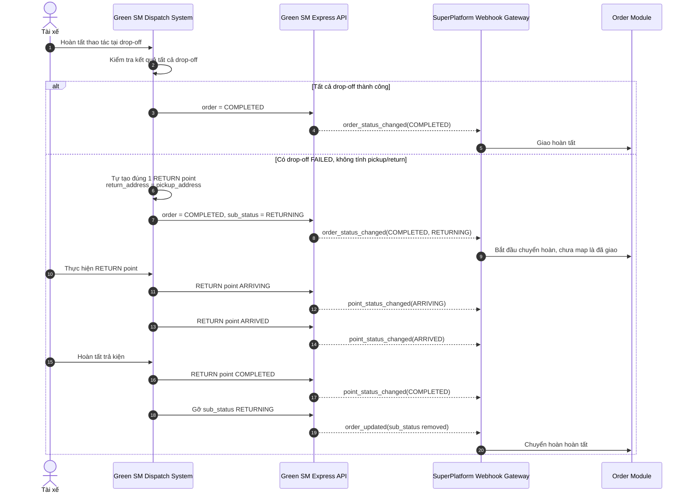
```mermaid
sequenceDiagram
    autonumber
    actor Driver as Tài xế
    participant DSP as Green SM Dispatch System
    participant API as Green SM Express API
    participant WH as SuperPlatform Webhook Gateway
    participant ORD as Order Module

    Driver->>DSP: Hoàn tất thao tác tại drop-off
    DSP->>DSP: Kiểm tra kết quả tất cả drop-off

    alt Tất cả drop-off thành công
        DSP->>API: order = COMPLETED
        API-->>WH: order_status_changed(COMPLETED)
        WH->>ORD: Giao hoàn tất
    else Có drop-off FAILED, không tính pickup/return
        DSP->>DSP: Tự tạo đúng 1 RETURN point<br/>return_address = pickup_address
        DSP->>API: order = COMPLETED, sub_status = RETURNING
        API-->>WH: order_status_changed(COMPLETED, RETURNING)
        WH->>ORD: Bắt đầu chuyển hoàn, chưa map là đã giao
        Driver->>DSP: Thực hiện RETURN point
        DSP->>API: RETURN point ARRIVING
        API-->>WH: point_status_changed(ARRIVING)
        DSP->>API: RETURN point ARRIVED
        API-->>WH: point_status_changed(ARRIVED)
        Driver->>DSP: Hoàn tất trả kiện
        DSP->>API: RETURN point COMPLETED
        API-->>WH: point_status_changed(COMPLETED)
        DSP->>API: Gỡ sub_status RETURNING
        API-->>WH: order_updated(sub_status removed)
        WH->>ORD: Chuyển hoàn hoàn tất
    end
```

#### Cách hiểu kết quả giao và hoàn

Green SM dùng `COMPLETED` theo nghĩa **đã kết thúc các điểm giao ban đầu**, chứ chưa chắc người nhận đã nhận được hàng\. Vì vậy SuperPlatform phải đọc đồng thời `order.status`, `sub_status` và kết quả của từng point:

|Dữ liệu Green SM nhận được|Hàng hóa thực tế|SuperPlatform phải hiểu|
|---|---|---|
|Tất cả `DROP OFF` đều `COMPLETED`; Order `COMPLETED`; không có `RETURNING`|Người nhận đã nhận hàng|Có thể chuyển sang `SPF-0901 — Đã giao hàng`|
|Có `DROP OFF = FAILED`; Order `COMPLETED`; `sub_status = RETURNING`|Giao người nhận thất bại, tài xế đang mang hàng quay về điểm lấy|Chuyển sang trạng thái đang hoàn; **không** được ghi đã giao|
|`RETURN point = COMPLETED`; `RETURNING` được gỡ|Hàng đã được trả về điểm lấy|Chuyển sang trạng thái đã trả hàng/hoàn tất hoàn|
|`RETURN point = FAILED`|Tài xế chưa trả hàng thành công|Giữ trạng thái ngoại lệ/cần vận hành xử lý; **không** được ghi đã trả hàng|

Ví dụ: tài xế tới người nhận nhưng không giao được\. Green SM kết thúc lượt giao ban đầu bằng `order.status = COMPLETED`, đồng thời tạo `RETURN point` và gắn `sub_status = RETURNING`\. Trong trường hợp này, chữ `COMPLETED` chỉ nói rằng **lượt giao tới người nhận đã kết thúc**, còn kiện hàng vẫn đang trên đường hoàn về Shop\.

Theo sơ đồ Green SM hiện có, khi một hoặc nhiều `DROP OFF` thất bại, hệ thống tạo **một điểm ****`RETURN`**** cho Order** và địa chỉ trả chính là địa chỉ `PICK UP`\. Nếu việc thực hiện điểm `RETURN` cũng thất bại, tài liệu công khai chưa mô tả thống nhất trạng thái cuối, số lần thử trả lại hoặc hành động tiếp theo\. Vì vậy đây là nội dung phải xác nhận với Green SM trước production; trong thời gian chưa chốt, SuperPlatform chỉ lưu sự kiện gốc, cảnh báo vận hành và không tự suy diễn rằng hàng đã được trả\. `TBD-CONTRACT` \[E\-GSM\-RES\]

### 3\.7\.5\. Bảng xử lý thử lại, đối soát và chuyển phương án dự phòng

|**Trường hợp**|**Ai retry?**|**Điều kiện / số lần đã xác nhận**|**SuperPlatform phải làm gì**|
|---|---|---|---|
|Grab đang `ALLOCATING`|Grab|Tự thử trong `allocation window`; **chưa công bố** số lần và thời lượng|Giữ `SPF-0302`; không gọi Create song song|
|Grab: tài xế hủy ở `PENDING_PICKUP`/`PICKING_UP`|Grab|Có thể quay lại `ALLOCATING` tùy cancellation reason; danh mục reason chưa công bố đầy đủ|Tiếp tục theo delivery cũ; ghi event tài xế hủy|
|Grab đã `FAILED` vì không tìm được tài xế|Không có retry cùng delivery qua API công khai|Delivery cũ terminal; không có API reallocate|Chỉ tạo Booking Attempt mới sau khi reconcile và policy cho phép|
|Green SM `FINDING` hoặc tài xế hủy sau `ASSIGNED`|Green SM|Tái điều phối theo service; nguồn mâu thuẫn `retry_counts <= 2` và `re_dispatch_counts = 4`|Đọc cấu hình service/contract runtime; không hard\-code 2 hoặc 4|
|Green SM webhook nghiệp vụ|Green SM|Tối đa **7 lần**, backoff tăng với hệ số **30 giây**, tổng khoảng **1 giờ**|ACK nhanh; deduplicate; xử lý bất đồng bộ|
|Green SM webhook vị trí tài xế|Green SM|**Không retry**; receiver phải trả `200` trong **5 giây**|Không dùng location event làm nguồn duy nhất; đối soát khi cần|
|Grab webhook|Grab|Số lần, backoff, thứ tự và chống trùng **chưa công bố**|Thiết kế inbox idempotent; xác nhận contract trước production|
|Create Grab/Green SM timeout|SuperPlatform|Chưa xác nhận Create idempotency|Không retry mù; reconcile trước khi tạo mới|
|HTTP `429`/`5xx` ở API đọc/quote|SuperPlatform|Chỉ retry thao tác an toàn; theo policy nội bộ và `Retry-After` nếu có|Exponential backoff \+ jitter; circuit breaker; không áp dụng máy móc cho Create|
|Fallback sang NVC khác|SuperPlatform|Chỉ sau terminal hoặc xác nhận booking cũ không tồn tại/đã hủy|Quote lại; kiểm tra giá/ETA/COD; tạo Booking Attempt mới có audit|

Ba khái niệm không được gộp:

1. **Redispatch/allocation retry**: NVC tiếp tục tìm tài xế cho cùng booking\.

2. **API retry**: SuperPlatform gọi lại HTTP request; Create chỉ gọi lại khi đã giải quyết nguy cơ tạo trùng\.

3. **Webhook retry**: NVC gửi lại cùng event vì chưa nhận ACK; SuperPlatform phải deduplicate\.

# 4\. QUYỀN SỞ HỮU DỮ LIỆU VÀ HỢP ĐỒNG GIỮA CÁC MODULE

|Dữ liệu / Quyết định|Module sở hữu|Module sử dụng|
|---|---|---|
|Người dùng, Shop, organization, role, Data Scope|User|Tất cả module|
|Địa chỉ chuẩn, mã địa chỉ, tọa độ chuẩn|Address|Shipping Configuration, Carrier, Order|
|Carrier, service, account, credential reference, capability, adapter, raw event|Carrier|Shipping Configuration, Pricing, Order, Support|
|Shop/pickup/app nào được dùng candidate nào và policy fallback|Shipping Configuration|Order, Carrier|
|Carrier raw quote|Carrier|Pricing, Order|
|Giá bán Shop, markup, discount, fee composition|Pricing|Order, Finance|
|Order, fulfillment plan snapshot, leg, waybill và trạng thái chuẩn|Order|Support, Finance, Reporting|
|Cờ bật adapter/capability theo môi trường|System Configuration|Carrier và consumer liên quan|
|Tiền thu hộ, công nợ, phí thực tế và đối soát|Finance|Payment, Claims, Reporting|
|Event phân phối liên module/webhook outbound|Integration \& Webhook|Các consumer|

# 5\. ẢNH HƯỞNG VÀ GIẢI PHÁP CHO TOÀN BỘ MODULE

## 5\.1\. User

- **Ảnh hưởng:** Không thay đổi mô hình danh tính\. Cần xác định Shop, ứng dụng, quyền xem giá/đặt/hủy chuyến và quyền xem thông tin tài xế\. Carrier Account chung hay riêng không thuộc User\. `CONFIRMED-BASELINE` \[E\-SP\-ARCH\]

- **Giải pháp:** Bổ sung permission như `shipping.option.view`, `carrier.booking.create`, `carrier.booking.cancel`; tiếp tục cung cấp `shop_id`, `organization_id`, application và Data Scope\. Không lưu token Grab/Green SM trong User\. `PROPOSED`, dựa trên boundary User/Carrier \[E\-SP\-ARCH\]\[E\-GRAB\-API\]\[E\-GSM\-API\]

## 5\.2\. Address

- **Ảnh hưởng:** On\-demand cần tọa độ chính xác cho cả pickup/drop\-off; cùng tỉnh không đồng nghĩa serviceable\. Green SM có Geocode/Reverse Geocode, Grab contract dùng địa chỉ và tọa độ\. `CONFIRMED-PUBLIC` \[E\-COV\]\[E\-GSM\-API\]\[E\-GRAB\-API\]

- **Giải pháp:** Address vẫn là nguồn địa chỉ chuẩn; lưu `address_id`, administrative code, latitude/longitude và chất lượng tọa độ\. Provider geocode chỉ là dữ liệu tương thích theo NVC, không âm thầm ghi đè canonical address\. Thay đổi địa chỉ làm vô hiệu option/quote cũ\. `PROPOSED`, dựa trên ownership Address và đầu vào provider \[E\-SP\-ARCH\]\[E\-COV\]

## 5\.3\. Carrier

- **Ảnh hưởng:** Lớn nhất\. Phải hỗ trợ authentication, available services, quote, create, details, cancel, webhook, polling, raw status, driver/vehicle, proof URL và rate limit\. `CONFIRMED-PUBLIC` \[E\-CAP\]\[E\-GRAB\-API\]\[E\-GSM\-API\]

- **Giải pháp:** Xây `GrabExpressAdapter` và `GreenSMExpressAdapter` sau interface chung; registry capability theo service/account; token cache; idempotency nội bộ; booking reconciliation; webhook inbox; raw payload store; status mapper; circuit breaker và quota\. URL tracking/proof có hạn không được coi là kho lưu trữ lâu dài\. `PROPOSED`, căn cứ hạn URL Grab \[E\-GRAB\-RES\]

## 5\.4\. Product

- **Ảnh hưởng:** Loại hàng, khối lượng, kích thước và hàng cấm ảnh hưởng vehicle/service\. Giới hạn khác theo service/hợp đồng\. `CONFIRMED-PUBLIC` \[E\-GRAB\-RES\]\[E\-GSM\-RES\]

- **Giải pháp:** Product cung cấp snapshot hàng hóa chuẩn; Carrier dịch sang provider schema\. Không đặt enum hàng hóa Grab/Green SM làm master Product\. Nếu thiếu kích thước bắt buộc, option tương ứng phải bị loại hoặc yêu cầu nhập bổ sung\. `PROPOSED`

## 5\.5\. System Configuration

- **Ảnh hưởng:** Cần kill switch khi provider lỗi, credential chưa sẵn sàng hoặc rollout pilot\. Không quản lý chính sách chọn NVC của từng Shop\. `CONFIRMED-BASELINE` \[E\-SP\-EXT\]

- **Giải pháp:** Feature/capability flag theo môi trường như `CARRIER.GRABEXPRESS.ENABLED`, `CARRIER.GREENSM.ENABLED`, webhook/polling switch và rollout allowlist\. Tắt capability chỉ ngăn thao tác mới; booking đang chạy vẫn phải theo dõi đến terminal\. `PROPOSED`

## 5\.6\. Shipping Configuration

- **Ảnh hưởng:** Phải xác định candidate theo app, loại khách hàng, Shop, điểm lấy, account, tuyến, hàng hóa, COD, thời gian và khu vực\. Khi dữ liệu thực tế cho thấy một NVC/service thường xuyên không tạo được chuyến tại một địa bàn hoặc khung giờ, hệ thống cần giảm ưu tiên hoặc tạm dừng option mới trước khi khách hàng tạo Order\. Shipping Configuration không sở hữu quote, raw metric hoặc trạng thái tài xế\. `CONFIRMED-BASELINE/PROPOSED` \[E\-SP\-ARCH\]\[E\-COV\]\[E\-CAP\]

- **Giải pháp:** Trả `Eligibility Decision` và policy fallback có giải thích\. Cấu hình kế thừa theo application/customer type → Shop → pickup point và địa bàn theo tỉnh → quận/huyện → phường/xã/geofence\. Mỗi rule theo carrier account/service có trạng thái `ENABLED`, `DEGRADED`, `PAUSED`, `BLOCKED`, thời gian hiệu lực, lý do, người phê duyệt và audit\. Reporting cung cấp metric; Shipping Configuration sở hữu quyết định bật/tắt; Carrier vẫn xác nhận runtime serviceability\. Không hard\-code danh sách vùng public thành sự thật tuyệt đối\. `PROPOSED`

## 5\.7\. Pricing

- **Ảnh hưởng:** Giá on\-demand là quote theo tuyến/thời điểm và có thể khác giá bán Shop; Green SM có fee breakdown/expiry, Grab quote contract cần xác nhận TTL\. `CONFIRMED-PUBLIC/TBD-CONTRACT` \[E\-GSM\-API\]\[E\-GRAB\-RES\]

- **Giải pháp:** Pricing nhận carrier quote, áp markup/discount/tax policy, trả Selling Quote\. Order lưu snapshot carrier amount, selling amount, currency, fee breakdown, nguồn giá và expiry\. Không dùng bảng giá tĩnh thay thế quote provider\. `PROPOSED`

## 5\.8\. Order

- **Ảnh hưởng:** Thêm bước chọn option, booking attempt, trạng thái điều phối tài xế và khả năng thất bại trước pickup\. Một Order vẫn có một hoặc nhiều Waybill theo leg\. `CONFIRMED-BASELINE/CONFIRMED-PUBLIC` \[E\-SP\-ARCH\]\[E\-OND\]

- **Giải pháp:** Order điều phối use case nhưng không gọi API provider trực tiếp; lưu Fulfillment Plan/Quote/Configuration snapshots; tham chiếu Booking Attempt; map raw lifecycle sang SPF\. `ALLOCATING/FINDING` là sub\-status trong giai đoạn tạo/chờ NVC, không làm phình Order status\. Provider ID được lưu ngay khi thực sự cấp; timeout không tạo mã giả\. `PROPOSED`

## 5\.9\. Notification

- **Ảnh hưởng:** Có thông báo mới: đang tìm tài xế, đã có tài xế, tài xế đến, provider/tài xế hủy, không tìm được tài xế, fallback và quote hết hạn\. `INFERRED` từ lifecycle \[E\-GRAB\-API\]\[E\-GSM\-API\]

- **Giải pháp:** Nhận normalized domain event, không nghe raw provider webhook trực tiếp\. Chống gửi trùng theo event key; template khác cho Shop, người nhận và Ops; không lộ token/raw lỗi kỹ thuật\. `PROPOSED`

## 5\.10\. Integration \& Webhook

- **Ảnh hưởng:** Phải nhận webhook NVC và phát webhook outbound cho Shop/đối tác\. Green SM hỗ trợ HMAC/OAuth tùy cấu hình và có event vị trí; Grab webhook reliability/sequence còn phải chốt\. `CONFIRMED-PUBLIC/TBD-CONTRACT` \[E\-CAP\]

- **Giải pháp:** Inbox → xác thực raw body → lưu payload → deduplicate → map → publish qua transactional outbox\. Trả ACK nhanh; xử lý bất đồng bộ; có replay/dead\-letter; không để Order endpoint trực tiếp làm webhook receiver\. `PROPOSED`

## 5\.11\. CRM

- **Ảnh hưởng:** Sales/CS cần biết Shop nào đủ điều kiện, account nào dùng, tỷ lệ không tìm được tài xế và vấn đề onboarding\. `INFERRED` từ boundary CRM và cơ chế allocation thất bại \[E\-SP\-ARCH\]\[E\-CAP\]

- **Giải pháp:** CRM chỉ hiển thị eligibility/onboarding summary và insight; không sở hữu cấu hình NVC hoặc credential\. Dùng event/report đã chuẩn hóa\. `PROPOSED`, dựa trên boundary CRM/Carrier/Shipping Configuration \[E\-SP\-ARCH\]

## 5\.12\. Support

- **Ảnh hưởng:** Phát sinh case mới: quote được nhưng không có tài xế, booking timeout, tài xế hủy, giá thay đổi, webhook trễ, hủy bị từ chối, proof URL hết hạn\. `CONFIRMED-PUBLIC/INFERRED` \[E\-CAP\]\[E\-GRAB\-RES\]

- **Giải pháp:** Timeline hiển thị Order → Leg → Waybill → Booking Attempt; cho Ops đối soát Details, retry/fallback theo quyền và xem raw correlation ID\. Không cho force retry khi booking còn `UNKNOWN`\. `PROPOSED`

## 5\.13\. Finance

- **Ảnh hưởng:** Phí dự kiến có thể khác phí cuối; COD, người trả phí, phí hủy/chờ và đối soát phụ thuộc hợp đồng\. Hai NVC có khả năng COD nhưng eligibility/settlement không được suy từ sự tồn tại của field API\. `CONFIRMED-PUBLIC/TBD-CONTRACT` \[E\-GRAB\-RES\]\[E\-GSM\-RES\]

- **Giải pháp:** Tách estimated charge, selling charge, actual carrier charge và adjustment; lưu provider transaction/reference; chỉ bật COD/payer mode khi capability contract xác nhận\. Finance sở hữu công nợ/đối soát, Order chỉ giữ snapshot hiển thị\. `PROPOSED`

## 5\.14\. Payment \& Payout

- **Ảnh hưởng:** Có thể phải thu tiền Shop/người nhận và thanh toán NVC/tài xế theo chu kỳ khác NVC mạng lưới\. Cơ chế thực tế chưa đủ bằng chứng công khai\. `TBD-CONTRACT` \[E\-GRAB\-RES\]\[E\-GSM\-RES\]

- **Giải pháp:** Không thanh toán trực tiếp từ callback giao hàng; tạo payable/receivable từ kết quả Finance đã đối soát\. Thiết kế provider\-neutral, hỗ trợ adjustment/refund và không bật payout tự động trước khi chốt settlement contract\. `PROPOSED`, dựa trên boundary Finance/Payment \[E\-SP\-ARCH\]

## 5\.15\. Claims \& Compensation

- **Ảnh hưởng:** Proof, tài xế, thời gian, vị trí và giá trị hàng hỗ trợ khiếu nại; Grab proof/tracking URL có hạn\. Chính sách bồi thường khác theo NVC/gói\. `CONFIRMED-PUBLIC` \[E\-GRAB\-RES\]\[E\-GSM\-RES\]

- **Giải pháp:** Khi được phép pháp lý/hợp đồng, sao lưu bằng chứng cần thiết về kho SuperPlatform cùng checksum, thời gian và nguồn; Claims liên kết Order/Waybill/Leg\. Không dùng URL tạm như bằng chứng lâu dài\. `PROPOSED`

## 5\.16\. Electronic Invoice

- **Ảnh hưởng:** Hóa đơn cho phí nền tảng/Shop có thể dựa trên giá bán và phí thực tế; NVC invoice đầu vào là chứng từ riêng\. `INFERRED` từ boundary Finance/Electronic Invoice \[E\-SP\-ARCH\]

- **Giải pháp:** Chỉ phát hành từ giao dịch Finance đã chốt; không lấy quote tạm hoặc `total_fee_display` làm số liệu hóa đơn\. Không cần tích hợp trực tiếp API Grab/Green SM trong module này\. `PROPOSED`, dựa trên quote là dữ liệu dự kiến và boundary hóa đơn \[E\-GSM\-API\]\[E\-SP\-ARCH\]

## 5\.17\. Reporting

- **Ảnh hưởng:** Cần KPI riêng cho on\-demand, không trộn “không có tài xế” với lỗi kỹ thuật\. Metric còn là đầu vào giúp Business/Ops quyết định khu vực nào nên bật, giảm ưu tiên hoặc tạm dừng\. `INFERRED`, dựa trên lifecycle \[E\-CAP\]

- **Giải pháp:** Báo cáo serviceability pass rate, quote\-to\-book, create acceptance, allocation success/time, `NO_DRIVER_AVAILABLE`, pickup ETA accuracy, delivery success, cancellation actor/reason, fallback rate, price delta, webhook lag và cost/margin\. Phân tích theo NVC/service/vehicle/giờ/khu vực pickup–drop\-off/Shop/pickup point/app/account; luôn kèm sample size và data window\. Reporting phát cảnh báo/khuyến nghị nhưng không tự sửa Shipping Configuration\. `PROPOSED`

## 5\.18\. Partner \& Network Management

- **Ảnh hưởng:** Cần quản lý hợp đồng, thị trường, service/account được mở, PIC, credential onboarding, hạn mức và ngày hiệu lực\. Production Grab được bật theo country/city/project; Green SM service/account trả động\. `CONFIRMED-PUBLIC` \[E\-GRAB\-RES\]\[E\-GSM\-API\]

- **Giải pháp:** Sở hữu hồ sơ quan hệ đối tác và commercial/technical onboarding; Carrier chỉ tham chiếu account/config runtime\. Có checklist sandbox, security, webhook, COD, settlement và go\-live\. `PROPOSED`

## 5\.19\. Rating \& Feedback

- **Ảnh hưởng:** Có thể thu đánh giá trải nghiệm NVC/tài xế nhưng public API không chứng minh SuperPlatform được quyền đẩy rating tương ứng; Grab có Tip nhưng Tip không phải Rating\. `CONFIRMED-PUBLIC/TBD-CONTRACT` \[E\-GRAB\-API\]

- **Giải pháp:** Lưu feedback nội bộ gắn Order/Waybill/service; chỉ gửi dữ liệu sang NVC khi có API và consent hợp lệ\. Không trộn điểm nội bộ với provider driver rating\. `PROPOSED`

# 6\. MÔ HÌNH DỮ LIỆU KHÁI NIỆM TỐI THIỂU

## 6\.1\. Nhóm dữ liệu cấu hình và điều kiện được sử dụng NVC

|**Dữ liệu cần quản lý**|**Nội dung cần lưu và mục đích**|**Module chịu trách nhiệm**|**Tên đối chiếu kỹ thuật**|
|---|---|---|---|
|Khả năng của từng dịch vụ NVC|NVC nào, tài khoản nào, dịch vụ/phương tiện nào; có hỗ trợ COD, đặt lịch, hủy và theo dõi tài xế hay không; hiệu lực từ ngày nào\. Dữ liệu này trả lời câu hỏi “dịch vụ này về nguyên tắc có làm được việc Shop yêu cầu không?”\.|Carrier|`CarrierServiceCapability`|
|Chính sách bật/tắt theo phạm vi|Ứng dụng, mô hình khách hàng, Shop, điểm lấy và khu vực nào được dùng từng NVC/dịch vụ; trạng thái đang bật, giảm ưu tiên, tạm dừng hay chặn; ai phê duyệt, lý do và thời gian hiệu lực\.|Shipping Configuration|`ServiceAreaPolicy`|
|Số liệu khả dụng thực tế|Tỷ lệ lấy được báo giá, tạo chuyến thành công, tìm được tài xế, thời gian tìm tài xế và số lần thất bại theo NVC, dịch vụ, khu vực và khung giờ\. Dữ liệu này hỗ trợ quyết định giảm ưu tiên hoặc tạm dừng\.|Reporting|`OperationalAvailabilityMetric`|
|Kết quả xét điều kiện cho một lần tạo đơn|Shop và điểm lấy hiện tại được dùng những dịch vụ nào; phương án nào bị loại và vì lý do gì; cấu hình nào đã dẫn tới quyết định; phương án dự phòng nào được phép\.|Shipping Configuration|`ShippingEligibilityDecision`|

## 6\.2\. Nhóm dữ liệu báo giá và giá bán cho Shop

|**Dữ liệu cần quản lý**|**Nội dung cần lưu và mục đích**|**Module chịu trách nhiệm**|**Tên đối chiếu kỹ thuật**|
|---|---|---|---|
|Báo giá gốc của NVC|NVC báo dịch vụ/phương tiện nào, giá bao nhiêu, tiền tệ, thời gian dự kiến, mã báo giá và thời điểm hết hiệu lực\. Đây là chi phí đầu vào do NVC cung cấp\.|Carrier|`CarrierQuote`|
|Giá bán hiển thị cho Shop|Giá Shop phải trả sau khi áp dụng phí dịch vụ, chính sách giá, chiết khấu hoặc ưu đãi; thời điểm giá hết hiệu lực\. Giá này có thể khác báo giá gốc của NVC\.|Pricing|`SellingQuote`|

Hai dữ liệu này phải tách nhau để sau này giải thích được: NVC báo bao nhiêu, SuperPlatform bán cho Shop bao nhiêu và chênh lệch hình thành từ chính sách nào\.

## 6\.3\. Nhóm dữ liệu kế hoạch và quá trình thực hiện đơn hàng

|Dữ liệu cần quản lý|Nội dung cần lưu và mục đích|Module chịu trách nhiệm|Tên đối chiếu kỹ thuật|
|---|---|---|---|
|Kế hoạch vận chuyển đã chọn|Shop đã chọn phương án nào; Order gồm mấy chặng; mỗi chặng đi từ đâu tới đâu; phiên bản cấu hình và giá nào đã được áp dụng\. Đây là bản chụp lịch sử để cấu hình thay đổi sau này không làm thay đổi đơn cũ\.|Order|`FulfillmentPlanSnapshot`|
|Vận đơn của từng chặng|Chặng nào do NVC nào thực hiện, dịch vụ nào, mã chuyến NVC là gì và trạng thái hiện tại đã được SuperPlatform chuẩn hóa ra sao\.|Order|`Waybill`|
|Lịch sử các lần yêu cầu NVC tạo chuyến|Mỗi lần SuperPlatform gọi NVC tạo chuyến, kết quả thành công, thất bại hay chưa xác định; mã chuyến NVC nếu có; nguyên nhân lỗi và thời điểm xử lý\. Dữ liệu này ngăn việc gọi lại thiếu kiểm soát và tạo hai tài xế cho cùng một kiện\.|Carrier|`BookingAttempt`|
|Tài xế và phương tiện hiện tại|Mã tài xế/phương tiện do NVC cung cấp cùng những thông tin được phép hiển thị cho Shop/người nhận\. Thông tin này có thể thay đổi nếu NVC phân tài xế khác\.|Carrier|`DriverAssignmentSnapshot`|

## 6\.4\. Nhóm dữ liệu tiếp nhận và kiểm chứng thông báo từ NVC

|**Dữ liệu cần quản lý**|**Nội dung cần lưu và mục đích**|**Module chịu trách nhiệm**|**Tên đối chiếu kỹ thuật**|
|---|---|---|---|
|Thông báo gốc NVC gửi sang|Mã sự kiện, kết quả xác thực, nội dung gốc, thời điểm NVC phát sinh, thời điểm SuperPlatform nhận và tình trạng đã xử lý hay chưa\. Dữ liệu này dùng để chống xử lý trùng, điều tra lỗi và đối soát khi hai bên lệch trạng thái\.|Integration \& Webhook phối hợp Carrier|`ProviderEventInbox`|

Thông báo gốc chỉ là bằng chứng kỹ thuật\. Trạng thái nghiệp vụ mà Shop và nhân viên nhìn thấy phải là trạng thái đã được Carrier chuẩn hóa và Order áp dụng đúng vào Vận đơn/chặng tương ứng\.

## 6\.5\. Ví dụ dữ liệu hình thành trong một Đơn hàng thực tế

Giả sử Shop A tạo đơn giao từ Kho Quận 1 tới người nhận bằng Green SM:

1. Shipping Configuration xác nhận App, Shop A, Kho Quận 1 và khu vực hiện tại được dùng Green SM\.

2. Carrier xác nhận tài khoản Green SM có dịch vụ xe máy, được phép tạo chuyến và lấy báo giá gốc 33\.000 đồng\.

3. Pricing áp dụng chính sách giá và trả giá bán cho Shop là 36\.000 đồng\.

4. Shop chọn phương án này; Order lưu lại kế hoạch vận chuyển, giá và cấu hình đã áp dụng tại thời điểm chọn\.

5. Carrier gửi yêu cầu tạo chuyến lần thứ nhất và Green SM cấp mã chuyến\. Lần tạo chuyến được lưu là thành công\.

6. Order tạo Vận đơn Green SM cho chặng Kho Quận 1 → Người nhận\.

7. Khi Green SM tìm được tài xế, Carrier cập nhật thông tin tài xế hiện tại\.

8. Mỗi webhook Green SM gửi sang được lưu nguyên bản để kiểm chứng, sau đó được dịch thành các trạng thái dễ hiểu như “Đang tìm tài xế”, “Đang lấy hàng” và “Đang giao hàng”\.

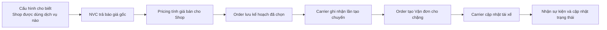
```mermaid
flowchart LR
    CFG["Cấu hình cho biết<br/>Shop được dùng dịch vụ nào"] --> CQ["NVC trả báo giá gốc"]
    CQ --> SQ["Pricing tính giá bán cho Shop"]
    SQ --> PLAN["Order lưu kế hoạch đã chọn"]
    PLAN --> BA["Carrier ghi nhận lần tạo chuyến"]
    BA --> WB["Order tạo Vận đơn cho chặng"]
    WB --> DRV["Carrier cập nhật tài xế"]
    DRV --> EVT["Nhận sự kiện và cập nhật trạng thái"]
```

## 6\.6\. Nguyên tắc bảo mật và nguồn dữ liệu

- Không lưu mật khẩu kết nối, mã truy cập \(`access token`\) hoặc khóa bí mật ứng dụng \(`client secret`\) của NVC trong Order\. Carrier quản lý thông tin xác thực bằng cơ chế bảo mật riêng\.

- Không dùng nội dung gốc NVC gửi sang làm trạng thái nghiệp vụ duy nhất\. Nội dung gốc được giữ để kiểm tra; trạng thái chuẩn hóa mới là dữ liệu các module khác sử dụng\.

- Order chỉ tham chiếu dữ liệu thuộc module khác bằng mã định danh và bản chụp cần thiết; không sao chép toàn bộ cấu hình, credential hoặc payload kỹ thuật\.

- Dữ liệu tài xế chỉ lưu và hiển thị trong phạm vi được NVC, hợp đồng và chính sách bảo vệ dữ liệu cho phép\.

# 7\. CÁC GIAO TIẾP NỘI BỘ TỐI THIỂU GIỮA CÁC MODULE

## 7\.1\. Luồng lấy phương án vận chuyển cho Shop

|**Khi nào xảy ra**|**Bên yêu cầu**|**Bên xử lý**|**Kết quả nghiệp vụ cần nhận**|**Tên kỹ thuật gợi ý**|
|---|---|---|---|---|
|Shop đã nhập đủ điểm lấy, địa chỉ giao, hàng hóa, COD và thời gian|Order API/BFF|Shipping Configuration|Danh sách NVC/dịch vụ mà App, mô hình khách hàng, Shop, điểm lấy và khu vực được phép sử dụng; kèm lý do loại bỏ phương án không hợp lệ|`resolveEligibleServices`<br>|
|Đã có danh sách dịch vụ được phép|Order API/BFF|Carrier|Với từng dịch vụ: có nhận tuyến hiện tại không, báo giá gốc bao nhiêu, dự kiến bao lâu và báo giá có hiệu lực tới khi nào|`checkAndQuote`|
|Đã có báo giá gốc từ NVC|Order API/BFF|Pricing|Giá bán cuối cùng hiển thị cho Shop sau phí dịch vụ, chính sách giá, chiết khấu hoặc ưu đãi|`priceDeliveryOptions`|

Kết quả cuối của ba bước trên là danh sách phương án vận chuyển đã đủ điều kiện để giao diện hiển thị\. Shop không nhìn thấy các dịch vụ bị chặn, ngoài vùng, không lấy được giá hoặc chưa được cấp cho Shop\.

## 7\.2\. Luồng tạo chuyến sau khi Shop xác nhận

|Khi nào xảy ra|Bên yêu cầu|Bên xử lý|Kết quả nghiệp vụ cần nhận|Tên kỹ thuật gợi ý|
|---|---|---|---|---|
|Shop bấm “Tạo đơn” và phương án đã chọn còn hiệu lực|Order|Carrier|Ghi nhận một lần yêu cầu NVC tạo chuyến; trả về thành công, thất bại hoặc chưa xác định; kèm mã chuyến NVC nếu đã được cấp|`createBooking`|
|NVC tạo chuyến thành công|Carrier|Order|Order tạo/liên kết Vận đơn cho đúng chặng và cập nhật trạng thái đang tìm tài xế hoặc chờ lấy hàng|Sự kiện `bookingAccepted`|
|NVC từ chối tạo chuyến rõ ràng|Carrier|Order|Ghi nhận tạo chuyến thất bại và lý do đã chuẩn hóa để Shop/CSKH có thể xử lý|Sự kiện `bookingFailed`|
|API NVC quá thời gian chờ, chưa biết tạo thành công hay chưa|Carrier|Order|Giữ kết quả “chưa xác định”, không tạo chuyến mới cho tới khi đối soát xong|Sự kiện `bookingUnknown`|

Khóa chống xử lý trùng phải bảo đảm một thao tác của Shop không vô tình tạo nhiều chuyến NVC\. Nếu lần tạo cũ đang “chưa xác định”, hệ thống không được gọi tạo chuyến mới chỉ vì người dùng bấm lại\.

## 7\.3\. Luồng theo dõi, đối soát và hủy chuyến

|Khi nào xảy ra|Bên yêu cầu|Bên xử lý|Kết quả nghiệp vụ cần nhận|Tên kỹ thuật gợi ý|
|---|---|---|---|---|
|Webhook bị thiếu, đến chậm hoặc kết quả tạo chuyến chưa rõ|Order hoặc Support|Carrier|Trạng thái hiện tại được Carrier tra cứu lại từ NVC và chuẩn hóa|`getBookingStatus`|
|Shop/nhân viên yêu cầu hủy khi kiện chưa được lấy|Order hoặc Support|Carrier|Xác nhận NVC cho phép hủy hay từ chối; lý do từ chối phải được chuẩn hóa|`cancelBooking`|
|Grab/Green SM gửi thay đổi trạng thái|Carrier|Order|Cập nhật đúng Vận đơn/chặng như đã có tài xế, đang lấy, đã lấy, đang giao, đã giao hoặc đang hoàn|Sự kiện vận chuyển đã chuẩn hóa|

Carrier chịu trách nhiệm hiểu trạng thái riêng của từng NVC\. Order chỉ nhận các sự kiện đã chuẩn hóa và không phải tự hiểu `ALLOCATING`, `FINDING`, `PENDING_PICKUP` hoặc các mã riêng khác\.

## 7\.4\. Luồng đề xuất điều chỉnh khả dụng từ dữ liệu vận hành

|Khi nào xảy ra|Bên cung cấp|Bên nhận|Kết quả nghiệp vụ|
|---|---|---|---|
|Reporting phát hiện tỷ lệ lấy giá, tạo chuyến hoặc tìm tài xế giảm dưới ngưỡng đã duyệt|Reporting|Shipping Configuration|Tạo đề xuất giảm ưu tiên, tạm dừng hoặc xem xét bật lại; kèm khu vực, dịch vụ, thời gian đo, số lượng mẫu và lý do|

Reporting **không tự thay đổi cấu hình**\. Shipping Configuration tiếp nhận đề xuất, áp dụng quy trình phê duyệt rồi mới thay đổi trạng thái\. Tên sự kiện kỹ thuật gợi ý là `availabilityRecommendationCreated`\.

## 7\.5\. Sơ đồ phối hợp tổng thể

```mermaid
sequenceDiagram
    autonumber
    actor Shop
    participant API as Order API/BFF
    participant CFG as Shipping Configuration
    participant CAR as Carrier
    participant PRC as Pricing
    participant NVC as Grab hoặc Green SM
    participant ORD as Order

    Shop->>API: Nhập đủ dữ liệu và yêu cầu xem phương án
    API->>CFG: Shop được phép dùng dịch vụ nào?
    CFG-->>API: Danh sách dịch vụ hợp lệ và lý do quyết định
    loop Từng dịch vụ hợp lệ
        API->>CAR: Kiểm tra tuyến và lấy báo giá gốc
        CAR->>NVC: Gọi API khả dụng và báo giá
        NVC-->>CAR: Khả dụng, giá và thời hạn
        CAR-->>API: Báo giá gốc đã chuẩn hóa
        API->>PRC: Tính giá bán cho Shop
        PRC-->>API: Giá bán và thời hạn
    end
    API-->>Shop: Hiển thị phương án vận chuyển
    Shop->>API: Chọn phương án và bấm Tạo đơn
    API->>ORD: Tạo Order và lưu phương án đã chọn
    ORD->>CAR: Yêu cầu tạo chuyến NVC
    CAR->>NVC: Gọi API tạo chuyến
    NVC-->>CAR: Mã chuyến và trạng thái ban đầu
    CAR-->>ORD: Kết quả đã chuẩn hóa
    ORD-->>API: Order và Vận đơn đã được cập nhật
    API-->>Shop: Hiển thị trạng thái tiếp theo
```

## 7\.6\. Nguyên tắc an toàn dữ liệu

- Giao diện không gọi trực tiếp Grab/Green SM và không được nhận khóa bí mật hoặc mã truy cập NVC\.

- Module Order không tự đọc lỗi thô của NVC; Carrier phải chuyển thành lý do thống nhất, dễ hiểu và không chứa dữ liệu nhạy cảm\.

- Dữ liệu kỹ thuật chi tiết chỉ hiển thị cho nhân viên có quyền; Shop nhận thông điệp nghiệp vụ bằng tiếng Việt\.

- Mỗi yêu cầu phải có mã theo dõi xuyên suốt để Support tra cứu được luồng Order → Carrier → NVC khi có sự cố\.

# 8\. QUY TẮC GIAO DIỆN VÀ TRẢI NGHIỆM

GrabExpress và Green SM không tạo thành một chức năng tạo đơn tách biệt\. Chúng nằm trong **cùng luồng tạo đơn hiện hành**, nhưng được trình bày thành nhóm “Giao ngay” để Shop phân biệt với NVC mạng lưới\. `PROPOSED`

## 8\.1\. Khác biệt mà giao diện phải thể hiện

|Nội dung|NVC mạng lưới|NVC giao ngay như Grab/Green SM|
|---|---|---|
|Cách vận chuyển|Qua mạng lưới bưu cục, kho và tuyến khai thác|Tài xế thực hiện chuyến trực tiếp giữa các điểm|
|Thời gian dự kiến|Thường tính theo ngày|Thường tính theo phút/giờ và phụ thuộc thời điểm đặt|
|Giá|Có thể lấy từ bảng giá/cấu hình hoặc API|Phải lấy báo giá tại thời điểm hiện tại và có thể hết hiệu lực nhanh|
|Tài xế|Shop không cần chờ hệ thống tìm tài xế ngay khi tạo đơn|Sau khi tạo chuyến còn có bước tìm và phân tài xế|
|Phương tiện|Thường không phải lựa chọn chính trên giao diện|Có thể ảnh hưởng trực tiếp đến dịch vụ, giới hạn hàng và giá|
|Vị trí|Địa chỉ chuẩn thường đủ để tạo vận đơn|Cần tọa độ chính xác của điểm lấy và điểm giao|
|Khi không có tài xế|Không phải trạng thái đặc trưng ngay sau tạo đơn|Có thể tạo chuyến được nhưng sau đó không tìm được tài xế|
|Theo dõi|Chủ yếu theo trạng thái vận đơn|Có thể có tài xế, phương tiện, thời gian tới lấy và vị trí theo thời gian thực|

## 8\.2\. Vị trí của phần “Phương thức vận chuyển” trên màn hình tạo đơn

Chỉ tải phương án vận chuyển sau khi người dùng đã nhập đủ dữ liệu có ảnh hưởng tới khả năng phục vụ và giá:

- Shop và điểm lấy hàng;

- địa chỉ, tọa độ người nhận;

- hàng hóa, khối lượng và kích thước bắt buộc;

- tiền thu hộ nếu có;

- thời điểm lấy/giao mong muốn\.

Khu vực lựa chọn nên hiển thị hai nhóm trong cùng một khối:

```Plaintext
PHƯƠNG THỨC VẬN CHUYỂN

[ Giao tiêu chuẩn ]
  ○ GHN          32.000đ    Dự kiến 2–3 ngày
  ○ J&T Express  30.000đ    Dự kiến 3–4 ngày

[ Giao ngay ]
  ○ Green SM     36.000đ    Tới lấy 10–15 phút · Giao 35–45 phút
  ○ GrabExpress  39.000đ    Tới lấy 8–12 phút  · Giao 30–40 phút

  Giá và khả năng có tài xế được kiểm tra tại thời điểm hiện tại.
```

Quy tắc hiển thị:

- Nếu Shop/App chưa bật giao ngay, không hiển thị nhóm “Giao ngay” và không gọi API báo giá Grab/Green SM\.

- Nếu đã bật nhưng tuyến hiện tại không có dịch vụ, vẫn hiển thị tiêu đề nhóm kèm thông báo ngắn “Chưa có dịch vụ giao ngay phù hợp cho tuyến này”; không hiển thị thẻ NVC bị vô hiệu hóa gây nhầm lẫn\.

- Không hiển thị NVC chỉ vì cấu hình đã bật\. NVC phải vượt qua kiểm tra tài khoản, khu vực, tình trạng kết nối, khả năng phục vụ và báo giá hiện tại\.

- Nếu một NVC đang bị tạm dừng hoặc chặn, Shop không nhìn thấy NVC đó; lý do chi tiết chỉ hiển thị cho nhân viên nội bộ\.

## 8\.3\. Nội dung một thẻ phương án giao ngay

Mỗi phương án phải giúp Shop trả lời ngay năm câu hỏi: ai giao, dùng dịch vụ/phương tiện gì, giá bao nhiêu, bao lâu tới lấy và bao lâu giao xong\.

```Plaintext
┌──────────────────────────────────────────────────────┐
│ ○ Green SM Express                         GIAO NGAY │
│   Xe máy · Tối đa theo giới hạn dịch vụ             │
│                                                      │
│   Phí dự kiến             36.000đ                    │
│   Tài xế dự kiến tới lấy  10–15 phút                 │
│   Giao hàng dự kiến       35–45 phút                 │
│   Thu hộ COD              Có hỗ trợ / Không hỗ trợ   │
│                                                      │
│   Báo giá còn hiệu lực 02:15                         │
└──────────────────────────────────────────────────────┘
```

Không dùng mã `BIKE`, tên service ID hoặc mã lỗi NVC làm nội dung chính\. Giao diện hiển thị “Xe máy”, “Ô tô” hoặc tên dịch vụ tiếng Việt; mã kỹ thuật chỉ hiện trong phần chi tiết dành cho nhân viên nội bộ\.

## 8\.4\. Luồng tương tác khi Shop chọn giao ngay

```mermaid
flowchart TD
    A["Shop nhập đủ thông tin đơn"] --> B["Hệ thống lấy các phương án vận chuyển"]
    B --> C["Hiển thị hai nhóm: tiêu chuẩn và giao ngay"]
    C --> D{"Shop chọn phương án nào?"}
    D -->|"NVC mạng lưới"| E["Tiếp tục luồng tạo vận đơn hiện hành"]
    D -->|"Grab hoặc Green SM"| F["Lưu phương án và thời hạn báo giá đã chọn"]
    F --> G["Shop bấm Tạo đơn"]
    G --> H{"Báo giá và dữ liệu còn hiệu lực?"}
    H -->|"Có"| I["Tạo Order và yêu cầu NVC tạo chuyến"]
    H -->|"Không"| J["Lấy báo giá mới và yêu cầu Shop xác nhận lại"]
    J --> K{"Shop chấp nhận giá mới?"}
    K -->|"Có"| I
    K -->|"Không"| C
    I --> L["Chuyển tới màn hình Đang tìm tài xế"]
```

Khi Shop thay đổi địa chỉ, tọa độ, điểm lấy, hàng hóa, khối lượng, COD hoặc thời gian giao, phương án giao ngay đã chọn phải hết hiệu lực và được báo giá lại\.

Không tự động đổi sang NVC khác nếu giá hoặc thời gian thay đổi ngoài ngưỡng Shop đã chấp nhận\. Giao diện phải đưa Shop quay lại bước xác nhận phương án\.

## 8\.5\. Trạng thái giao diện sau khi tạo chuyến

### 8\.5\.1\. Đang tìm tài xế

Sau khi NVC chấp nhận tạo chuyến nhưng chưa phân tài xế, trang chi tiết đơn hiển thị:

```Plaintext
ĐANG TÌM TÀI XẾ
Green SM đang tìm tài xế phù hợp cho chuyến giao này.

[ Hủy chuyến ]  chỉ hiển thị khi NVC còn cho phép hủy
```

Shop không nhìn thấy các từ `ALLOCATING`, `FINDING` hay số lần hệ thống đang thử\. Nhân viên nội bộ được xem NVC, dịch vụ, mã chuyến, thời gian bắt đầu tìm và trạng thái kỹ thuật gốc\.

### 8\.5\.2\. Đã có tài xế

Khi NVC đã phân tài xế, giao diện cập nhật cùng Vận đơn, không tạo Order hoặc Vận đơn mới:

```Plaintext
TÀI XẾ ĐANG ĐẾN ĐIỂM LẤY
Nguyễn Văn A · Xe máy · 59A1-xxxxx
Dự kiến tới lấy trong 8 phút
[ Theo dõi hành trình ]
```

Chỉ hiển thị thông tin tài xế/phương tiện mà hợp đồng và chính sách bảo vệ dữ liệu cho phép\. Không lưu hoặc hiển thị vị trí tài xế lâu hơn thời gian cần thiết\.

### 8\.5\.3\. Không tìm được tài xế

Khi NVC đã kết thúc việc tìm tài xế và không còn lần tự thử nào:

```Plaintext
KHÔNG TÌM ĐƯỢC TÀI XẾ
Green SM hiện chưa bố trí được tài xế cho chuyến này.

[ Xem phương án khác ]   [ Thử lại ]   [ Hủy đơn ]
```

- “Thử lại” phải tạo một lần yêu cầu mới có kiểm soát; không gọi lại khi kết quả chuyến cũ còn chưa rõ\.

- “Xem phương án khác” lấy lại báo giá hiện tại và hiển thị cả NVC mạng lưới lẫn NVC giao ngay còn phù hợp\.

- Nếu phương án khác có giá hoặc thời gian khác, Shop phải xác nhận trước khi tạo chuyến mới\.

- Không hiển thị nút “Thử lại” nếu NVC cũ chưa ở trạng thái kết thúc hoặc hệ thống đang đối soát\.

## 8\.6\. Thể hiện trên danh sách và chi tiết đơn hàng

Giao diện vẫn tuân theo mô hình một Order có một hoặc nhiều Vận đơn:

- Cột “Trạng thái đơn hàng” hiển thị trạng thái chung của SuperPlatform như “Đang tìm tài xế”, “Đang lấy hàng” hoặc “Đang giao hàng”\.

- Cột “Thông tin vận chuyển” hiển thị NVC, vai trò chặng và mã Vận đơn/mã chuyến khi đã được cấp\.

- Trang chi tiết hiển thị đủ các Vận đơn của mọi chặng; không ẩn chặng Shop → Hub hoặc Hub → Người nhận\.

- Trạng thái kỹ thuật gốc của Grab/Green SM chỉ hiển thị cho nhân viên nội bộ trong lịch sử sự kiện; Shop thấy tên tiếng Việt\.

- Nếu chuyến Grab/Green SM chỉ đưa kiện tới Hub, trạng thái NVC hoàn thành chỉ kết thúc chặng đó; Order không được hiển thị “Đã giao hàng”\.

## 8\.7\. Giao diện quản trị dành cho vận hành

Nhân viên có quyền cần một màn hình quản lý khả dụng với các bộ lọc:

- ứng dụng, mô hình khách hàng, Shop và điểm lấy;

- NVC, tài khoản, dịch vụ và phương tiện;

- tỉnh/thành phố, quận/huyện, phường/xã hoặc vùng tọa độ;

- trạng thái đang bật, giảm ưu tiên, tạm dừng hoặc chặn;

- khoảng thời gian và số lượng mẫu dùng để đánh giá\.

Mỗi dòng phải cho biết:

- tỷ lệ lấy được báo giá;

- tỷ lệ tạo chuyến thành công;

- tỷ lệ tìm được tài xế và thời gian tìm trung bình;

- lý do đề xuất giảm ưu tiên/tạm dừng;

- cấu hình nào đang có hiệu lực, ai thay đổi và khi nào hết hiệu lực\.

Hành động quản trị gồm “Bật”, “Giảm ưu tiên”, “Tạm dừng” và “Chặn”\. Mọi thay đổi phải nhập lý do và ghi nhật ký; tắt phương án mới không được làm mất theo dõi các chuyến đang chạy\.

## 8\.8\. Mã lý do nội bộ và thông điệp hiển thị

Mã lý do phục vụ xử lý trong hệ thống, không hiển thị trực tiếp cho Shop:

|Mã nội bộ|Nhân viên nội bộ hiểu là|Thông điệp phù hợp cho Shop|
|---|---|---|
|`AREA_POLICY_PAUSED`|Khu vực đang được SuperPlatform tạm dừng|Chưa có dịch vụ phù hợp tại khu vực này|
|`OUT_OF_SERVICE_AREA`|NVC xác nhận ngoài vùng phục vụ|NVC chưa hỗ trợ tuyến giao này|
|`QUOTE_UNAVAILABLE`|Không lấy được báo giá hiện tại|Chưa thể lấy giá, vui lòng thử lại|
|`LOW_OPERATIONAL_AVAILABILITY`|Hiệu quả tìm tài xế tại phạm vi này đang quá thấp|Dịch vụ hiện tạm thời không khả dụng|
|`NO_DRIVER_AVAILABLE`|NVC đã kết thúc tìm nhưng không có tài xế|Không tìm được tài xế, vui lòng chọn phương án khác|
|`ACCOUNT_NOT_ELIGIBLE`|Tài khoản NVC không được cấp dịch vụ|Shop chưa được hỗ trợ dịch vụ này|

Toàn bộ thiết kế giao diện tại mục 8 là giải pháp đề xuất của SuperPlatform \(`PROPOSED`\)\. Các trường ETA, tài xế, vị trí, COD và nút hủy chỉ hiển thị khi API/hợp đồng của đúng NVC và tài khoản xác nhận có hỗ trợ\.

# 9\. CÁC QUYẾT ĐỊNH KHÔNG ĐƯỢC GIẢ ĐỊNH

- Không mặc định Grab chỉ giao nội tỉnh; điều khoản sản phẩm/app và API partner không đồng nhất về liên tỉnh Việt Nam\. `TBD-CONTRACT` \[E\-GRAB\-RES\]

- Không dùng tên thương mại trên app để hard\-code API `serviceType`\. `TBD-CONTRACT` \[E\-GRAB\-RES\]

- Không mặc định quote Grab có TTL/quote ID nếu contract hiện hành không trả\. `TBD-CONTRACT` \[E\-GRAB\-RES\]

- Không mặc định Create của hai NVC idempotent\. `TBD-CONTRACT` \[E\-CAP\]

- Không mặc định quote/serviceability thành công nghĩa chắc chắn có tài xế\. `CONFIRMED-PUBLIC` \[E\-COV\]

- Không mặc định COD, payer, return, redelivery, multi\-stop hoặc schedule được bật cho account SuperShip chỉ vì schema có field\. `TBD-CONTRACT` \[E\-CAP\]

- Không hard\-code unit `min_distance/max_distance` Green SM trước khi sandbox/provider xác nhận mâu thuẫn đơn vị\. `TBD-CONTRACT` \[E\-COV\]

- Không coi driver GPS là lịch sử vĩnh viễn; phải có mục đích, retention và phân quyền phù hợp\. `PROPOSED`

# 10\. LỘ TRÌNH TRIỂN KHAI

## 10\.1\. Giai đoạn 0 — Sẵn sàng hợp đồng và môi trường thử nghiệm

- Chốt account/service/vehicle/vùng/COD/payment/cancel/return/settlement\.

- Chốt idempotency, timeout, retry, webhook security/retry/order và quota\.

- Chạy ma trận serviceability hai đầu tuyến theo `E-COV`\.

- Chốt DPA/retention cho driver location, phone và proof\.

Không qua Phase 0 thì không production\.

## 10\.2\. Giai đoạn 1 — Thử nghiệm giới hạn trên SuperAI nội thành

- Một pickup, một drop\-off\.

- Shop chọn thủ công\.

- Không COD hoặc chỉ COD đã được contract xác nhận\.

- Quote, Create, Details, Cancel, webhook và polling reconciliation\.

- Không fallback tự động\.

- Allowlist Shop/pickup point\.

## 10\.3\. Giai đoạn 2 — Chính sách và phương án dự phòng

- Shipping Configuration nhiều cấp\.

- So sánh option/giá/ETA\.

- Retry/fallback có ngưỡng và xác nhận thay đổi giá\.

- Notification, Support console và KPI đầy đủ\.

## 10\.4\. Giai đoạn 3 — Đa chặng và vận hành nội bộ

- Shop → Kho SuperShip hoặc Kho → Người nhận như Fulfillment Leg riêng\.

- Return/handover theo capability đã xác nhận\.

- `Operational Transport Job` cho chuyến nội bộ không gắn Order\.

# 11\. TIÊU CHÍ ĐƯA VÀO VẬN HÀNH THỰC TẾ

Chỉ go\-live khi đồng thời đạt:

- Credential, IP whitelist, scope và service production đã xác nhận\.

- Contract test request/response/error của mọi endpoint baseline\.

- Không tạo booking trùng trong thử nghiệm timeout/retry\.

- Webhook xác thực, deduplicate, out\-of\-order và replay hoạt động\.

- Polling reconciliation đóng được booking `UNKNOWN`\.

- Quote expiry và thay đổi input được kiểm soát\.

- Rule khu vực ưu tiên đúng từ tỉnh đến geofence/điểm lấy, có hiệu lực và audit đầy đủ\.

- Metric availability luôn kèm sample size/window; cảnh báo không tự tắt dịch vụ ngoài policy được duyệt\.

- Kiểm thử hysteresis/cooldown chứng minh không bật–tắt option liên tục\.

- Option `PAUSED/BLOCKED` không xuất hiện cho Shop nhưng booking đang chạy vẫn tiếp tục được theo dõi\.

- Mapping raw status → normalized status được duyệt\.

- COD/payment/settlement/cancel/return chỉ bật đúng capability hợp đồng\.

- Dashboard quan sát allocation failure, provider error, webhook lag và price delta\.

- Runbook cho Support/Ops được nghiệm thu\.

# 12\. KẾT LUẬN

GrabExpress và Green SM Express nên được tích hợp như các NVC thuộc loại hình vận chuyển giao tức thời theo nhu cầu `ON_DEMAND_DIRECT`, không phải module hoặc loại Order riêng\. Mô hình Order–Waybill vẫn dùng được nếu bổ sung Fulfillment Plan Snapshot, Carrier Quote và Booking Attempt, đồng thời phân biệt rõ provider booking, phân tài xế và trạng thái Waybill\.

Carrier chịu trách nhiệm tích hợp và sự thật kỹ thuật của NVC; Shipping Configuration quyết định candidate/policy; Address cung cấp địa chỉ và tọa độ chuẩn; Pricing tạo giá bán; Order sở hữu hành trình/snapshot/trạng thái chuẩn; Integration xử lý webhook tin cậy; Finance sở hữu tiền và đối soát\. Những module còn lại chỉ sử dụng dữ liệu chuẩn hóa theo đúng boundary\.

Giá trị kiến trúc quan trọng nhất không phải “thêm Grab và Xanh SM”, mà là giúp SuperPlatform có khung capability\-driven để tích hợp NVC on\-demand tiếp theo mà không sửa logic lõi theo từng nhà cung cấp\.


